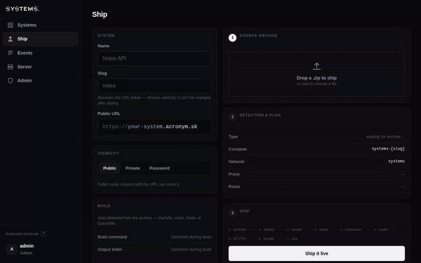
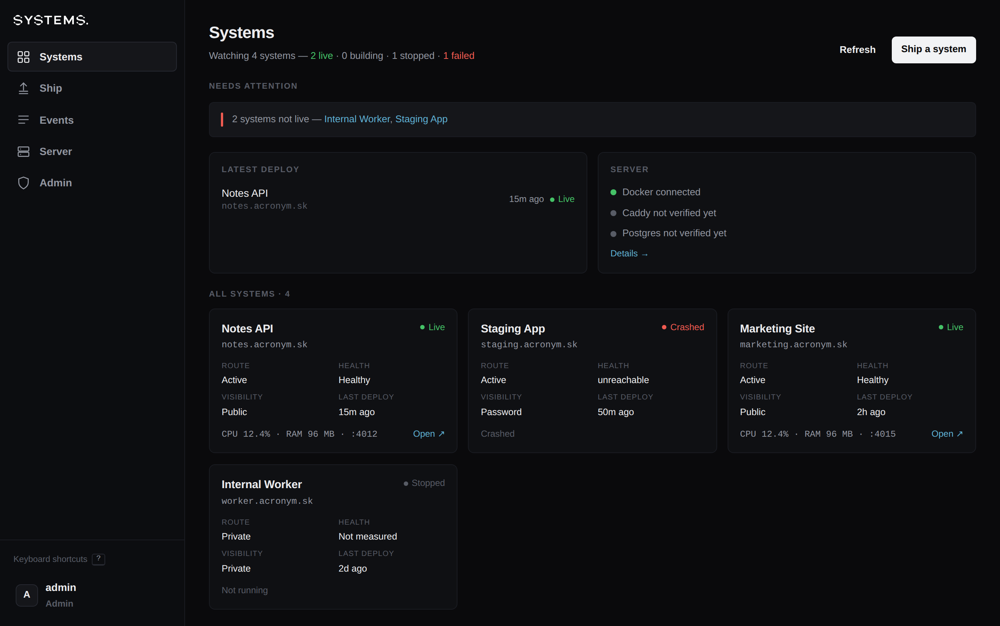
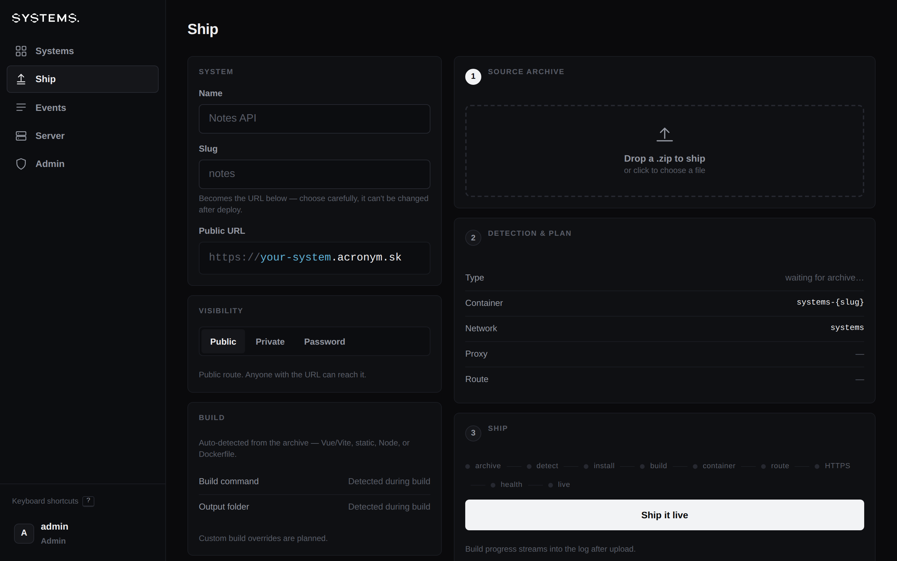
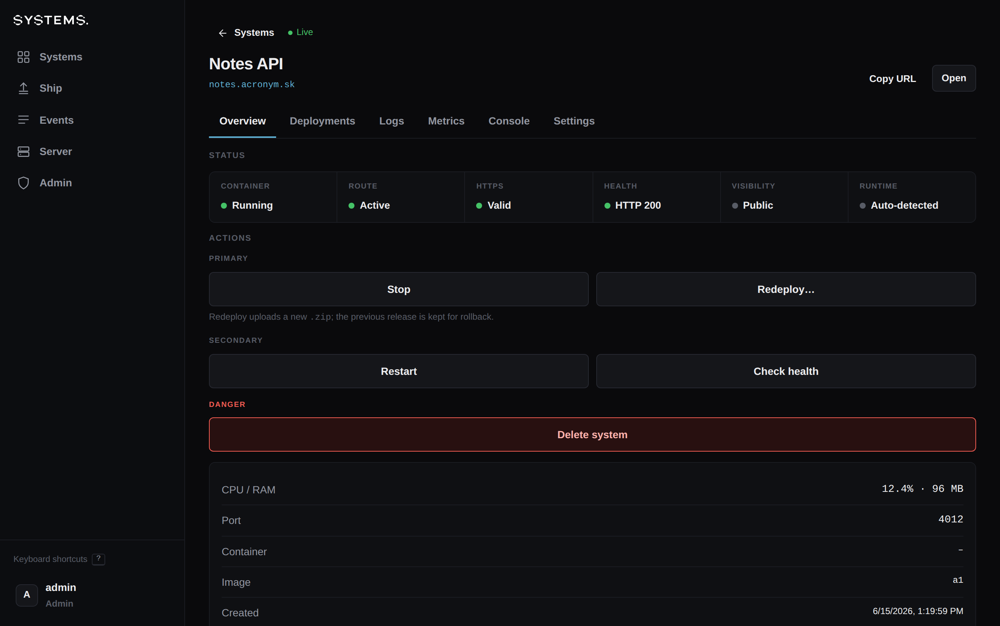
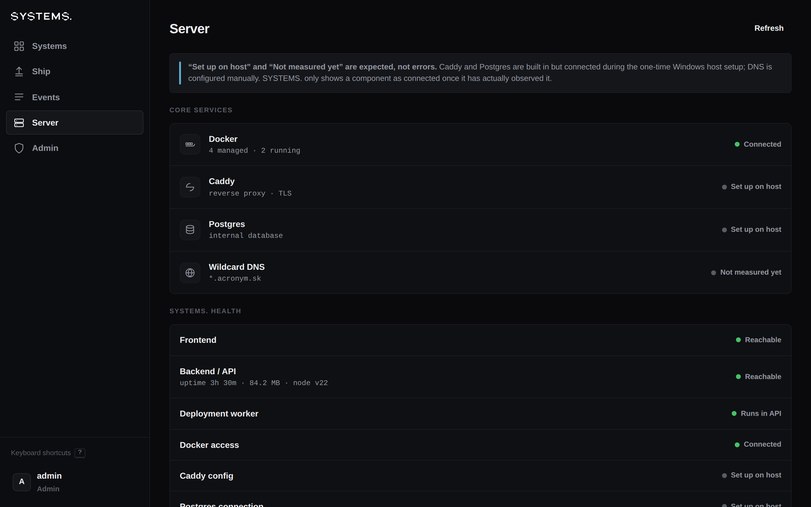
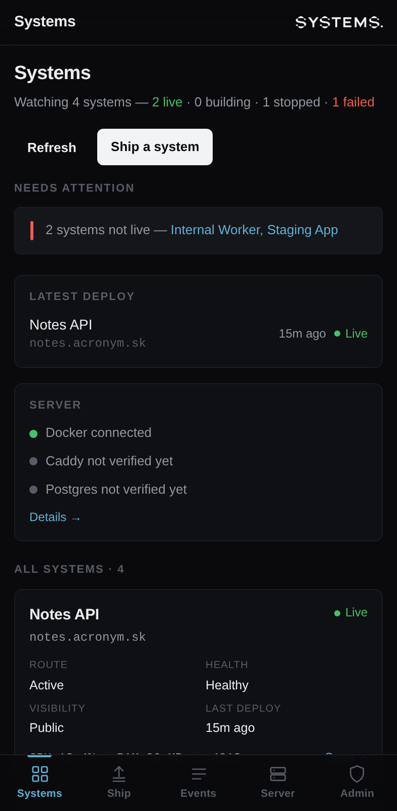

<p align="center">
  
</p>

# SYSTEMS.

<p align="center">
  <a href="https://github.com/b5463/systems/actions/workflows/ci.yml"></a>
  
  
  
  
</p>

Your own deployment engine. Drop in a zip and SYSTEMS. builds it, runs it in a
hardened Docker container, and serves it at its own subdomain with automatic
HTTPS. The push-button deploy flow you'd get from Vercel or Render — on a server
you actually own.

No cloud account, no per-seat billing, no shipping your source off to someone
else's platform. It's self-hosted and admin-only: you deploy, watch, and roll
back from one dashboard. Every app you ship is a **system** — its own subdomain,
status, logs, metrics, and one-click rollback.

<p align="center">
  
  <br /><em>Zip in, live URL out — drop an archive, watch it build, and it's serving with HTTPS.</em>
</p>

**Where it's at:** 2.0 release candidate. The code is all here and tested; what's
left is proving the live pieces (Docker, Caddy, Postgres, HTTPS) on the real
Windows host.

## What you get

- **Zip in, live URL out.** Drop a Vue/Vite or static-site zip — it works out the
  build, runs it in a hardened container, and serves it at its own subdomain with HTTPS.
- **Per-system control.** Public, password-protected, or private; start, stop,
  restart, redeploy, roll back, delete — all one click.
- **Status you can trust.** It reconciles against what Docker is actually doing,
  so a crash or reboot never leaves a stale "running" badge — and tells you the
  difference between a build that failed and a container that crashed.
- **See everything.** Live logs, an interactive container shell, metrics, and an
  audit log of every action.
- **Yours, safely.** Admin-only with optional two-factor, encrypted env vars,
  typed-slug confirmation on destructive actions, and backups built in.

## A look around

<p align="center">
  
  <br /><em>The command center — every system's live status, what needs attention, and one-click control.</em>
</p>

<table>
  <tr>
    <td width="50%"><br /><em><b>Ship.</b> Drop a zip; see the container name and route before you commit.</em></td>
    <td width="50%"><br /><em><b>Control.</b> An honest status grid and one-click actions per system.</em></td>
  </tr>
  <tr>
    <td width="50%"><br /><em><b>Watch.</b> Docker, proxy, database, disk, backups — and SYSTEMS. itself.</em></td>
    <td width="50%" align="center"><br /><em><b>Anywhere.</b> Installable PWA — run your fleet from your phone.</em></td>
  </tr>
</table>

## Who it's for

- **Indie devs & makers** running a portfolio, a few side projects, and the odd
  client demo on a single VPS — without paying per-project or per-seat.
- **Small teams** that want push-button deploys on infrastructure they control,
  with the source never leaving their box.
- **Homelab / self-hosting** folks who'd rather own the whole stack than rent it.

### Where it fits

Vercel and Render are great — but they're someone else's cloud, metered and
multi-tenant. Bigger self-hosted PaaS tools (Coolify, Dokku, CapRover) are
powerful and general. SYSTEMS. is deliberately **small and opinionated**:
admin-only with a hard two-admin cap (no public signup, ever), Windows-first,
and obsessive about *honest* status — it never shows a green light it hasn't
actually verified. If you want a focused, auditable, single-host deploy engine
you can read end to end, that's the niche.

## Domain model

| Domain | Purpose |
| --- | --- |
| `acronym.sk` | The **primary** system — whichever one you flag to serve the bare root domain (e.g. your portfolio) |
| `systems.acronym.sk` | The SYSTEMS. dashboard |
| `{slug}.acronym.sk` | Each deployed system at its own subdomain (e.g. `notes.acronym.sk`) |

Every system always gets its `{slug}.acronym.sk` subdomain. You can additionally
mark **one** system as primary (System detail → Settings → Root domain) so it's
also served at the bare `acronym.sk`. The dashboard always stays on
`systems.acronym.sk`. A private system can't be primary (it has no public route).

DNS is configured **manually in Websupport** with a wildcard; SYSTEMS. does not
automate DNS. Assume these records exist:

```
A   acronym.sk     → SERVER_IP
A   *.acronym.sk   → SERVER_IP
```

DNS points the domains at the server; SYSTEMS. handles routing from there.

## Stack

| Part | Details |
| --- | --- |
| Frontend | Vue 3 + Vite (PWA) |
| API | Node.js + Fastify |
| Containers | Docker (isolated bridge network, per-container resource limits) |
| Reverse proxy | Caddy (it generates the route files; the local dev setup still uses nginx) |
| Internal DB | SQLite for now; Postgres is supported, you just point it at one |
| Auth | JWT bearer token, bcrypt password hashes, optional TOTP two-factor, sign-out-everywhere |

The Caddy and Postgres code is all here — you just connect it on the real
server. See [`docs/ARCHITECTURE.md`](docs/ARCHITECTURE.md) and the
[Windows checklist](docs/WINDOWS_VALIDATION_CHECKLIST.md).

## Admin model

- No public signup.
- Two admins maximum. The first comes from `.env` (`ADMIN_USERS`); the second is
  added on the Admin screen.
- All dashboard, API, and deployment actions require admin auth.
- Optional two-factor (TOTP) per admin, and a "sign out other sessions" control
  that invalidates any other tokens (also triggered by a password change/reset).

## Deployment support

- **Working now:** Vue/Vite source zips and static sites (it figures out the
  build type for you).
- **Wired up but off by default:** custom Dockerfiles, an interactive container
  shell, per-app Postgres provisioning, big (2 GB) chunked uploads, GitHub
  deploy-on-push, and outbound notifications. The endpoints and UI all exist;
  each one stays behind its `.env` flag until you enable it.
- **Still needs a real server to confirm:** Node API/worker runtimes, Caddy
  routing, Postgres, HTTPS — the parts that only a live host can prove out.
- See [`docs/V2_ROADMAP.md`](docs/V2_ROADMAP.md). The riskier features pull or
  run external code, so they're deliberately off until you turn them on.

## Dashboard

- **Systems** — overview: counts, what needs attention, latest deploy, system cards.
- **Ship** — build & deploy a zip (desktop workbench; stepped on mobile).
- **Events** — time-stamped audit log of admin and deploy actions.
- **Server** — what Docker / Caddy / Postgres / DNS are actually doing, plus how
  SYSTEMS. itself is holding up; "back up now" and a notification test.
- **Admin** — profile, password, two-factor, sessions, second admin, limits.
- **System detail** — overview, deployments, logs, metrics, console, settings
  (env vars, visibility, root-domain toggle, and — when enabled — repo mapping
  and DB provisioning).

## Run locally

```bash
# API (full functionality needs a Docker socket)
cp .env.example .env            # set JWT_SECRET, ENV_SECRET, ADMIN_USERS
cd api && npm install && npm run dev      # http://localhost:3000

# Dashboard
cd dashboard && npm install && npm run dev   # proxies /api to :3000
```

Run the tests:

```bash
cd api && npm test               # unit + route/integration tests (app.inject)
```

## Configuration

Everything is set in `.env` (copy from [`.env.example`](.env.example)). The keys
you actually need to run:

| Key | What it's for |
| --- | --- |
| `JWT_SECRET` | Signs admin session tokens. Long random string. |
| `ENV_SECRET` | AES-256-GCM key encrypting per-system env vars at rest. |
| `ADMIN_USERS` | First admin(s), `user:password` (two max, no public signup). |
| `BASE_DOMAIN` | Root domain (e.g. `acronym.sk`). |
| `CORS_ORIGIN` | Locked to the dashboard origin. |
| `REVERSE_PROXY` | `caddy` (production) or `nginx` (dev default). |
| `RECONCILE_INTERVAL_SEC` | How often status is reconciled against Docker (0 disables). |

Risky/extra capabilities are **off by default** and opt-in per flag:

| Flag | Enables |
| --- | --- |
| `ENABLE_LARGE_UPLOADS` | Chunked uploads up to `V2_UPLOAD_MAX_MB`. |
| `ENABLE_DOCKERFILE_MODE` | Building archives that ship their own Dockerfile. |
| `ENABLE_SHELL_CONSOLE` | Interactive in-container shell. |
| `ENABLE_DB_PROVISIONING` | Per-app Postgres database + role (needs `pg` + `POSTGRES_ADMIN_URL`). |
| `ENABLE_GITHUB_DEPLOYS` | Deploy-on-push webhook (needs `GITHUB_WEBHOOK_SECRET`). |
| `ENABLE_NOTIFICATIONS` | Outbound webhook alerts (needs `NOTIFY_WEBHOOK_URL`). |
| `ENABLE_BACKUP_SCHEDULER` | Periodic backups (manual backup is always available). |

## Project layout

```
api/         Fastify API — auth, deploy pipeline, lifecycle, routing, logs,
             metrics, audit, reconciliation, backups, gated V2 routes
  src/app.js   buildApp() — assembles the app (injectable in tests)
  src/routes/  HTTP/WS endpoints           src/services/  docker, proxy, caddy,
  src/util/    pure, unit-tested helpers                  nginx, health, backup,
  test/        node:test unit + integration               notify, reconcile
dashboard/   Vue 3 + Vite PWA (views, components, stores); scripts/ generates art
scripts/     Windows PowerShell ops (setup, deploy, backup, restore, update, checks)
docs/        Architecture, deployment, security, operations, per-feature guides
```

## Operations

- **Status stays honest** — reconciliation corrects each system against real
  Docker state on boot and every `RECONCILE_INTERVAL_SEC`.
- **Backups** — "Back up now" on the Server screen (or `POST /api/server/backup`)
  takes an online SQLite snapshot + Caddy routes; turn on the scheduler for
  periodic runs. Full-volume/offsite backups use the PowerShell scripts.
- **Recovery** — see [`docs/DISASTER_RECOVERY.md`](docs/DISASTER_RECOVERY.md).

## Production (Windows)

The target is a Windows host with Docker Desktop (WSL2, Linux containers). The
step-by-step guide is [`docs/WINDOWS_DEPLOYMENT.md`](docs/WINDOWS_DEPLOYMENT.md),
with PowerShell scripts in [`scripts/`](scripts) (`setup`, `deploy`, `backup`,
`restore`, `update`, `check-systems-health`, `check-firewall`,
`verify-hardening`). Data lives under `C:\ProgramData\SYSTEMS`. Linux is a
development path.

A bunch of this only really proves out on a live box — Docker, Caddy, Postgres,
HTTPS, DNS. Those bits say "requires host validation" in the UI and docs until
you've run them on the actual machine. The
[Windows checklist](docs/WINDOWS_VALIDATION_CHECKLIST.md) is the punch list.

## Security

SYSTEMS. controls Docker, the reverse proxy, uploaded code, env vars, routes,
and logs, so it is privileged. Keep it admin-only and private; never expose the
Docker socket, the proxy admin API, or the database to the internet; treat
uploaded code as untrusted. It is built to be hardened and least-privilege — not
"unhackable." See [`docs/SECURITY.md`](docs/SECURITY.md).

## FAQ

**Can other people sign up?** No. There's no public signup and a hard cap of two
admins — it's your control panel, not a service.

**What can I deploy today?** Vue/Vite and static-site zips, built and served
automatically. Node APIs, background workers, custom Dockerfiles, per-app
Postgres, GitHub deploy-on-push, and 2 GB chunked uploads are all built and wired
— off by default behind `.env` flags until you validate them on the host.

**What does it cost?** Nothing — it's yours. You bring a server (a Windows host
with Docker Desktop / WSL2) and a wildcard DNS record.

**Is it production-ready?** It's a 2.0 release candidate: the code is here and
tested, and the live pieces (Caddy, Postgres, HTTPS) are wired pending validation
on the real host — see the [Windows checklist](docs/WINDOWS_VALIDATION_CHECKLIST.md).

**Linux?** Linux is the dev path (nginx + SQLite); Windows + Caddy + Postgres is
the production target.

## Documentation

- [`docs/ARCHITECTURE.md`](docs/ARCHITECTURE.md) — architecture & data model
- [`docs/WINDOWS_DEPLOYMENT.md`](docs/WINDOWS_DEPLOYMENT.md) — Windows production guide
- [`docs/SERVER_DEPLOYMENT_GUIDE.md`](docs/SERVER_DEPLOYMENT_GUIDE.md) — deployment surface + Linux dev
- [`docs/DEPLOYMENT.md`](docs/DEPLOYMENT.md) — how a zip becomes a live system
- [`docs/SECURITY.md`](docs/SECURITY.md) — security model & firewall
- [`docs/OPERATIONS.md`](docs/OPERATIONS.md) — day-2 operations
- [`docs/BACKUPS.md`](docs/BACKUPS.md) — backup & restore
- [`docs/RESOURCE_LIMITS.md`](docs/RESOURCE_LIMITS.md) — per-container limits
- [`docs/HARDENING.md`](docs/HARDENING.md) — hardening verification
- [`docs/UPDATE_STRATEGY.md`](docs/UPDATE_STRATEGY.md) — updating SYSTEMS.
- [`docs/DISASTER_RECOVERY.md`](docs/DISASTER_RECOVERY.md) — recovery runbook
- [`docs/WINDOWS_VALIDATION_CHECKLIST.md`](docs/WINDOWS_VALIDATION_CHECKLIST.md) — host validation steps
- [`docs/V2_ROADMAP.md`](docs/V2_ROADMAP.md) — where this came from and where it's going
- Optional features (off by default): [`DATABASES`](docs/DATABASES.md) · [`LARGE_UPLOADS`](docs/LARGE_UPLOADS.md) · [`DOCKERFILE_MODE`](docs/DOCKERFILE_MODE.md) · [`WORKERS`](docs/WORKERS.md) · [`GITHUB_DEPLOYS`](docs/GITHUB_DEPLOYS.md) · [`NOTIFICATIONS`](docs/NOTIFICATIONS.md) · [`SHELL_CONSOLE`](docs/SHELL_CONSOLE.md)
