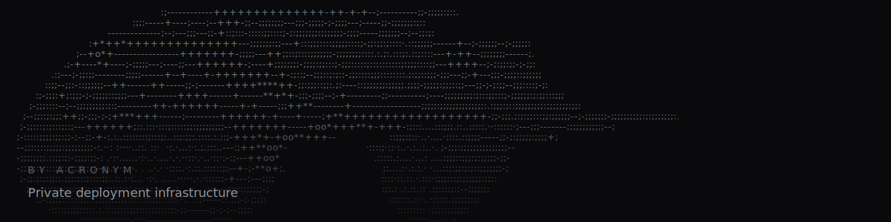

<p align="center">
  
  
</p>
<p align="center">
  
</p>

# SYSTEMS.
### by Acronym

A private, self-hosted deployment platform. A deployment cockpit for one
operator's own infrastructure — not a SaaS, not a generic admin dashboard.

> **North star:** Drop a zip. Get a live system at `slug.acronym.sk`.

SYSTEMS. is a private control surface for shipping, running, and monitoring
containerized systems on a single server — think lightweight, self-hosted
Heroku/Vercel/Fly.io for your own boxes.

---

## What SYSTEMS. is

- A **private deployment console** — admin-only, no public signup.
- A **system monitor & control surface** — live status, logs, metrics, console.
- A **routing manager** — it owns internal routing through a reverse proxy.

It is **not** a multi-tenant SaaS, a public PaaS, or a generic dashboard
template.

## Domain model

| Domain | Purpose |
| --- | --- |
| `acronym.sk` | Public portfolio (separate, not part of SYSTEMS.) |
| `systems.acronym.sk` | The private SYSTEMS. dashboard |
| `{slug}.acronym.sk` | A deployed system (e.g. `notes.acronym.sk`, `demo.acronym.sk`) |

### DNS — manual, wildcard, Websupport

DNS is managed **manually in Websupport** with a wildcard record. SYSTEMS. does
**not** automate DNS and has **no** Cloudflare/Websupport integration. Assume
these records exist:

```
A   acronym.sk     → SERVER_IP
A   *.acronym.sk   → SERVER_IP
```

DNS only points domains at the server. SYSTEMS. manages internal routing from
there (via the reverse proxy).

## The stack

| Concern | V1.1 (today) | V1.2 target |
| --- | --- | --- |
| Frontend | Vue 3 + Vite PWA | — |
| API | Node.js + Fastify | — |
| Internal DB | **SQLite** | **Postgres** (documented, not yet wired) |
| Reverse proxy | **nginx** + per-route configs | **Caddy** + `systems.d` route files |
| Containers | Docker (isolated bridge network) | — |
| Auth | JWT bearer token, bcrypt hashes | HTTP-only cookie sessions + CSRF |

> **Honesty note:** The locked platform decisions target **Postgres** and
> **Caddy**. V1.1 deliberately keeps the working **SQLite + nginx** backend
> intact rather than rushing a risky migration mid-flight. See
> [`docs/ARCHITECTURE.md`](docs/ARCHITECTURE.md) for the reasoning and the
> migration plan.

## Admin-only model

- No public signup, ever.
- V1 supports **two admins**. The first comes from `.env` (`ADMIN_USERS`);
  the second is added in the Admin screen.
- Every dashboard, API, and deployment action is admin-only.

## Deployment capability split

- **V1 / V1.1:** Vue/Vite source zips and static-site zips → static container.
  The build type is auto-detected from the archive.
- **V1.5 (if safe):** Node APIs; custom Dockerfile (advanced/admin-only).
- **V2:** 2 GB chunked uploads, databases, workers/bots, GitHub deploys,
  backups/restores, shell console, advanced metrics. See
  [`docs/V2_ROADMAP.md`](docs/V2_ROADMAP.md).

## The dashboard

Five operational surfaces plus a system detail view:

- **Systems** — command center: snapshot counts, needs-attention, latest deploy, system cards.
- **Ship** — desktop-first workbench to build & deploy a zip; guided steps on mobile.
- **Events** — audited, time-stamped stream of every admin/deploy action.
- **Server** — honest status of Docker / reverse proxy / database / wildcard DNS.
- **Admin** — profile, password, second admin, limits & retention, security/audit.
- **System detail** — Overview (truth model + grouped actions), Deployments, Logs, Metrics, Console, Settings.

## Local run basics

```bash
# 1. API (needs a Docker socket for full functionality)
cp .env.example .env            # fill in JWT_SECRET, ENV_SECRET, ADMIN_USERS
cd api && npm install && npm run dev      # http://localhost:3000

# 2. Dashboard
cd dashboard
cp .env.example .env            # optional; sets VITE_BASE_DOMAIN etc.
npm install && npm run dev      # proxies /api to localhost:3000
```

Open the dashboard, sign in with an `ADMIN_USERS` credential.

## Production deployment overview

**Production target is Windows** (Docker Desktop + WSL2, Linux containers). The
canonical, step-by-step guide is
[`docs/WINDOWS_DEPLOYMENT.md`](docs/WINDOWS_DEPLOYMENT.md), driven by PowerShell
scripts in [`scripts/`](scripts) (`setup`, `deploy`, `backup`, `restore`,
`update`, `check-systems-health`, `check-firewall`). Data lives under
`C:\ProgramData\SYSTEMS`. Linux remains a dev/secondary path.

## ⚠️ Security warning

SYSTEMS. controls Docker, the reverse proxy, uploaded source code, environment
variables, routes, and logs. It is **privileged infrastructure**. Run it
**admin-only and private**, never expose the Docker socket, the proxy admin API,
or the database to the public internet, and treat uploaded code as untrusted.
It is hardened and least-privilege by design — it is **not** "unhackable." See
[`docs/SECURITY.md`](docs/SECURITY.md).

## Documentation

- [`docs/ARCHITECTURE.md`](docs/ARCHITECTURE.md) — system architecture & data model
- [`docs/WINDOWS_DEPLOYMENT.md`](docs/WINDOWS_DEPLOYMENT.md) — **canonical** Windows production guide
- [`docs/SERVER_DEPLOYMENT_GUIDE.md`](docs/SERVER_DEPLOYMENT_GUIDE.md) — deployment surface + Linux dev path
- [`docs/DEPLOYMENT.md`](docs/DEPLOYMENT.md) — how a zip becomes a live system
- [`docs/SECURITY.md`](docs/SECURITY.md) — security model, posture & firewall
- [`docs/OPERATIONS.md`](docs/OPERATIONS.md) — day-2 operations, backups, limits, disk
- [`docs/UPDATE_STRATEGY.md`](docs/UPDATE_STRATEGY.md) — updating SYSTEMS. safely
- [`docs/DISASTER_RECOVERY.md`](docs/DISASTER_RECOVERY.md) — recovery runbook
- [`docs/V2_ROADMAP.md`](docs/V2_ROADMAP.md) — what's coming

---

**SYSTEMS.** — *by Acronym.* A private deployment cockpit. Not another generic dashboard.
