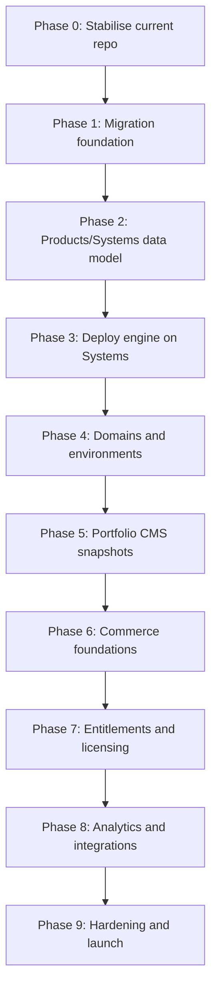

# SYSTEMS. V4 — Slow and Steady Technical Roadmap

**Document status:** implementation roadmap, reviewed and corrected  
**Repository baseline:** current `systems-main(3).zip`  
**Roadmap style:** conservative, phased, test-gated, rollback-friendly  
**Companion documents:**

- `docs/V4/V4_PROPOSAL.md`
- `docs/V4/SYSTEMS_V4_TECHNICAL_UPGRADE_PLAN.md`
- `docs/V4/V4_IDENTITY_LICENSING_ADDITION.md`
- `docs/V4/SYSTEMS_V4_APP_BUILDER_GUIDE.md`

---

## 1. Roadmap principle

V4 must be built as an evolution, not a rewrite.

The current SYSTEMS. repository already has valuable production-grade foundations:

```text
Fastify API
Vue dashboard
SQLite WAL control database
Docker deployment engine
Caddy route generation
health checks
stats
logs
audit chain
sessions
CSRF
TOTP
IP denylist
resource limits
backup/restore scripts
GitHub deploy hooks
chunked uploads
database provisioning helpers
hardening docs
```

The safest V4 path is:

```text
stabilise current control plane
→ introduce new data model beside old one
→ migrate projects into systems
→ split products from systems
→ add portfolio publishing
→ add commerce
→ add entitlements/licensing
→ add analytics/external integrations
→ harden and launch
```

Do **not** start by building the pretty portfolio UI, Stripe checkout, or product-key system. Those depend on the data model, jobs, migrations and recovery flow being trustworthy first.

---

## 2. Ground rules for the whole upgrade

### 2.1 One major risk at a time

Never combine these in one phase:

```text
database migration
routing migration
Stripe/payment launch
licence/access revocation
public portfolio launch
dashboard redesign
```

Each of those can break the platform alone. Combining them makes failures hard to understand.

### 2.2 Keep the old system working

Until V4 reaches launch readiness:

```text
/api/projects must keep working
existing deploy flow must keep working
existing dashboard must still be usable
existing backup/restore must still run
existing projects must not disappear
```

### 2.3 Every phase must have a rollback point

A phase is not finished unless there is a documented rollback path.

### 2.4 Feature flags are mandatory

Every new V4 surface starts behind a flag.

```env
ENABLE_V4_PLATFORM=false
ENABLE_V4_PRODUCTS=false
ENABLE_V4_SYSTEMS=false
ENABLE_V4_PORTFOLIO=false
ENABLE_V4_COMMERCE=false
ENABLE_V4_LICENSING=false
ENABLE_V4_ANALYTICS=false
ENABLE_V4_EXTERNAL_INTEGRATIONS=false
```

### 2.5 Do not move customer money through unfinished infrastructure

Stripe and subscription logic should only be connected after:

```text
PostgreSQL works
migrations work
jobs work
audit works
backup/restore works
products/offers exist
entitlements exist
webhooks are idempotent
```

### 2.6 No silent failures

Remove or quarantine new code that uses:

```js
try { ... } catch {}
```

V4 needs explicit failures, explicit migrations and explicit recovery.

---

## 3. Recommended implementation style

Use small pull requests.

Recommended PR size:

```text
1 database migration + 1 repository + 1 route group + tests
```

Avoid PRs that mix:

```text
schema + dashboard + deploy engine + Stripe + UI polish
```

A good V4 PR should be understandable in one review session.

---

## 4. Workstream order

V4 has many parts, but they should not be built at the same time.

Correct order:



---

## 4.1 Canonical API namespace strategy

Use `/api/...` everywhere. Do not introduce `/v1/...` or `/api/v4/...` paths in V4. Versioning belongs in payload schemas and compatibility contracts, not in the URL path.

Canonical namespaces:

```text
/api/projects/*          legacy compatibility only
/api/auth/*              administrator authentication
/api/admin/*             SYSTEMS. administration
/api/products/*          product management
/api/systems/*           system, environment, release and deployment management
/api/portfolio/*         Portfolio CMS, drafts, snapshots and publishing
/api/public/*            public-safe catalog, product pages, checkout helpers and forms
/api/commerce/*          offers, orders, subscriptions and billing portal actions
/api/customers/*         customer records and customer-linked access state
/api/entitlements/*      effective access checks and admin grants/revocations
/api/licensing/*         product-key redemption, activation, validation and device handling
/api/analytics/*         aggregated product and operations analytics
/api/integrations/*      integration-key administration
/api/ingest/*            app/external heartbeat, release, error, event and metric ingestion
/api/webhooks/*          Stripe, GitHub and provider webhooks
```

Schema names may still be versioned inside request bodies, for example `systems.event.v1` or `systems.license.validate.v1`. That keeps compatibility explicit without creating competing URL families.

Hard rule: dashboard/admin APIs, public APIs, webhooks and app-ingestion APIs must have separate authentication and rate-limit policies even though all use `/api/...`.

---

# Phase 0 — Stabilise the current repository

## Goal

Make the current system safer before adding V4 complexity.

## Why this phase comes first

The current repo is already good, but V4 will increase write volume, operational risk and commercial responsibility. Fix small foundational issues before the schema and dashboard get larger.

## Tasks

### Backend

- Add `PATCH` to Fastify CORS methods.
- Add global request ID generation.
- Add request ID to logs and audit entries.
- Add `/api/server/schema` endpoint.
- Add `/api/server/features` endpoint.
- Add global API response shape for errors.
- Add stricter payload-size defaults for JSON routes.
- Add pagination defaults and maximums where list endpoints can grow.
- Add a visible warning when SQLite is used in production mode.
- Add feature flag helper for all V4 gates.

### Database

- Keep current SQLite tables unchanged.
- Add `schema_migrations` table.
- Add migration runner skeleton.
- Stop adding new V4 schema through silent `ALTER TABLE` blocks.
- Add test-only migration reset utility.

### Jobs

- Add minimal `jobs` table.
- Add in-process job runner disabled by default.
- Add job lock/unlock behavior.
- Add retry/backoff fields.
- Add job dashboard placeholder under Server.

### Early resource protection

Confirm existing host-protection behaviour remains active before V4 work starts:

```text
build concurrency remains capped
disk admission checks run before uploads/builds
large uploads have explicit limits
admin APIs use no-store cache headers
public APIs are cache-classified
analytics and ingestion jobs have lower priority than commerce/entitlement jobs
container memory/CPU/PID/log limits remain enforced
```

### Tests

Add or update tests for:

```text
CORS allows PATCH
schema endpoint works
feature flags return expected values
migration runner records migration
job table accepts and locks jobs
legacy dashboard still loads
legacy deploy route still inject-tests
```

## Do not build yet

- PostgreSQL migration
- Products UI
- Portfolio UI
- Stripe
- Product keys

## Exit gate

Phase 0 is done only when:

```text
all existing tests pass
new Phase 0 tests pass
current dashboard works
current deploy flow still works
backup script still works
schema endpoint reports current schema
```

## Rollback

Revert Phase 0 PRs. No data migration should be required.

---

# Phase 0.5 — Baseline snapshot and namespace lock

## Goal

Create a known-good baseline before any database or route migration work begins, and lock the `/api/...` namespace decision.

## Tasks

Record and commit a baseline report containing:

```text
npm test result
lint/typecheck result where available
current API route list
current SQLite schema dump
current Caddy route files inventory
current Docker containers and labels
current backup dry run output
current feature flags
current deployable test app result
```

Add lightweight boundary tests for the final namespace strategy:

```text
/api/projects/* remains legacy-compatible
/api/public/* never requires admin cookies
/api/public/* exposes only allowlisted public fields
/api/ingest/* rejects admin JWTs and requires integration keys when enabled
/api/webhooks/* rejects unsigned provider events
/api/admin, /api/products, /api/systems and /api/commerce require admin auth
```

Add deprecation headers to legacy APIs once their V4 replacements exist, but do not remove them yet.

## Exit gate

```text
baseline report committed
namespace strategy documented
namespace boundary tests pass
legacy routes still work
no production data changed
```

## Rollback

Delete the baseline-only code and test additions. No data rollback should be required.

---

# Phase 1 — PostgreSQL and migration foundation

## Goal

Prepare PostgreSQL as the future V4 control-plane database without forcing the whole app onto it immediately.

## Why this phase comes before products

Products, orders, subscriptions, entitlements and analytics need reliable transactions. PostgreSQL should exist before commercial objects exist.

## Tasks

### Database connection

Add:

```text
api/src/db/postgres.js
api/src/db/sqlite-legacy.js
api/src/db/repositories/
api/src/db/migrate.js
api/src/db/migrations/
```

Environment:

```env
SYSTEMS_DB_ENGINE=sqlite|postgres
DATABASE_URL=
MIGRATIONS_AUTO_RUN=false
```

### Migration tooling

Add scripts:

```text
api/scripts/migrate-sqlite-to-postgres.js
api/scripts/verify-postgres-migration.js
scripts/migrate-v4-windows.ps1
scripts/verify-v4-windows.ps1
```

### First PostgreSQL schema

Create only foundational tables:

```text
schema_migrations
organisations
admin_users
admin_sessions
platform_settings
audit_log_v4
jobs
```

Do not migrate projects yet.

### Repository facade

Introduce repositories without changing every route immediately:

```text
repositories/usersRepository
repositories/settingsRepository
repositories/auditRepository
repositories/jobsRepository
```

Current routes can still use old `db` directly until migrated.

### Backup/restore

Extend backup scripts to optionally include:

```text
PostgreSQL pg_dump
schema migration state
job table
platform settings
audit tables
```

## Tests

```text
PostgreSQL connection test
migration order test
migration checksum test
migration failure test
backup includes PostgreSQL when configured
restore dry run detects PostgreSQL dump
SQLite legacy mode still works
```

## Do not build yet

- project migration
- products
- systems
- Stripe
- portfolio CMS

## Exit gate

```text
SQLite mode passes all tests
PostgreSQL mode passes foundation tests
migration runner is deterministic
backup/restore scripts understand PostgreSQL
no dashboard behaviour changed
```

## Rollback

Turn `SYSTEMS_DB_ENGINE=sqlite`. No production object migration should be required yet.

---

# Phase 2 — Introduce V4 Products/Systems model beside Projects

## Goal

Create the V4 domain model while keeping current `projects` alive.

## Why this phase matters

This is the real foundation of V4. If this is wrong, everything later becomes painful.

## New tables

Add:

```text
products
systems
system_environments
releases
domains
environment_secrets
infrastructure_metrics
health_snapshots
legacy_project_map
```

## Migration approach

Do not delete or mutate old projects aggressively.

Use this bridge:

```text
projects
→ legacy_project_map
→ systems
→ production environment
→ current release
→ default domain
```

## Mapping

```text
projects.name                 → systems.name
projects.slug                 → systems.slug
projects.deploy_type          → systems.system_type
projects.status               → systems.current_status
projects.repo                 → systems.repo
projects.deploy_branch        → systems.deploy_branch
projects.is_primary           → systems.is_primary_root

projects.visibility           → system_environments.access_policy
projects.health_path          → system_environments.health_path
projects.route_published      → system_environments.route_published
projects.basic_user/hash      → system_environments basic auth fields

projects.container_id         → releases.container_id
projects.image_id             → releases.image_id
projects.port                 → releases.port
projects.previous_*           → previous release metadata
```

## API

Add read-only first:

```text
GET /api/systems
GET /api/systems/:id
GET /api/systems/:id/environments
GET /api/systems/:id/releases
GET /api/products
GET /api/products/:id
```

Then add write APIs only after read APIs are stable:

```text
POST /api/systems
PATCH /api/systems/:id
POST /api/products
PATCH /api/products/:id
```

## Compatibility

Keep:

```text
GET /api/projects
GET /api/projects/:slug
```

But internally allow them to read from V4 tables when `ENABLE_V4_SYSTEMS=true`.

## Dashboard

Do not redesign everything.

First dashboard step:

```text
current Systems page
→ can display V4-backed systems through same visual layout
```

Do not add Product screens yet except a simple hidden admin/test page.

## Tests

```text
project-to-system migration test
legacy projects API still works
systems API returns migrated projects
one project becomes one system with production environment
deploy_history can map to releases
health/stats map correctly
route_published maps correctly
```

## Do not build yet

- multiple environments UI
- promote preview
- portfolio CMS
- commerce
- licensing

## Exit gate

```text
all current projects are visible as systems
legacy project API still works
current deploy flow still works
no route files changed by migration alone
backup/restore includes V4 tables
```

## Rollback

Keep old `projects` table as source of truth. Disable `ENABLE_V4_SYSTEMS`.

---

# Phase 2.5 — Migration reconciliation checkpoint

## Goal

Prove that the current `projects` world and the new `systems/environments/releases/domains` world describe the same running platform before deploy logic is moved.

## Tasks

Build a reconciliation command:

```text
api/scripts/reconcile-v4-migration.js
```

It must verify:

```text
every project maps to one system
every mapped system has a production environment
every running container maps to a release
every route maps to a domain/environment
every route can be regenerated without changing active output unexpectedly
every encrypted env var decrypts under current ENV_SECRET
deploy_history rows map to releases
stats_history rows map to infrastructure metrics
health state maps to health snapshots
backup includes both legacy and V4 tables during dual mode
restore can recover the dual-mode state
```

Add an operator-facing report in Server/Admin showing:

```text
mapped projects
unmapped projects
orphan containers
orphan routes
missing domains
missing releases
env decryption failures
backup coverage status
```

## Exit gate

```text
reconciliation passes on current test data
no orphan running containers
no unknown active routes
environment secrets decrypt correctly
backup/restore works in dual mode
legacy dashboard and V4 Systems API agree on counts
```

## Rollback

Keep using legacy `projects` as the source of truth and disable `ENABLE_V4_SYSTEMS`.

---

# Phase 3 — Move deploy engine from Projects to Systems/Environments

## Goal

Make deployment target a `system_environment`, not a `project`.

## Why this phase comes after migration

The platform must understand systems/environments before the deploy engine can target them.

## New deployment routes

```text
POST /api/systems/:systemId/environments/:environment/deploy
POST /api/systems/:systemId/environments/:environment/redeploy
POST /api/systems/:systemId/environments/:environment/rollback
GET  /api/systems/:systemId/environments/:environment/logs
GET  /api/systems/:systemId/environments/:environment/stats
```

## Keep legacy routes

```text
POST /api/deploy
POST /api/projects/:slug/redeploy
POST /api/projects/:slug/rollback
```

Legacy routes should call the new deployment service through the mapping layer.

## Refactor

Extract from current deploy route into service:

```text
deployService.detect()
deployService.extract()
deployService.build()
deployService.runContainer()
deployService.verifyHealth()
deployService.recordRelease()
deployService.publishRoute()
deployService.rollback()
```

## Docker labels

Add labels to containers:

```text
systems.organisation_id
systems.system_id
systems.environment_id
systems.release_id
systems.slug
systems.environment
```

## Preview environment

Add backend support for:

```text
production
preview
```

Do not expose full preview UI until deploy tests pass.

## Promotion

Add:

```text
POST /api/systems/:systemId/promote
```

Promotion flow:

```text
preview release exists
→ health/readiness passes
→ production container starts
→ production route switches
→ previous production retained
→ release recorded
```

## Tests

```text
new deploy route deploys to environment
legacy deploy route still works
container labels are present
preview deploy does not affect production
promotion switches production only after health passes
rollback returns previous release
failed deploy leaves old release running
```

## Do not build yet

- custom domains
- portfolio
- Stripe
- product-key generation

## Exit gate

```text
one test app can deploy through new systems route
legacy deploy still works
preview and production can coexist
rollback works
Caddy routes still publish correctly
```

## Rollback

Legacy deploy routes remain available. Disable `ENABLE_V4_SYSTEM_DEPLOY`.

---

# Phase 4 — Domains, routing, access and maintenance

## Goal

Move routing from project-shaped logic to domain/environment records.

## Why this phase comes before portfolio and commerce

Public products and paid products need reliable routing, custom domains, access state and maintenance mode.

## New domain behavior

Support:

```text
{slug}.acronym.sk
custom domains
canonical redirects
preview domains
private systems
password/preview-protected systems
maintenance mode
```

## Tables

Use:

```text
domains
maintenance_windows
route_publication_attempts
```

## Caddy service upgrade

Current route renderer should become domain-driven:

```text
renderRoute({
  hostname,
  upstreamHost,
  upstreamPort,
  accessPolicy,
  basicAuth,
  canonicalRedirect,
  maintenanceMode,
  attestation
})
```

## Route publication transaction

```text
write pending route
→ validate Caddy config
→ reload Caddy
→ probe route
→ mark active
```

Never mark a route active before validation and reload succeed.

## Custom domain verification

Flow:

```text
add hostname
→ generate verification token
→ show DNS instructions
→ verify TXT/CNAME/A record
→ publish route
→ check TLS
→ allow canonical selection
```

## Tests

```text
default subdomain route works
private system publishes no public route
password route works
route reload failure keeps old route
custom domain cannot activate without verification
canonical redirect works
maintenance mode route works
```

## Do not build yet

- public portfolio launch
- Stripe checkout
- licence delivery

## Exit gate

```text
routes are generated from domains table
current Caddy files can be regenerated
failed route changes are recoverable
default project subdomains still work
```

## Rollback

Keep old project-based route generator available behind `REVERSE_PROXY_LEGACY_ROUTES=true`.

---

# Phase 5 — Portfolio CMS and Acronym public renderer

## Goal

Build portfolio management directly into SYSTEMS., while keeping `acronym.sk` as a separately deployed public renderer.

## Why this comes after routing

The public portfolio needs stable domains, root/apex routing and safe publication.

## Portfolio module

Dashboard navigation adds:

```text
Portfolio
Products
Systems
```

Portfolio area includes:

```text
homepage editor
navigation editor
product-page editor
media library
legal pages
redirects
locales
preview
publish history
snapshot rollback
```

## Tables

Add:

```text
portfolio_pages
product_portfolio_profiles
portfolio_blocks
portfolio_snapshots
portfolio_redirects
public_forms
form_submissions
lead_status
media_assets
legal_versions
```

## Snapshot rule

Public site must consume immutable snapshots.

```text
draft CMS tables
→ validation
→ preview snapshot
→ publish
→ immutable snapshot
→ public catalog API
→ acronym.sk renderer cache
```

The public renderer must not query draft tables.

## Locales

Initial locales:

```text
sk
en
```

Add:

```text
localized slugs
localized SEO
language switch mapping
translation completeness
fallback rules
localized legal pages
```

## Public catalog API

```text
GET /api/public/catalog?locale=sk
GET /api/public/catalog?locale=en
GET /api/public/products/:slug?locale=sk
GET /api/public/snapshot/latest?locale=en
```

Public catalog must expose only safe data.

Never expose:

```text
container IDs
ports
repo URLs
deployment logs
internal routes
admin IDs
customer data
billing internals
secret names
```

## Renderer

Deploy `acronym.sk` as first primary V4 system.

Renderer requirements:

```text
pre-rendered pages
snapshot cache
last-known-good snapshot
ETag
stale-while-revalidate
hashed assets
no live DB dependency for public page render
```

## Tests

```text
draft change does not alter public site
publish creates immutable snapshot
snapshot rollback works
SK and EN pages render
translation missing state is visible
public API exposes no private fields
renderer works when SYSTEMS API is temporarily down
```

## Do not build yet

- live payments
- product-key emails
- entitlement enforcement

## Exit gate

```text
Portfolio CMS can publish SK/EN snapshots
acronym.sk renders from snapshot
portfolio remains available during SYSTEMS API outage
root domain is operated as a primary system
```

## Rollback

Use last-known-good snapshot. Disable new publish actions.

---

# Phase 6 — Commerce foundation without licence enforcement

## Goal

Add offers, customers, orders and subscriptions with Stripe, but do not yet enforce access in apps.

## Why this phase is intentionally limited

Money flow must be stable before access revocation/product keys are automated.

## Tables

Add:

```text
offers
customers
orders
subscriptions
payment_webhook_events
checkout_disclosures
```

## Stripe integration

Add:

```text
Stripe Checkout
Stripe Customer Portal
signed webhook endpoint
webhook idempotency
manual order creation
complimentary order creation
```

## Checkout flow

```text
product page
→ create checkout session
→ Stripe Checkout
→ signed webhook
→ order/subscription record
→ confirmation page
```

Important rule:

```text
success redirect must never grant access
```

## Subscription states

Mirror Stripe into SYSTEMS:

```text
trialing
active
past_due
cancel_at_period_end
cancelled
expired
```

Do not yet enforce those states in apps. Just record them correctly.

## Legal/compliance capture

Capture per checkout:

```text
terms version
privacy version
withdrawal consent if needed
marketing consent if used
locale
billing country
tax/VAT evidence fields where needed
```

Legal/accounting text still needs external Slovak professional approval before live launch.

## Stripe reconciliation jobs

Webhook idempotency is not enough. Add reconciliation jobs before any live billing:

```text
stripe.reconcile.checkout_sessions
stripe.reconcile.subscriptions
stripe.reconcile.invoices
stripe.reconcile.entitlements
```

These jobs handle delayed, missed, duplicated and out-of-order Stripe events.

## Tests

```text
checkout session creation
webhook signature verification
duplicate webhook does not duplicate order
subscription created
subscription updated
subscription deleted
invoice payment failed recorded
manual order audited
checkout disclosure captured
```

## Do not build yet

- automatic product-key delivery
- entitlement-based app locking
- licence revocation
- subscription suspension logic

## Exit gate

```text
test-mode Stripe checkout works
webhooks are idempotent
orders/subscriptions visible in dashboard
no access is granted from redirect
backup/restore includes commerce tables
```

## Rollback

Disable checkout creation. Keep recorded test data or purge in non-production.

---

# Phase 7 — Entitlements, product keys and licensing

## Goal

Connect payments/subscriptions to customer access, product keys and licence validation.

## Why this comes after commerce

Access enforcement depends on trustworthy payment state.

## Tables

Add:

```text
entitlement_grants
entitlement_revocations
entitlement_resolution_snapshots
effective_entitlements
licences
licence_activations
entitlement_events
licence_events
licence_signing_keys
```

## Core flow

```text
verified payment/subscription/manual grant/promo/trial
→ entitlement grant
→ entitlement resolver
→ effective entitlement
→ licence or hosted access
→ fulfilment email
→ redemption/activation
→ validation
→ renewal/revocation
```

## Entitlement-grant model

Do not treat a single order or subscription as the entitlement itself. Orders, subscriptions, manual grants, trials, promotions and compensations are all entitlement sources. The resolver calculates the effective entitlement from those grants.

This prevents broken edge cases such as:

```text
lifetime purchase plus active subscription
manual grace access during failed payment
refund of one offer while another valid offer remains
upgrade/downgrade overlap
temporary admin grant
complimentary access for testing/support
```

The effective entitlement is what apps check. Grants and revocations are the audit/source-of-truth history.

## Product-key rules

```text
high entropy keys
store hash, not raw key
show raw key only at creation or through secure redemption
never encode email/price/plan into key
support revocation
support replacement
support activation limits
audit every action
```

## APIs

```text
POST /api/entitlements/check
POST /api/entitlements/admin/grant
POST /api/entitlements/admin/revoke
POST /api/licensing/redeem
POST /api/licensing/activate
POST /api/licensing/validate
POST /api/licensing/deactivate
```

## Signed licence leases

Use signed time-limited leases so apps do not fail instantly when SYSTEMS. is unavailable.

```text
validUntil
offlineUntil
features
subscription state
signature
```

## Licence signing-key management

Signed leases require managed signing keys, not hardcoded secrets. Add:

```text
licence_signing_keys table
current and previous signing key support
key ID in every lease
public-key endpoint for app verification
revocation-list endpoint where needed
emergency key-rotation runbook
```

Use a modern asymmetric signing approach so apps can verify leases without holding SYSTEMS. private secrets.

## Subscription access behavior

Do not instantly lock users out after first failed payment.

Recommended flow:

```text
active
→ payment failed
→ past_due
→ grace
→ suspended
→ recovered or cancelled
```

## Email fulfilment

SYSTEMS. sends:

```text
purchase confirmation
redemption link
billing portal link
licence activation instructions
support link
```

Do not email permanent raw master keys unless a specific product truly requires it.

## Tests

```text
one-time purchase creates perpetual entitlement
subscription creates renewable entitlement
duplicate webhook does not duplicate entitlement
refund revokes entitlement
chargeback revokes entitlement
licence key redemption works once
activation limit works
validation returns signed lease
expired subscription suspends after grace
SYSTEMS outage still allows cached lease until offlineUntil
```

## Exit gate

```text
one internal test product can be bought
entitlement is created automatically
licence can be redeemed
subscription failure moves through grace/suspension correctly
admin can manually grant/revoke access
all actions are audited
```

## Rollback

Disable automated fulfilment. Keep manual entitlement grants available.

---

# Phase 8 — Product analytics and external integrations

## Goal

Allow managed and external products to report health, releases, errors, events and usage.

## Why this comes after licensing

Analytics should describe real customer/product state, not invent it before commerce and entitlements exist.

## Integration keys

Add:

```text
integration_keys
integration_key_events
```

Scopes:

```text
heartbeat:write
events:write
errors:write
releases:write
metrics:write
entitlements:check
licences:validate
```

## Ingestion endpoints

```text
POST /api/ingest/heartbeat
POST /api/ingest/releases
POST /api/ingest/errors
POST /api/ingest/events
POST /api/ingest/metrics
```

## Event storage

Add:

```text
product_events
product_metric_hourly
product_metric_daily
error_groups
release_reports
external_heartbeats
```

## Aggregation

Do not query raw events for dashboard cards.

Use jobs:

```text
analytics.aggregate.hourly
analytics.aggregate.daily
analytics.compact.raw
analytics.retention.cleanup
```

## Safety

Analytics must never block:

```text
Stripe webhooks
entitlement checks
licence validation
admin login
deploy rollback
```

## Tests

```text
bad integration key rejected
scoped key cannot access wrong endpoint
event payload size capped
heartbeat updates external system health
release report appears in dashboard
analytics aggregation creates daily metrics
high event volume is rate-limited
analytics failure does not affect entitlement checks
```

## Exit gate

```text
external test app can report heartbeat
managed app can send events
dashboard shows product analytics from aggregates
integration keys can be rotated/revoked
```

## Rollback

Disable ingestion endpoints. Keep existing infra stats.

---

# Phase 9 — Hardening, operations and launch readiness

## Goal

Make V4 safe enough to run real public portfolio and real paid products.

## Security hardening

Add/verify:

```text
RBAC roles
owner/admin/operator/commerce/viewer permissions
TOTP enforced option
session revocation
secret write-only UI
integration key hashing
licence signing key rotation
Stripe webhook signing
media quarantine
public API allowlist
admin audit coverage
rate limits per route class
```

## Reliability

Verify:

```text
backup/restore on clean host
Caddy route recovery
PostgreSQL restore
media restore
portfolio snapshot restore
commerce restore
entitlement restore
licence restore
job recovery
```

## Load and resource protection

Test:

```text
large upload cap
build concurrency
disk admission control
container memory limits
container CPU limits
analytics event flood
webhook burst
public catalog cache
renderer last-known-good snapshot
```

## Legal/compliance launch gates

Before live commerce:

```text
terms approved
privacy approved
cookie policy approved
digital content withdrawal flow approved
subscription cancellation wording approved
VAT/accounting flow approved
refund/complaints flow approved
GDPR export/delete flow reviewed
accessibility baseline checked
```

## Operational runbooks

Create/update:

```text
V4_DEPLOY_RUNBOOK.md
V4_ROLLBACK_RUNBOOK.md
V4_STRIPE_INCIDENT_RUNBOOK.md
V4_ENTITLEMENT_RECOVERY_RUNBOOK.md
V4_DOMAIN_RECOVERY_RUNBOOK.md
V4_BACKUP_RESTORE_RUNBOOK.md
V4_SECURITY_INCIDENT_RUNBOOK.md
```

## Launch rehearsal

Run a full rehearsal:

```text
deploy portfolio renderer
publish SK/EN snapshot
deploy test product
create offer
run Stripe test purchase
create entitlement
redeem licence
simulate failed payment
simulate recovery
simulate refund
restore backup on clean machine
roll back product release
roll back portfolio snapshot
```

## Exit gate

V4 is launch-ready only when:

```text
all V4 tests pass
all old tests pass
restore drill passes
test purchase passes
test subscription lifecycle passes
public snapshot works while API is down
no critical security findings open
legal/accounting review is complete
operator can recover from failed deploy/domain/payment scenarios
```

---

# 10. Suggested milestone sequence

## Milestone A — Safe base

Includes:

```text
Phase 0
Phase 1
```

Outcome:

```text
Current SYSTEMS. is safer.
PostgreSQL path exists.
No major user-visible V4 feature yet.
```

Do not skip this milestone.

## Milestone B — V4 operational core

Includes:

```text
Phase 2
Phase 3
Phase 4
```

Outcome:

```text
SYSTEMS. understands products/systems/environments/releases/domains.
Deployment still works.
Routing is safer.
```

This is the most important milestone.

## Milestone C — Acronym public portfolio

Includes:

```text
Phase 5
```

Outcome:

```text
Portfolio CMS lives in SYSTEMS.
acronym.sk renders published snapshots.
```

This can go public before commerce if needed.

## Milestone D — Paid products

Includes:

```text
Phase 6
Phase 7
```

Outcome:

```text
Stripe, orders, subscriptions, entitlements, product keys and licences work.
```

This should stay in test mode until heavily verified.

## Milestone E — Intelligence and scale

Includes:

```text
Phase 8
Phase 9
```

Outcome:

```text
External systems, analytics, hardening, recovery and launch operations are complete.
```

---

# 11. Stop signs

Stop implementation and fix foundations if any of these happen:

```text
legacy deploy breaks
backup/restore cannot restore current state
migration cannot be repeated safely
Stripe webhook creates duplicate access
route reload breaks unrelated systems
public catalog exposes internal data
analytics ingestion slows entitlement checks
licence validation requires SYSTEMS. to be online every time
customer access changes without audit log
dashboard cannot explain why a product is visible/sellable/access-controlled
```

These are not polish issues. They are architecture issues.

---

# 12. Definition of done per phase

A phase is done only when:

```text
code merged
tests added
old tests still pass
feature flag exists
dashboard state is understandable
audit events exist for dangerous actions
backup impact is documented
rollback path is documented
operator runbook is updated
```

Without these, the phase is only partially implemented.

---

# 13. Development team rhythm

Recommended rhythm:

```text
1. plan the phase
2. create schema migration
3. add repository layer
4. add API routes
5. add tests
6. add minimal dashboard
7. run migration on test data
8. run backup/restore
9. enable feature flag in staging
10. observe
11. then move to next phase
```

Avoid starting the next phase because the UI “looks done.” V4 is mostly a correctness and reliability project.

---

# 14. First five implementation PRs

The first five PRs should be boring.

## PR 1 — Current repo hardening and namespace lock

```text
CORS PATCH
request IDs
schema endpoint
feature flags endpoint
pagination constants
/api namespace boundary tests
baseline report generator
```

## PR 2 — Migration runner

```text
schema_migrations
migration runner
migration tests
no V4 product tables yet
```

## PR 3 — Jobs foundation

```text
jobs table
job repository
in-process runner disabled by default
job tests
server UI placeholder
```

## PR 4 — PostgreSQL connection

```text
pg pool
DATABASE_URL validation
PostgreSQL health check
foundation migration
backup script extension
```

## PR 5 — Organisations and admin migration

```text
organisations table
admin_users table
settings/audit repository
migration verification script
```

Only after these should the team start Products/Systems.

---

# 15. Final recommendation

The slowest-looking path is actually the fastest safe path.

The dangerous path is:

```text
portfolio UI
→ Stripe checkout
→ product keys
→ then fix database/model later
```

That will create customer-facing debt.

The correct path is:

```text
database/migrations/jobs
→ products/systems/environments/releases
→ deploy/routing
→ portfolio snapshots
→ commerce
→ entitlements/licensing
→ analytics/integrations
→ hardening
```

That is the roadmap that gives V4 a real chance of becoming a stable product platform instead of a large fragile dashboard.
