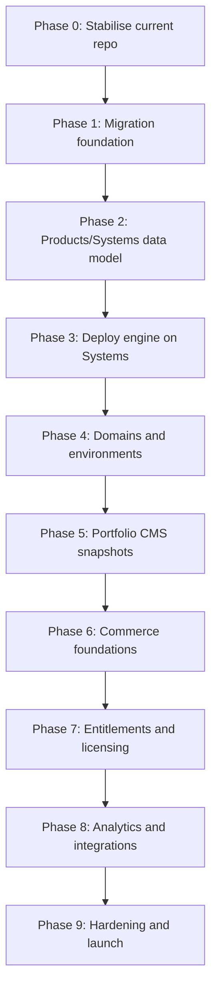

# SYSTEMS. V4 — Slow and Steady Technical Roadmap

**Document status:** implementation roadmap, reviewed and corrected  
**Repository baseline:** current `systems-main(3).zip`  
**Roadmap style:** conservative, phased, test-gated, rollback-friendly  
**Companion documents:**

- `docs/V4/V4_PROPOSAL.md` — definitive product and architecture proposal
- `docs/V4/SYSTEMS_V4_TECHNICAL_UPGRADE_PLAN.md` — technical upgrade plan based on current repository
- `docs/V4/V4_IDENTITY_LICENSING_ADDITION.md` — identity, entitlements, licensing and product-user analytics
- `docs/V4/SYSTEMS_V4_APP_BUILDER_GUIDE_FIXED.md` — app builder integration guide and acceptance levels
- `docs/V4/V4_DEVELOPER_ALLOCATION.md` — task allocation between Alex and Tomas

---

## 1. Roadmap principle

V4 must be built as an evolution, not a rewrite.

The current SYSTEMS. repository already has valuable production-grade foundations:

```text
Fastify API
Vue dashboard
SQLite WAL control database
Docker deployment engine
Caddy route generation
health checks
stats
logs
audit chain
sessions
CSRF
TOTP
IP denylist
resource limits
backup/restore scripts
GitHub deploy hooks
chunked uploads
database provisioning helpers
hardening docs
```

The safest V4 path is:

```text
stabilise current control plane
→ introduce new data model beside old one
→ migrate projects into systems
→ split products from systems
→ add portfolio publishing
→ add commerce
→ add entitlements/licensing
→ add analytics/external integrations
→ harden and launch
```

Do **not** start by building the pretty portfolio UI, Stripe checkout, or product-key system. Those depend on the data model, jobs, migrations and recovery flow being trustworthy first.

---

## 2. Ground rules for the whole upgrade

### 2.1 One major risk at a time

Never combine these in one phase:

```text
database migration
routing migration
Stripe/payment launch
licence/access revocation
public portfolio launch
dashboard redesign
```

Each of those can break the platform alone. Combining them makes failures hard to understand.

### 2.2 Keep the old system working

Until V4 reaches launch readiness:

```text
/api/projects must keep working
existing deploy flow must keep working
existing dashboard must still be usable
existing backup/restore must still run
existing projects must not disappear
```

### 2.3 Every phase must have a rollback point

A phase is not finished unless there is a documented rollback path.

**Cross-phase rollback rule:** Rolling back across a phase boundary (e.g., reverting Phase 7 after Phase 8 has run) requires restoring a database backup taken immediately before that phase started — schema rollback alone is insufficient because forward migrations may have transformed data irreversibly. Every phase must begin with a labelled backup that includes the schema version marker (`schema_migrations` snapshot). The backup must be verified restorable before any phase migration runs.

### 2.4 Feature flags are mandatory

Every new V4 surface starts behind a flag.

```env
ENABLE_V4_PLATFORM=false
ENABLE_V4_PRODUCTS=false
ENABLE_V4_SYSTEMS=false
ENABLE_V4_PORTFOLIO=false
ENABLE_V4_COMMERCE=false
ENABLE_V4_LICENSING=false
ENABLE_V4_ANALYTICS=false
ENABLE_V4_EXTERNAL_INTEGRATIONS=false
```

### 2.5 Do not move customer money through unfinished infrastructure

Stripe and subscription logic should only be connected after:

```text
PostgreSQL works
migrations work
jobs work
audit works
backup/restore works
products/offers exist
entitlements exist
webhooks are idempotent
```

### 2.6 No silent failures

Remove or quarantine new code that uses:

```js
try { ... } catch {}
```

V4 needs explicit failures, explicit migrations and explicit recovery.

---

## 3. Recommended implementation style

Use small pull requests.

Recommended PR size:

```text
1 database migration + 1 repository + 1 route group + tests
```

Avoid PRs that mix:

```text
schema + dashboard + deploy engine + Stripe + UI polish
```

A good V4 PR should be understandable in one review session.

---

## 4. Workstream order

V4 has many parts, but they should not be built at the same time.

Correct order:



---

## 4.1 Canonical API namespace strategy

Use `/api/...` everywhere. Do not introduce `/v1/...` or `/api/v4/...` paths in V4. Versioning belongs in payload schemas and compatibility contracts, not in the URL path.

Canonical namespaces:

```text
/api/projects/*          legacy compatibility only
/api/auth/*              administrator authentication
/api/admin/*             SYSTEMS. administration
/api/products/*          product management
/api/systems/*           system, environment, release and deployment management
/api/portfolio/*         Portfolio CMS, drafts, snapshots and publishing
/api/public/*            public-safe catalog, product pages, checkout helpers and forms
/api/commerce/*          offers, orders, subscriptions and billing portal actions
/api/customers/*         customer records and customer-linked access state
/api/entitlements/*      effective access checks and admin grants/revocations
/api/licensing/*         product-key redemption, activation, validation and device handling
/api/analytics/*         aggregated product and operations analytics
/api/integrations/*      integration-key administration
/api/ingest/*            app/external heartbeat, release, error, event and metric ingestion
/api/webhooks/*          Stripe, GitHub and provider webhooks
```

Schema names may still be versioned inside request bodies, for example `systems.event.v1` or `systems.license.validate.v1`. That keeps compatibility explicit without creating competing URL families.

Hard rule: dashboard/admin APIs, public APIs, webhooks and app-ingestion APIs must have separate authentication and rate-limit policies even though all use `/api/...`.

---

# Pre-flight decisions — make these before Phase 0 begins

These are human decisions that cannot be deferred to the phase where they are first needed. If they are not resolved before Phase 0 starts, the first relevant phase will hit a hard blocker with no warning.

## Decision 1 — Email provider

**Needed by:** Phase 7 (fulfilment) and Phase 8 (feedback/bug email intake), but must be configured in Phase 0 staging so the path is tested.
**Owner:** Alex (infrastructure decision; Tomas integrates the templates and dashboard surfaces).
**What to decide:** Which provider to use: SendGrid, AWS SES, Mailgun, or SMTP relay. Prefer a provider that supports both transactional sending and signed inbound/webhook processing for product-specific feedback and bug-report addresses. Set `SEND_EMAIL_PROVIDER` and, if supported, `INBOUND_EMAIL_PROVIDER` in the Phase 0 env spec. Add transactional and inbound-email smoke tests to the Phase 0 exit gate so staging confirms delivery and intake before Phase 7/8 depend on them.
**Risk of deferring:** Phase 7 begins and fulfilment jobs fire immediately after payment, or Phase 8 begins and product feedback/bug emails disappear outside SYSTEMS. If the transport is not wired, every purchase or inbound report can silently fail with no key, no confirmation, no triage item, and no recovery path.

## Decision 2 — Monitoring and alerting stack

**Needed by:** Phase 5 (first public traffic), but must be wired in Phase 1.
**Owner:** Alex (infrastructure); on-call rotation must be named by Acronym management.
**What to decide:** Which monitoring system (Prometheus + Grafana, Datadog, or self-hosted equivalent), which alerting channel (Slack, PagerDuty, email), and who is on-call for production incidents. Define these alert thresholds before Phase 5:

```text
disk used > 80%                     → alert immediately
PostgreSQL connections > 18 of 20   → alert immediately (PgBouncer pool near exhaustion)
checkout error rate > 2%            → alert immediately
webhook queue depth > 500 jobs      → alert immediately
build queue depth > 10 jobs         → alert (admission control may be too lenient)
dead-letter queue > 0 items         → alert within 5 minutes
pg_dump failure                     → alert immediately
restore drill failure               → alert immediately
```

**Risk of deferring:** Phase 5 launches public traffic. The first traffic spike, disk issue, or payment failure is discovered by a customer reporting an error, not by an alert. Incident response cannot begin until someone notices.

## Decision 3 — Legal review engagement

**Needed by:** Phase 6 (first commerce), minimum 4 weeks before Phase 6 go-live.
**Owner:** Acronym management must engage a Slovak/EU-licensed legal professional. Alex coordinates the technical questions; Tomas coordinates the copy review.
**What to submit for review:**
```text
1. VAT treatment: Stripe Tax enabled; Slovak 20% VAT on B2C; EU B2B zero-rate with VIES;
   micro-business exemption evaluated and documented.
2. Cancellation and withdrawal: cancellation flow UI copy, 14-day withdrawal right wording,
   pro-rata refund calculation, digital-content immediate-supply waiver wording.
3. GDPR erasure: data_subject_requests workflow, PII anonymisation scope, legal hold
   criteria, 30-day SLA, financial data 7-year retention rationale.
4. Consumer disclosures: checkout consent checkboxes, legal terms version attached to
   each order, cookie consent (Act 108/2024 compliance).
```

**What approval unlocks:** Phase 6 go-live. Without legal sign-off, the commerce layer must not be connected to live Stripe keys regardless of engineering readiness.

**Risk of deferring:** Legal review at a reputable Slovak/EU firm takes 2–4 weeks. Starting it in Phase 5 is the latest safe window. Starting it in Phase 6 means the engineering is done but go-live is blocked waiting for sign-off — potentially for weeks after the team considers itself "done."

---

# Phase 0 — Stabilise the current repository

## Goal

Make the current system safer before adding V4 complexity.

## Why this phase comes first

The current repo is already good, but V4 will increase write volume, operational risk and commercial responsibility. Fix small foundational issues before the schema and dashboard get larger.

## Tasks

### Backend

- Add `PATCH` to Fastify CORS methods.
- Add global request ID generation.
- Add request ID to logs and audit entries.
- Add `/api/server/schema` endpoint.
- Add `/api/server/features` endpoint.
- Add global API response shape for errors.
- Add stricter payload-size defaults for JSON routes.
- Add pagination defaults and maximums where list endpoints can grow.
- Add a visible warning when SQLite is used in production mode.
- Add feature flag helper for all V4 gates.

### Database

- Keep current SQLite tables unchanged.
- Add `schema_migrations` table.
- Add migration runner skeleton.
- Stop adding new V4 schema through silent `ALTER TABLE` blocks.
- Add test-only migration reset utility.

### Jobs

- Add minimal `jobs` table.
- Add in-process job runner disabled by default.
- Add job lock/unlock behavior.
- Add retry/backoff fields.
- Add job dashboard placeholder under Server.

### Early resource protection

Confirm existing host-protection behaviour remains active before V4 work starts:

```text
build concurrency remains capped
disk admission checks run before uploads/builds
large uploads have explicit limits
admin APIs use no-store cache headers
public APIs are cache-classified
analytics and ingestion jobs have lower priority than commerce/entitlement jobs
container memory/CPU/PID/log limits remain enforced
```

### Tests

Add or update tests for:

```text
CORS allows PATCH
schema endpoint works
feature flags return expected values
migration runner records migration
job table accepts and locks jobs
legacy dashboard still loads
legacy deploy route still inject-tests
```

## Do not build yet

- PostgreSQL migration
- Products UI
- Portfolio UI
- Stripe
- Product keys

## Exit gate

Phase 0 is done only when:

```text
all existing tests pass
new Phase 0 tests pass
current dashboard works
current deploy flow still works
backup script still works
schema endpoint reports current schema
```

## Rollback

Revert Phase 0 PRs. No data migration should be required.

## Pre-build infrastructure decisions

The following three decisions must be locked before any V4 code is written. They affect how Phase 0 tests are structured and cannot be decided retroactively.

### Staging environment

Allocate a staging SYSTEMS. instance separate from production:

```env
SYSTEMS_ENV=staging|production
```

Required staging resources:
```text
separate PostgreSQL database
separate Stripe account (test mode only)
separate Caddy instance
separate domains: staging.systems.acronym.sk (control plane), staging.acronym.sk (portfolio renderer)
```

Every PR deploys to staging before merging to main. The Phase 0 exit gate must include: "staging deploy passes." The `SYSTEMS_ENV=staging` environment refuses to process live Stripe webhooks — it rejects any event where `livemode: true`.

### Email provider

Choose and configure before Phase 7 work begins:

```env
SEND_EMAIL_PROVIDER=sendgrid|ses|mailgun|smtp
SEND_EMAIL_FROM=noreply@acronym.sk
SEND_EMAIL_API_KEY=
SEND_EMAIL_REPLY_TO=support@acronym.sk
```

Phase 0 exit gate must include a smoke test: send a test email to a known address on startup when `SYSTEMS_ENV=staging`. If the email fails to deliver within 60 seconds, the smoke test fails.

### Monitoring and alerting stack

Choose before Phase 5 instruments anything:

```env
METRICS_PROVIDER=prometheus|datadog|none
METRICS_ENDPOINT=
ALERT_WEBHOOK_URL=
```

Alert thresholds — define and configure before Phase 5 goes live:

```text
disk usage > 90%
PostgreSQL connections (via PgBouncer) > 15 of 20
checkout error rate > 0.5% over any 5-minute window
Stripe webhook queue age > 5 minutes
build queue depth > 10 pending jobs
dead-letter job count > 5
public catalog miss rate > 10% (cache bypassed)
```

On-call rotation must be assigned and tested before Phase 5.

---

# Phase 0.5 — Baseline snapshot and namespace lock

## Goal

Create a known-good baseline before any database or route migration work begins, and lock the `/api/...` namespace decision.

## Tasks

Record and commit a baseline report containing:

```text
npm test result
lint/typecheck result where available
current API route list
current SQLite schema dump
current Caddy route files inventory
current Docker containers and labels
current backup dry run output
current feature flags
current deployable test app result
```

Add lightweight boundary tests for the final namespace strategy:

```text
/api/projects/* remains legacy-compatible
/api/public/* never requires admin cookies
/api/public/* exposes only allowlisted public fields
/api/ingest/* rejects admin JWTs and requires integration keys when enabled
/api/webhooks/* rejects unsigned provider events
/api/admin, /api/products, /api/systems and /api/commerce require admin auth
```

Add deprecation headers to legacy APIs once their V4 replacements exist, but do not remove them yet.

## Exit gate

```text
baseline report committed
namespace strategy documented
namespace boundary tests pass
legacy routes still work
no production data changed
```

## Rollback

Delete the baseline-only code and test additions. No data rollback should be required.

---

# Phase 1 — PostgreSQL and migration foundation

## Goal

Prepare PostgreSQL as the future V4 control-plane database without forcing the whole app onto it immediately.

## Why this phase comes before products

Products, orders, subscriptions, entitlements and analytics need reliable transactions. PostgreSQL should exist before commercial objects exist.

## Tasks

### Database connection

Add:

```text
api/src/db/postgres.js
api/src/db/sqlite-legacy.js
api/src/db/repositories/
api/src/db/migrate.js
api/src/db/migrations/
```

Environment:

```env
SYSTEMS_DB_ENGINE=sqlite|postgres
DATABASE_URL=
MIGRATIONS_AUTO_RUN=false
```

### Migration tooling

Add scripts:

```text
api/scripts/migrate-sqlite-to-postgres.js
api/scripts/verify-postgres-migration.js
scripts/migrate-v4-windows.ps1
scripts/verify-v4-windows.ps1
```

### First PostgreSQL schema

Create only foundational tables:

```text
schema_migrations
organisations
admin_users
admin_sessions
platform_settings
audit_log_v4
jobs
```

Do not migrate projects yet.

### Repository facade

Introduce repositories without changing every route immediately:

```text
repositories/usersRepository
repositories/settingsRepository
repositories/auditRepository
repositories/jobsRepository
```

Current routes can still use old `db` directly until migrated.

### Backup/restore

Extend backup scripts to optionally include:

```text
PostgreSQL pg_dump
schema migration state
job table
platform settings
audit tables
```

## Tests

```text
PostgreSQL connection test
migration order test
migration checksum test
migration failure test
backup includes PostgreSQL when configured
restore dry run detects PostgreSQL dump
SQLite legacy mode still works
```

## Do not build yet

- project migration
- products
- systems
- Stripe
- portfolio CMS

## Exit gate

```text
SQLite mode passes all tests
PostgreSQL mode passes foundation tests
migration runner is deterministic
backup/restore scripts understand PostgreSQL
no dashboard behaviour changed
```

## Rollback

Turn `SYSTEMS_DB_ENGINE=sqlite`. No production object migration should be required yet.

---

## Phase 1 infrastructure requirements

The following infrastructure must be in place before any Phase 2 migrations run on any environment (staging or production).

### PgBouncer connection pooler

Deploy PgBouncer as a sidecar alongside the API process. All application code connects to PgBouncer, never directly to PostgreSQL:

```env
PGBOUNCER_HOST=localhost
PGBOUNCER_PORT=6432
PGBOUNCER_POOL_MODE=transaction
PGBOUNCER_MAX_DB_CONNECTIONS=20
PGBOUNCER_DEFAULT_POOL_SIZE=5
PGBOUNCER_RESERVE_POOL_SIZE=1
PGBOUNCER_SERVER_IDLE_TIMEOUT=300
```

No code may hold a database connection across a HTTP request boundary. Connection pool exhaustion returns `503 Service Unavailable` with `Retry-After: 5`, never a hang. Add a PgBouncer health check to the startup sequence.

### Backup destination (S3-compatible remote)

Backups must go to an S3-compatible remote, never local disk only:

```env
BACKUP_S3_BUCKET=
BACKUP_S3_ENDPOINT=
BACKUP_S3_REGION=
BACKUP_S3_ACCESS_KEY=
BACKUP_S3_SECRET_KEY=
BACKUP_ENCRYPTION_KEY=
BACKUP_RETENTION_DAYS=30
```

Backup process:
```text
pg_dump --format=custom
→ gzip
→ encrypt with AES-256-GCM (key from BACKUP_ENCRYPTION_KEY env var)
→ upload to S3: backups/{date}/{timestamp}-{schema_version}-systems.dump.gz.enc
→ verify upload checksum
→ write backup manifest: backups/manifest.json (lists all backups with checksums)
```

Restore process (must be tested before Phase 9):
```text
fetch from S3 (never from local disk)
→ verify checksum
→ decrypt
→ gunzip
→ pg_restore
→ verify row counts match manifest
```

Backup encryption key rotation: when the key rotates, re-encrypt all existing S3 backups with the new key before discarding the old key. Undocumented as an option — it is mandatory.

The Phase 9 restore drill must restore exclusively from S3 on a clean host with no local files present.

### Database index strategy

Every migration that creates a table must include composite indexes for its known query patterns in the same migration file. Indexes added retroactively at scale are painful and dangerous (lock table during creation). Required indexes for foundational Phase 1 tables:

```sql
-- audit_log_v4
CREATE INDEX idx_audit_admin_created ON audit_log_v4(admin_user_id, created_at DESC);
CREATE INDEX idx_audit_entity ON audit_log_v4(entity_type, entity_id, created_at DESC);

-- jobs
CREATE INDEX idx_jobs_status_type ON jobs(status, job_type, created_at);
CREATE INDEX idx_jobs_next_run ON jobs(next_run_at) WHERE status = 'pending';
CREATE INDEX idx_jobs_dead ON jobs(created_at) WHERE status = 'dead';

-- admin_sessions
CREATE INDEX idx_sessions_token ON admin_sessions(token_hash);
CREATE INDEX idx_sessions_admin ON admin_sessions(admin_user_id, created_at DESC);
```

### Job runner concurrency limits

The in-process job runner must enforce per-type concurrency from the first deployment:

```text
build jobs:                  max 1 concurrent (expand only after headroom measurement)
stripe reconciliation jobs:  max 3 concurrent
email fulfilment jobs:       max 10 concurrent
analytics aggregation jobs:  max 5 concurrent
webhook retry jobs:          max 20 concurrent
```

Dead-letter policy: after 3 failed attempts with exponential backoff (30s, 5m, 30m), move job to `status = 'dead'`. Dead jobs alert at > 10 rows. Alert admin; do not auto-retry dead jobs without investigation.

Completed jobs purged after 7 days. Jobs table row count alert at > 10,000 pending jobs.

### Session token entropy

Admin session tokens must be generated with `crypto.randomBytes(32).toString('hex')`. Never `Math.random()`, never UUID v4.

Session fixation prevention: after every successful login, the session ID must be rotated to a new random value — the old session ID is invalidated immediately even if the login was from the same device.

Maximum concurrent admin sessions per user: 5. Creating a 6th session revokes the oldest.

---

# Phase 2 — Introduce V4 Products/Systems model beside Projects

## Goal

Create the V4 domain model while keeping current `projects` alive.

## Why this phase matters

This is the real foundation of V4. If this is wrong, everything later becomes painful.

## New tables

Add:

```text
products
systems
system_environments
releases
domains
environment_secrets
infrastructure_metrics
health_snapshots
legacy_project_map
```

## Migration approach

Do not delete or mutate old projects aggressively.

Use this bridge:

```text
projects
→ legacy_project_map
→ systems
→ production environment
→ current release
→ default domain
```

## Mapping

```text
projects.name                 → systems.name
projects.slug                 → systems.slug
projects.deploy_type          → systems.system_type
projects.status               → systems.current_status
projects.repo                 → systems.repo
projects.deploy_branch        → systems.deploy_branch
projects.is_primary           → systems.is_primary_root

projects.visibility           → system_environments.access_policy
projects.health_path          → system_environments.health_path
projects.route_published      → system_environments.route_published
projects.basic_user/hash      → system_environments basic auth fields

projects.container_id         → releases.container_id
projects.image_id             → releases.image_id
projects.port                 → releases.port
projects.previous_*           → previous release metadata
```

## API

Add read-only first:

```text
GET /api/systems
GET /api/systems/:id
GET /api/systems/:id/environments
GET /api/systems/:id/releases
GET /api/products
GET /api/products/:id
```

Then add write APIs only after read APIs are stable:

```text
POST /api/systems
PATCH /api/systems/:id
POST /api/products
PATCH /api/products/:id
```

## Compatibility

Keep:

```text
GET /api/projects
GET /api/projects/:slug
```

But internally allow them to read from V4 tables when `ENABLE_V4_SYSTEMS=true`.

## Dashboard

Do not redesign everything.

First dashboard step:

```text
current Systems page
→ can display V4-backed systems through same visual layout
```

Do not add Product screens yet except a simple hidden admin/test page.

## Tests

```text
project-to-system migration test
legacy projects API still works
systems API returns migrated projects
one project becomes one system with production environment
deploy_history can map to releases
health/stats map correctly
route_published maps correctly
```

## Organisation scoping enforcement

Every repository method that returns or modifies rows must scope to the current organisation. This is not advisory — it is enforced by the repository layer:

```javascript
// Every repository method follows this pattern — no exceptions
async function getSystem(orgId, systemId) {
  const result = await db.query(
    'SELECT * FROM systems WHERE id = $1 AND organisation_id = $2',
    [systemId, orgId]
  )
  if (!result.rows[0]) throw new NotFoundError('System not found')
  return result.rows[0]
}
// The route handler passes req.auth.organisation_id — never trusts a URL parameter for org
```

CI lint rule: reject any SQL query string containing a table name from the scoped-table list (`systems`, `products`, `environments`, `releases`, `domains`, `customers`, `orders`, `entitlements`, `licences`, `accounts`, `product_users`) without the substring `organisation_id`. One violation fails the build.

Phase 2 acceptance tests must include:
```text
admin from org A with a valid session cannot read org B's systems by ID
admin from org A cannot modify org B's data via URL parameter manipulation
direct DB query confirms no cross-org data leakage in any list endpoint
```

## Do not build yet

- multiple environments UI
- promote preview
- portfolio CMS
- commerce
- licensing

## Exit gate

```text
all current projects are visible as systems
legacy project API still works
current deploy flow still works
no route files changed by migration alone
backup/restore includes V4 tables
```

## Rollback

Keep old `projects` table as source of truth. Disable `ENABLE_V4_SYSTEMS`.

---

# Phase 2.5 — Migration reconciliation checkpoint

## Goal

Prove that the current `projects` world and the new `systems/environments/releases/domains` world describe the same running platform before deploy logic is moved.

## Tasks

Build a reconciliation command:

```text
api/scripts/reconcile-v4-migration.js
```

It must verify:

```text
every project maps to one system
every mapped system has a production environment
every running container maps to a release
every route maps to a domain/environment
every route can be regenerated without changing active output unexpectedly
every encrypted env var decrypts under current ENV_SECRET
deploy_history rows map to releases
stats_history rows map to infrastructure metrics
health state maps to health snapshots
backup includes both legacy and V4 tables during dual mode
restore can recover the dual-mode state
```

Add an operator-facing report in Server/Admin showing:

```text
mapped projects
unmapped projects
orphan containers
orphan routes
missing domains
missing releases
env decryption failures
backup coverage status
```

## Exit gate

```text
reconciliation passes on current test data
no orphan running containers
no unknown active routes
environment secrets decrypt correctly
backup/restore works in dual mode
legacy dashboard and V4 Systems API agree on counts
```

## Rollback

Keep using legacy `projects` as the source of truth and disable `ENABLE_V4_SYSTEMS`.

---

# Phase 3 — Move deploy engine from Projects to Systems/Environments

## Goal

Make deployment target a `system_environment`, not a `project`.

## Why this phase comes after migration

The platform must understand systems/environments before the deploy engine can target them.

## New deployment routes

```text
POST /api/systems/:systemId/environments/:environment/deploy
POST /api/systems/:systemId/environments/:environment/redeploy
POST /api/systems/:systemId/environments/:environment/rollback
GET  /api/systems/:systemId/environments/:environment/logs
GET  /api/systems/:systemId/environments/:environment/stats
```

## Keep legacy routes

```text
POST /api/deploy
POST /api/projects/:slug/redeploy
POST /api/projects/:slug/rollback
```

Legacy routes should call the new deployment service through the mapping layer.

## Refactor

Extract from current deploy route into service:

```text
deployService.detect()
deployService.extract()
deployService.build()
deployService.runContainer()
deployService.verifyHealth()
deployService.recordRelease()
deployService.publishRoute()
deployService.rollback()
```

## Docker labels

Add labels to containers:

```text
systems.organisation_id
systems.system_id
systems.environment_id
systems.release_id
systems.slug
systems.environment
```

## Preview environment

Add backend support for:

```text
production
preview
```

Do not expose full preview UI until deploy tests pass.

## Promotion

Add:

```text
POST /api/systems/:systemId/promote
```

Promotion flow:

```text
preview release exists
→ health/readiness passes
→ production container starts
→ production route switches
→ previous production retained (no-op on first deployment — no prior release exists)
→ release recorded
```

On the very first promote (no prior production release), the "retain previous" step is skipped rather than failing. The deployment still succeeds and is recorded normally.

## Tests

```text
new deploy route deploys to environment
legacy deploy route still works
container labels are present
preview deploy does not affect production
promotion switches production only after health passes
rollback returns previous release
failed deploy leaves old release running
```

## Do not build yet

- custom domains
- portfolio
- Stripe
- product-key generation

## Exit gate

```text
one test app can deploy through new systems route
legacy deploy still works
preview and production can coexist
rollback works
Caddy routes still publish correctly
```

## Rollback

Legacy deploy routes remain available. Disable `ENABLE_V4_SYSTEM_DEPLOY`.

---

# Phase 4 — Domains, routing, access and maintenance

## Goal

Move routing from project-shaped logic to domain/environment records.

## Why this phase comes before portfolio and commerce

Public products and paid products need reliable routing, custom domains, access state and maintenance mode.

## New domain behavior

Support:

```text
{slug}.acronym.sk
custom domains
canonical redirects
preview domains
private systems
password/preview-protected systems
maintenance mode
```

## Tables

Use:

```text
domains
maintenance_windows
route_publication_attempts
system_environment_routes
```

Route status on `system_environments` must be an enum, not a boolean. Apply this migration in Phase 4:

```sql
ALTER TABLE system_environments
  DROP COLUMN IF EXISTS route_published,
  ADD COLUMN route_status TEXT NOT NULL DEFAULT 'inactive'
    CHECK (route_status IN ('inactive', 'pending', 'active', 'failed', 'superseded')),
  ADD COLUMN route_last_error TEXT,
  ADD COLUMN route_last_published_at TIMESTAMPTZ;
```

State transitions:
```text
inactive  → pending    (publication started)
pending   → active     (Caddy reload succeeded, probe passed)
pending   → failed     (Caddy reload failed OR probe failed — old route unchanged)
active    → superseded (replaced by promotion or rollback)
```

Route publication is **atomic**: if the Caddy reload fails, the status reverts to `failed` and the old route remains `active`. The publication job must never mark a route `active` before the health probe passes.

For systems with multiple domains, use the `system_environment_routes` junction table rather than a nullable FK on domains:

```sql
CREATE TABLE system_environment_routes (
  id              UUID PRIMARY KEY DEFAULT gen_random_uuid(),
  organisation_id UUID NOT NULL REFERENCES organisations(id),
  system_id       UUID NOT NULL REFERENCES systems(id) ON DELETE CASCADE,
  environment_id  UUID NOT NULL REFERENCES system_environments(id) ON DELETE CASCADE,
  domain_id       UUID NOT NULL REFERENCES domains(id) ON DELETE RESTRICT,
  is_primary      BOOLEAN NOT NULL DEFAULT false,
  route_status    TEXT NOT NULL DEFAULT 'inactive'
    CHECK (route_status IN ('inactive', 'pending', 'active', 'failed', 'superseded')),
  route_last_error TEXT,
  route_published_at TIMESTAMPTZ,
  created_at      TIMESTAMPTZ NOT NULL DEFAULT now(),
  UNIQUE(environment_id, domain_id)
);

CREATE INDEX idx_ser_system_env  ON system_environment_routes(system_id, environment_id);
CREATE INDEX idx_ser_active      ON system_environment_routes(domain_id)
  WHERE route_status = 'active';
CREATE INDEX idx_ser_org         ON system_environment_routes(organisation_id);
```

During promotion (preview → production):
```text
1. Select preview environment's active routes
2. Write new rows for production environment with route_status = 'pending'
3. Validate and reload Caddy (both environments' routes included)
4. On success: mark production rows 'active', mark old production rows 'superseded'
5. On failure: DELETE the pending rows, production state is unchanged
```

## Caddy service upgrade

Current route renderer should become domain-driven:

```text
renderRoute({
  hostname,
  upstreamHost,
  upstreamPort,
  accessPolicy,
  basicAuth,
  canonicalRedirect,
  maintenanceMode,
  attestation
})
```

## Route publication transaction

```text
write pending route
→ validate Caddy config
→ reload Caddy
→ probe route
→ mark active
```

Never mark a route active before validation and reload succeed.

## Custom domain verification

Flow:

```text
add hostname
→ generate verification token
→ show DNS instructions
→ verify TXT/CNAME/A record
→ publish route
→ check TLS
→ allow canonical selection
```

## Tests

```text
default subdomain route works
private system publishes no public route
password route works
route reload failure keeps old route
custom domain cannot activate without verification
canonical redirect works
maintenance mode route works
```

## Do not build yet

- public portfolio launch
- Stripe checkout
- licence delivery

## Exit gate

```text
routes are generated from domains table
current Caddy files can be regenerated
failed route changes are recoverable
default project subdomains still work
```

## Rollback

Keep old project-based route generator available behind `REVERSE_PROXY_LEGACY_ROUTES=true`.

---

# Phase 5 — Portfolio CMS and Acronym public renderer

## Goal

Build portfolio management directly into SYSTEMS., while keeping `acronym.sk` as a separately deployed public renderer.

## Why this comes after routing

The public portfolio needs stable domains, root/apex routing and safe publication.

## Portfolio module

Dashboard navigation adds:

```text
Portfolio
Products
Systems
```

Portfolio area includes:

```text
homepage editor
navigation editor
product-page editor
media library
legal pages
redirects
locales
preview
publish history
snapshot rollback
```

## Tables

Add:

```text
portfolio_pages
product_portfolio_profiles
portfolio_blocks
portfolio_snapshots
portfolio_redirects
public_forms
form_submissions
lead_status
media_assets
legal_versions
```

## Snapshot rule

Public site must consume immutable snapshots.

```text
draft CMS tables
→ validation
→ preview snapshot
→ publish
→ immutable snapshot
→ public catalog API
→ acronym.sk renderer cache
```

The public renderer must not query draft tables.

## Locales

Initial locales:

```text
sk
en
```

Add:

```text
localized slugs
localized SEO
language switch mapping
translation completeness
fallback rules
localized legal pages
```

## Public catalog API

```text
GET /api/public/catalog?locale=sk
GET /api/public/catalog?locale=en
GET /api/public/products/:slug?locale=sk
GET /api/public/snapshot/latest?locale=en
```

Public catalog must expose only safe data.

Never expose:

```text
container IDs
ports
repo URLs
deployment logs
internal routes
admin IDs
customer data
billing internals
secret names
```

## Renderer

Deploy `acronym.sk` as first primary V4 system.

Renderer requirements:

```text
pre-rendered pages
snapshot cache
last-known-good snapshot
ETag
stale-while-revalidate
hashed assets
no live DB dependency for public page render
```

## Tests

```text
draft change does not alter public site
publish creates immutable snapshot
snapshot rollback works
SK and EN pages render
translation missing state is visible
public API exposes no private fields
renderer works when SYSTEMS API is temporarily down
```

## CTA links and offer data in Phase 5

Portfolio product pages include call-to-action buttons. In Phase 5 these are stored as plain URLs (authored as static text in the CMS and baked into the snapshot). There is no link to the `offers` table and no offer-data validation at publish time.

Offer-aware checkout links (dynamic price display, currency formatting, trial terms, checkout session creation) are added in Phase 6 as a product-page enhancement. Phase 5 snapshots do not include live offer prices, trial conditions, or Stripe price IDs.

## Public catalog architecture

The public catalog endpoints must never query the live database for public reads.

At publish time, SYSTEMS. serialises the full catalog state to precomputed JSON snapshots stored in S3-compatible object storage:

```text
publish action
→ validate all content (translation completeness, no broken references)
→ acquire publish lock (reject concurrent publishes)
→ serialise catalog-sk.json and catalog-en.json
→ serialise per-product JSON: products/{slug}-{locale}.json
→ write all files to S3 under: snapshots/{snapshot_id}/
→ update atomic pointer: snapshots/latest → {snapshot_id}
→ invalidate CDN edge cache for /api/public/* paths
→ write portfolio_snapshots row (status = 'published')
→ release publish lock
```

API handlers read from S3/CDN, not PostgreSQL:

```text
GET /api/public/catalog?locale=sk    → s3://bucket/snapshots/latest/catalog-sk.json
GET /api/public/products/:slug       → s3://bucket/snapshots/latest/products/{slug}-{locale}.json
GET /api/public/snapshot/latest      → { snapshot_id, published_at, catalog_url, schema_version }
```

Cache headers:
```text
Cache-Control: public, max-age=300, stale-while-revalidate=3600
ETag: {snapshot_id}
Vary: Accept-Language
```

The renderer (acronym.sk) serves from its local snapshot cache. It re-fetches only when the ETag changes. SYSTEMS. can be unavailable for hours without affecting public reads.

## Media asset storage

All portfolio media must be stored in S3-compatible object storage with immutable URLs. Media is **never** embedded in snapshot JSON as base64 or data URIs.

Upload pipeline:
```text
upload request
→ write to quarantine bucket (not publicly accessible)
→ security scan: SVG sanitization (strip scripts/event handlers), malware signature check, content-type verification by file bytes (not by MIME header)
→ on clean: generate responsive variants (WebP, AVIF, sizes: 400/800/1200/2000px)
→ write to permanent bucket with immutable URL: media/{uuid}/{variant}.{ext}
→ strip EXIF metadata (remove GPS, device info)
→ record: media_assets(id, slug, original_url, variants_json, content_type, sha256, width, height, alt_text, focal_point)
```

Snapshot JSON references media by URL only:
```json
{ "image": { "url": "https://media.acronym.sk/assets/abc123/hero.webp", "width": 1200, "height": 800, "alt": "..." } }
```

Never:
```json
{ "image": { "data": "data:image/png;base64,..." } }
```

Maximum snapshot size: 2MB (metadata + block structure only, no embedded media). Publish validator rejects snapshots exceeding this limit with a clear error listing which blocks contributed the most data.

## Concurrent publish lock

Two admins publishing simultaneously must not create conflicting snapshots. Add a publish lock to `platform_settings` (or a dedicated `publish_locks` table):

```sql
CREATE TABLE publish_locks (
  id           TEXT PRIMARY KEY, -- e.g. 'portfolio-publish'
  acquired_by  UUID REFERENCES admin_users(id),
  acquired_at  TIMESTAMPTZ NOT NULL DEFAULT now(),
  expires_at   TIMESTAMPTZ NOT NULL
);
```

Lock TTL: 5 minutes. Before publishing, attempt `INSERT OR FAIL` on the lock row. If it exists and `expires_at > now()`, reject the publish with "A publish is already in progress." On publish success or failure, DELETE the lock row.

## Snapshot schema versioning

```sql
ALTER TABLE portfolio_snapshots
  ADD COLUMN schema_version INT NOT NULL DEFAULT 1,
  ADD COLUMN renderer_min_version TEXT NOT NULL DEFAULT '1.0.0';
```

The renderer validates `renderer_min_version` against its own version before serving. If the renderer is below the required version:
```text
1. Do NOT serve the incompatible snapshot
2. Do NOT silently fall back to last_known_good
3. Log an audit event: snapshot_incompatible {snapshot_id, renderer_version, required_version}
4. Serve the last known-good snapshot that IS compatible, AND alert the admin
```

Never silent fallback without an audit event. The admin must know the renderer is serving stale content.

## Do not build yet

- live payments
- product-key emails
- entitlement enforcement
- offer-aware pricing blocks (Phase 6)

## Exit gate

```text
Portfolio CMS can publish SK/EN snapshots
acronym.sk renders from snapshot
portfolio remains available during SYSTEMS API outage
root domain is operated as a primary system
```

## Rollback

Use last-known-good snapshot. Disable new publish actions.

---

# Phase 6 — Commerce foundation without licence enforcement

## Goal

Add offers, customers, orders and subscriptions with Stripe, but do not yet enforce access in apps.

## Why this phase is intentionally limited

Money flow must be stable before access revocation/product keys are automated.

## Tables

Add:

```text
offers
customers
orders
subscriptions
payment_webhook_events
checkout_disclosures
```

The `offers` table must include an `entitlement_template` JSON column. This column stores the entitlement parameters (type, duration, features, grace policy, trial duration) that Phase 7 reads to create `entitlement_grants` automatically after a payment event. Define this schema in Phase 6 even though it is only consumed in Phase 7.

Example shape (non-normative):
```json
{
  "type": "perpetual|subscription|trial",
  "features": ["feature_a", "feature_b"],
  "trial_days": 14,
  "grace_days": 7,
  "access_level": "full|read_only"
}
```

The `entitlement_template` column must be versioned:

```sql
ALTER TABLE offers ADD COLUMN entitlement_template_version INT NOT NULL DEFAULT 1;
```

Phase 7 reads `entitlement_template_version` to know which schema to expect. When the template schema evolves, increment the version and write a validator for the new version. Old versions remain valid for offers already in use; migrating existing offers to a new template version requires an explicit admin action and audit event.

Grace policy is captured in the template at the moment of grant creation and stored as a snapshot on `entitlement_grants.grace_policy_snapshot JSONB`. Changes to an offer's grace policy apply only to future grants — never retroactively.

## Soft-delete strategy

The following tables must use soft-delete (never hard-delete) for GDPR compliance and auditability:

```sql
ALTER TABLE customers     ADD COLUMN deleted_at TIMESTAMPTZ;
ALTER TABLE accounts      ADD COLUMN deleted_at TIMESTAMPTZ;
ALTER TABLE product_users ADD COLUMN deleted_at TIMESTAMPTZ;
ALTER TABLE account_emails ADD COLUMN deleted_at TIMESTAMPTZ;
ALTER TABLE entitlement_grants ADD COLUMN deleted_at TIMESTAMPTZ;
```

All repository queries on these tables must include `WHERE deleted_at IS NULL` unless explicitly auditing deleted records. CI lint rule: queries on soft-delete tables without this filter fail the build.

`orders`, `subscriptions`, `payment_webhook_events`, and `audit_log_v4` are append-only. They are anonymised in place during GDPR erasure but never deleted.

## GDPR data-subject request workflow

```sql
CREATE TABLE data_subject_requests (
  id              UUID PRIMARY KEY DEFAULT gen_random_uuid(),
  organisation_id UUID NOT NULL REFERENCES organisations(id),
  customer_id     UUID REFERENCES customers(id),
  account_id      UUID REFERENCES accounts(id),
  request_type    TEXT NOT NULL CHECK (request_type IN ('export', 'erasure', 'correction')),
  status          TEXT NOT NULL DEFAULT 'pending'
    CHECK (status IN ('pending', 'processing', 'completed', 'rejected', 'legal_hold')),
  requested_at    TIMESTAMPTZ NOT NULL DEFAULT now(),
  completed_at    TIMESTAMPTZ,
  stripe_deleted_at TIMESTAMPTZ,
  legal_hold_reason TEXT,
  exported_file_url TEXT,
  created_at      TIMESTAMPTZ NOT NULL DEFAULT now()
);
```

Erasure workflow (atomic — all steps run in a transaction):
```text
1. Admin approves erasure request
2. SYSTEMS. checks for legal hold:
   - active subscription with future period end
   - pending refund or dispute
   - unresolved chargeback
   If legal hold: status = 'legal_hold', stop. Do not delete.
3. If no hold:
   a. Anonymise customer PII: email → sha256(email + secret_salt), name → 'DELETED', billing_address → null
   b. Soft-delete: customers.deleted_at = now()
   c. Call Stripe API: DELETE /v1/customers/{stripe_customer_id}
   d. Record stripe_deleted_at
   e. Revoke all active entitlements (reason: 'gdpr_erasure')
   f. Invalidate all active sessions and licence leases for this customer
   g. status = 'completed', completed_at = now()
4. Audit event created for every step
5. Response SLA: 30 days from request, per GDPR Article 17
```

Data retained immutably (anonymised but not deleted):
```text
order amounts and dates (financial evidence, 10-year retention requirement)
subscription state history (regulatory)
dispute records (until resolution)
audit events (7-year retention)
```

## VAT and tax collection architecture

Use Stripe Tax for all EUR transactions. Stripe Tax must be enabled at the account level before creating the first live checkout session.

```env
STRIPE_TAX_ENABLED=true
STRIPE_DEFAULT_TAX_BEHAVIOR=exclusive
```

All checkout sessions must include `automatic_tax: { enabled: true }`. SYSTEMS. stores the tax amounts from the Stripe invoice for each order:
```sql
ALTER TABLE orders
  ADD COLUMN tax_amount_cents INT NOT NULL DEFAULT 0,
  ADD COLUMN tax_rate_percent NUMERIC(5,4),
  ADD COLUMN customer_vat_number TEXT,
  ADD COLUMN vat_validation_response JSONB;
```

For EU B2B customers with a valid VAT number: apply zero-rate and store the VAT number plus the validation response from a VAT number validation service (VIES). For Slovak consumers: current 20% VAT applies.

Manual VAT override is not permitted. If Stripe Tax cannot calculate (missing customer billing address), reject the checkout session creation with a clear error — do not create a zero-tax session.

Slovak/EU legal approval from a licensed tax professional is mandatory before any live commerce.

## Subscription cancellation flow

The Stripe Customer Portal must NOT be used as the sole cancellation interface. SYSTEMS. must build a cancellation flow that:
```text
1. Presents the offer's cancellation terms clearly
2. States whether the withdrawal right applies (digital content delivered immediately = right waived) or a 14-day withdrawal right remains
3. Shows the refund amount (pro-rata or zero, depending on terms)
4. Requires explicit confirmation from the customer
5. Calls Stripe to cancel the subscription at period end (or immediately, per terms)
6. Creates a durable cancellation record with reason and refund calculation
7. Creates an audit event
```

The cancellation wording must be approved by a Slovak/EU legal professional before going live.

## Webhook idempotency — atomic locking

The UNIQUE constraint on `payment_webhook_events.provider_event_id` is insufficient against concurrent duplicate deliveries. Use a PostgreSQL advisory lock before processing:

```javascript
async function processWebhook(providerEventId, event) {
  // hashCode must produce a consistent 64-bit signed integer from the event ID
  const lockKey = bigintHashCode(providerEventId)
  
  return await db.transaction(async (client) => {
    const { rows } = await client.query(
      'SELECT pg_try_advisory_xact_lock($1)', [lockKey]
    )
    if (!rows[0].pg_try_advisory_xact_lock) {
      // Another request is processing this exact event right now
      return { status: 'duplicate_in_progress' }
    }
    
    // Check if already processed (persisted duplicate)
    const existing = await client.query(
      'SELECT id FROM payment_webhook_events WHERE provider_event_id = $1',
      [providerEventId]
    )
    if (existing.rows[0]) return { status: 'already_processed' }
    
    // Safe to process — only one request reaches here per event
    await client.query(
      'INSERT INTO payment_webhook_events (provider_event_id, event_type, payload) VALUES ($1, $2, $3)',
      [providerEventId, event.type, event]
    )
    await client.query(
      'INSERT INTO jobs (job_type, payload) VALUES ($1, $2)',
      ['process_stripe_event', { provider_event_id: providerEventId }]
    )
  })
}
```

Add idempotency keys to orders and entitlement_grants:
```sql
ALTER TABLE orders ADD COLUMN idempotency_key TEXT UNIQUE;
ALTER TABLE entitlement_grants ADD COLUMN idempotency_key TEXT UNIQUE;
```

Mandatory acceptance test: fire the same Stripe event at two concurrent connections; assert exactly one order and one entitlement grant is created.

## Subscription to entitlement linkage

Add cross-reference foreign keys. These columns exist in Phase 6 (NULL), populated in Phase 7:

```sql
-- In Phase 6 subscriptions migration:
ALTER TABLE subscriptions
  ADD COLUMN entitlement_grant_id UUID REFERENCES entitlement_grants(id) ON DELETE SET NULL;

-- In Phase 7 entitlement_grants migration:
ALTER TABLE entitlement_grants
  ADD COLUMN subscription_id UUID REFERENCES subscriptions(id) ON DELETE SET NULL,
  ADD COLUMN order_id        UUID REFERENCES orders(id) ON DELETE SET NULL,
  ADD COLUMN grace_policy_snapshot JSONB;
```

When Phase 7 creates an entitlement grant from a payment event, both FKs must be set atomically with the grant creation. Reconciliation queries become trivial: `SELECT * FROM entitlement_grants WHERE subscription_id = ?`.

## Required indexes for Phase 6 tables

Add in the same migration as the tables:

```sql
-- Required indexes for Phase 6 tables (add in same migration as the tables)
CREATE INDEX idx_offers_org        ON offers(organisation_id, is_active);
CREATE INDEX idx_customers_email   ON customers(organisation_id, email_hash) WHERE deleted_at IS NULL;
CREATE INDEX idx_orders_customer   ON orders(customer_id, created_at DESC);
CREATE INDEX idx_orders_product    ON orders(product_id, created_at DESC);
CREATE INDEX idx_subs_customer     ON subscriptions(customer_id, status, current_period_end);
CREATE INDEX idx_subs_status       ON subscriptions(status, current_period_end);
CREATE INDEX idx_webhook_events    ON payment_webhook_events(provider_event_id, created_at DESC);
```

## Stripe integration

Add:

```text
Stripe Checkout
Stripe Customer Portal
signed webhook endpoint
webhook idempotency
manual order creation
complimentary order creation
```

## Checkout flow

```text
product page
→ create checkout session
→ Stripe Checkout
→ signed webhook
→ order/subscription record
→ confirmation page
```

Important rule:

```text
success redirect must never grant access
```

## Subscription states

Mirror Stripe into SYSTEMS:

```text
trialing
active
past_due
cancel_at_period_end
cancelled
expired
```

Do not yet enforce those states in apps. Just record them correctly.

## Legal/compliance capture

Capture per checkout:

```text
terms version
privacy version
withdrawal consent if needed
marketing consent if used
locale
billing country
tax/VAT evidence fields where needed
```

Legal/accounting text still needs external Slovak professional approval before live launch.

## Stripe reconciliation jobs

Webhook idempotency is not enough. Add reconciliation jobs before any live billing:

```text
stripe.reconcile.checkout_sessions
stripe.reconcile.subscriptions
stripe.reconcile.invoices
stripe.reconcile.orders
```

These jobs handle delayed, missed, duplicated and out-of-order Stripe events. They ensure all Stripe payment events have corresponding `orders` and `subscriptions` records in SYSTEMS.

Do not add an entitlement reconciliation job in Phase 6. The `entitlement_grants` table does not exist until Phase 7. Entitlement creation from orders is Phase 7's responsibility.

## Tests

```text
checkout session creation
webhook signature verification
duplicate webhook does not duplicate order
subscription created
subscription updated
subscription deleted
invoice payment failed recorded
manual order audited
checkout disclosure captured
```

## Do not build yet

- automatic product-key delivery
- entitlement-based app locking
- licence revocation
- subscription suspension logic
- entitlement_grants table (Phase 7)

## Exit gate

```text
test-mode Stripe checkout works
webhooks are idempotent
orders/subscriptions visible in dashboard
no access is granted from redirect
backup/restore includes commerce tables
```

## Rollback

Disable checkout creation. Keep recorded test data or purge in non-production.

---

# Phase 7 — Entitlements, product keys and licensing

## Goal

Connect payments/subscriptions to customer access, product keys and licence validation.

## Why this comes after commerce

Access enforcement depends on trustworthy payment state.

## Tables

Add:

```text
entitlement_grants
entitlement_revocations
entitlement_resolution_snapshots
effective_entitlements
licences
licence_activations
entitlement_events
licence_events
licence_signing_keys
```

The `entitlement_grants` table must include `account_id` as a **nullable** FK from day one. In Phase 7 this column is always `NULL` (no accounts exist yet). Phase 7.5 adds accounts and runs a migration that links existing grants to accounts where a customer email matches an account email. Defining the column in Phase 7 avoids a schema lock when Phase 7.5 runs on a table that may have millions of rows.

## Required indexes for Phase 7 tables

Add in the same migration as the tables:

```sql
-- Required indexes for Phase 7 tables
CREATE INDEX idx_grants_subject    ON entitlement_grants(subject_id, product_id, created_at DESC);
CREATE INDEX idx_grants_sub        ON entitlement_grants(subscription_id) WHERE subscription_id IS NOT NULL;
CREATE INDEX idx_grants_order      ON entitlement_grants(order_id) WHERE order_id IS NOT NULL;
CREATE INDEX idx_grants_account    ON entitlement_grants(account_id) WHERE account_id IS NOT NULL;
CREATE INDEX idx_licences_key_hash ON licences(key_hash) WHERE status = 'active';
CREATE INDEX idx_activations_lic   ON licence_activations(licence_id, device_fingerprint);
CREATE INDEX idx_signing_keys_kid  ON licence_signing_keys(kid) WHERE is_current = true;
```

## Webhook handler write path

The Stripe webhook handler must be decoupled from all side effects. It records the event and enqueues a job in a single transaction, then returns HTTP 200 immediately. No entitlement creation, no email sending, no Stripe API calls happen inline in the webhook handler:

```text
POST /api/webhooks/stripe
→ verify Stripe signature (CPU-only, no DB)
→ acquire advisory lock on event ID
→ check for duplicate in payment_webhook_events
→ INSERT into payment_webhook_events
→ INSERT into jobs (process_stripe_event, payload: {event_id})
→ COMMIT → return 200

Job: process_stripe_event (runs async, from job queue)
→ read event from payment_webhook_events
→ create/update order or subscription record
→ enqueue: create_entitlement_grant (Phase 7)
→ enqueue: send_fulfilment_email (Phase 7)
```

This decouples Stripe's 30-second webhook timeout from downstream processing time. Stripe receives 200 within 500ms regardless of entitlement resolution time.

## API authentication class

Every route must be tagged with an auth class. This is enforced by Fastify middleware, not just documented. A route without an assigned auth class must fail to register (throw on startup):

| Route pattern | Auth class | Scope required |
|---|---|---|
| `GET /api/server/*` | admin-session | — |
| `GET /api/systems/*` | admin-session | org-scoped |
| `POST /api/systems/*` | admin-session | org-scoped |
| `GET /api/products/*` | admin-session | org-scoped |
| `POST /api/entitlements/check` | integration-key | `entitlements:check` |
| `POST /api/entitlements/admin/*` | admin-session | org-scoped, audited |
| `POST /api/licensing/validate` | integration-key | `licences:validate` |
| `POST /api/licensing/redeem` | signed-token | redemption link |
| `POST /api/licensing/activate` | integration-key | `licences:validate` |
| `POST /api/licensing/deactivate` | integration-key | `licences:validate` |
| `POST /api/webhooks/stripe` | stripe-signature | — |
| `POST /api/webhooks/integration/*` | integration-key | `webhooks:receive` |
| `POST /api/ingest/*` | integration-key | scope per endpoint |
| `GET /api/public/*` | public-safe | — |
| `POST /api/identity/authorize` | public-safe | rate-limited |
| `POST /api/identity/token` | public-safe | rate-limited by IP |

Any route not listed here that handles auth must be added to this table. CI check: every route file must have an explicit auth class annotation.

## Rate limits

Enforced by application middleware, not just Caddy. All rate-limited endpoints return standard headers on every response (not just on limit-hit):

```text
RateLimit-Limit: {limit}
RateLimit-Remaining: {remaining}
RateLimit-Reset: {unix timestamp}
```

On limit hit, return 429 with `Retry-After` header. Never queue silently.

```text
/api/licensing/validate     100 req/min per licence_id; 1,000 req/min per integration key
/api/entitlements/check     500 req/min per integration key; 50 req/min per subject
/api/licensing/redeem       10 req/hour per licence_id (after 3 failures: 1 req/hour)
/api/licensing/activate     10 req/hour per licence_id
/api/identity/token         20 req/min per IP; 5 req/min per account (blocks at 50% threshold too)
/api/ingest/events          10,000 events/min per integration key
/api/ingest/heartbeat       60 req/min per integration key
/api/ingest/errors          200 req/min per integration key
/api/admin/*                200 req/min per admin session
/api/public/catalog         CDN-served; 5,000 req/min to origin as a circuit-breaker
```

## Error response contract

All API errors use this canonical envelope. No exceptions:

```json
{
  "error": {
    "code": "SNAKE_CASE_CONSTANT",
    "message": "Human-readable description safe to show externally",
    "details": {}
  },
  "requestId": "req_abc123"
}
```

Canonical error codes (exhaustive — never create inline error codes):

```text
ENTITLEMENT_NOT_FOUND         ENTITLEMENT_DENIED
ENTITLEMENT_EXPIRED           ENTITLEMENT_SUSPENDED
ENTITLEMENT_IN_GRACE          LICENCE_NOT_FOUND
LICENCE_ALREADY_REDEEMED      LICENCE_ACTIVATION_LIMIT_REACHED
LICENCE_REVOKED               LICENCE_INVALID_SIGNATURE
LICENCE_CLOCK_SKEW            PAYMENT_REQUIRED
SUBSCRIPTION_PAST_DUE         SUBSCRIPTION_CANCELLED
AUTH_INVALID_SESSION           AUTH_INVALID_KEY
AUTH_INVALID_SIGNATURE         AUTH_RATE_LIMITED
AUTH_INSUFFICIENT_SCOPE        ORG_NOT_FOUND
VALIDATION_ERROR               IDEMPOTENCY_CONFLICT
PUBLISH_LOCK_HELD              RESOURCE_NOT_FOUND
INTERNAL_ERROR                 MAINTENANCE_MODE
```

SDKs must treat any unknown error code as `INTERNAL_ERROR` (forward-compatible). Adding a new code is not a breaking change. Renaming a code is a breaking change and requires SDK coordination.

## Effective entitlements — materialised projection

`effective_entitlements` is a write-updated projection, not a live query. It is updated incrementally on every grant/revocation write. Entitlement checks read from this table — the resolver never runs on the read path:

```sql
CREATE TABLE effective_entitlements (
  id              UUID PRIMARY KEY DEFAULT gen_random_uuid(),
  organisation_id UUID NOT NULL,
  subject_id      UUID NOT NULL,
  subject_type    TEXT NOT NULL CHECK (subject_type IN ('account', 'customer')),
  product_id      UUID NOT NULL,
  state           TEXT NOT NULL
    CHECK (state IN ('pending','trial','active','grace','read_only','suspended','expired','denied')),
  features        JSONB NOT NULL DEFAULT '[]',
  valid_until     TIMESTAMPTZ,
  grace_until     TIMESTAMPTZ,
  computed_at     TIMESTAMPTZ NOT NULL DEFAULT now(),
  UNIQUE(subject_id, product_id)
);

CREATE INDEX idx_eff_ent_lookup  ON effective_entitlements(subject_id, product_id, state);
CREATE INDEX idx_eff_ent_expiry  ON effective_entitlements(valid_until)
  WHERE state IN ('active', 'grace', 'trial');
CREATE INDEX idx_eff_ent_org     ON effective_entitlements(organisation_id, product_id, state);
```

On every `INSERT` or `UPDATE` to `entitlement_grants` or `entitlement_revocations`: recompute and `UPSERT` the effective_entitlements row for the affected subject/product pair. This runs in the same transaction as the grant write.

If the projection and the grant sources diverge (detected by reconciliation job), the grants are authoritative — recompute from grants.

## Trial expiry flow

```text
trial_expiry_check (daily job):
1. Find subscriptions: status = 'trialing' AND trial_end <= now() + 3 days
   → send "trial ending soon" email with payment method update link
2. Find subscriptions: status = 'trialing' AND trial_end <= now()
   AND no payment method on file
   → set status = 'incomplete'
   → set effective_entitlement state = 'suspended'
   → add to admin view: "Incomplete trials requiring follow-up"
3. Find subscriptions: status = 'incomplete' AND updated_at < now() - 30 days
   → set status = 'cancelled'
   → set effective_entitlement state = 'expired'
   → send "trial expired" final email
```

## Ed25519 public key distribution

Public key endpoint — cacheable, served without authentication:
```text
GET /api/public/signing-keys

Response (Cache-Control: public, max-age=3600):
{
  "keys": [
    {
      "kid": "systems-ed25519-2026-01",
      "algorithm": "Ed25519",
      "publicKey": "<base64url-encoded key>",
      "validFrom": "2026-01-01T00:00:00Z",
      "validUntil": "2026-07-01T00:00:00Z"
    }
  ]
}
```

Key rotation schedule: 30-day cycles, 7-day overlap. During overlap, both old and new keys appear in the `keys` array. Apps accept leases signed by any key in the current set.

Clock skew tolerance: accept leases where `validUntil` is within 300 seconds (5 minutes) of the current time.

Offline apps: field `offlineGraceDays: 30` in each lease. Apps may verify against a locally cached key set for up to 30 days offline. After 30 days, the app must go online or deny access. Clock rollback detection: if the current time is earlier than a previously seen `validUntil` timestamp stored on the device, refuse offline validation and require online verification.

## Core flow

```text
verified payment/subscription/manual grant/promo/trial
→ entitlement grant
→ entitlement resolver
→ effective entitlement
→ licence or hosted access
→ fulfilment email
→ redemption/activation
→ validation
→ renewal/revocation
```

## Entitlement-grant model

Do not treat a single order or subscription as the entitlement itself. Orders, subscriptions, manual grants, trials, promotions and compensations are all entitlement sources. The resolver calculates the effective entitlement from those grants.

This prevents broken edge cases such as:

```text
lifetime purchase plus active subscription
manual grace access during failed payment
refund of one offer while another valid offer remains
upgrade/downgrade overlap
temporary admin grant
complimentary access for testing/support
```

The effective entitlement is what apps check. Grants and revocations are the audit/source-of-truth history.

## Product-key rules

```text
high entropy keys
store hash, not raw key
show raw key only at creation or through secure redemption
never encode email/price/plan into key
support revocation
support replacement
support activation limits
audit every action
```

## APIs

```text
POST /api/entitlements/check
POST /api/entitlements/admin/grant
POST /api/entitlements/admin/revoke
POST /api/licensing/redeem
POST /api/licensing/activate
POST /api/licensing/validate
POST /api/licensing/deactivate
```

## Signed licence leases

Use signed time-limited leases so apps do not fail instantly when SYSTEMS. is unavailable.

```text
validUntil
offlineUntil
features
subscription state
signature
```

## Licence signing-key management

Signed leases require managed signing keys, not hardcoded secrets. Add:

```text
licence_signing_keys table
current and previous signing key support
key ID in every lease
public-key endpoint for app verification
revocation-list endpoint where needed
emergency key-rotation runbook
```

Use a modern asymmetric signing approach so apps can verify leases without holding SYSTEMS. private secrets.

## Subscription access behavior

Do not instantly lock users out after first failed payment.

Recommended flow:

```text
active
→ payment failed
→ past_due
→ grace
→ suspended
→ recovered or cancelled
```

## Email fulfilment

SYSTEMS. sends:

```text
purchase confirmation
redemption link
billing portal link
licence activation instructions
support link
```

Do not email permanent raw master keys unless a specific product truly requires it.

## Tests

```text
one-time purchase creates perpetual entitlement
subscription creates renewable entitlement
duplicate webhook does not duplicate entitlement
refund revokes entitlement
chargeback revokes entitlement
licence key redemption works once
activation limit works
validation returns signed lease
expired subscription suspends after grace
SYSTEMS outage still allows cached lease until offlineUntil
```

## Exit gate

```text
one internal test product can be bought
entitlement is created automatically
licence can be redeemed
subscription failure moves through grace/suspension correctly
admin can manually grant/revoke access
all actions are audited
```

## Rollback

Disable automated fulfilment. Keep manual entitlement grants available.

---

# Phase 8 — Product analytics and external integrations

## Goal

Allow managed and external products to report health, releases, errors, events and usage.

## Why this comes after licensing

Analytics should describe real customer/product state, not invent it before commerce and entitlements exist.

## Integration keys

Add:

```text
integration_keys
integration_key_events
```

Scopes:

```text
heartbeat:write
events:write
errors:write
releases:write
metrics:write
feedback:write
bug-reports:write
entitlements:check
licences:validate
```

## Ingestion endpoints

```text
POST /api/ingest/heartbeat
POST /api/ingest/releases
POST /api/ingest/errors
POST /api/ingest/events
POST /api/ingest/metrics
POST /api/ingest/feedback
POST /api/ingest/bug-reports
```

## Event storage

Add:

```text
product_events
product_metric_hourly
product_metric_daily
error_groups
release_reports
external_heartbeats
feedback_channels
feedback_threads
feedback_messages
feedback_labels
bug_reports
bug_report_events
feedback_email_ingest_events
```

## Product analytics coverage

Phase 8 must make the following visible per product:

```text
revenue by product and offer
one-time revenue, refunds and chargebacks
MRR/ARR-derived views
active subscriptions and payment failures
trial-to-paid and checkout conversion
signup, onboarding and activation funnels
first meaningful action completion
D1/D7/D30 retention and cohort retention
churn, recovery and reactivation
feedback volume and bug-report trend
```

Revenue/payment numbers come from commerce/order/subscription state. Events explain behaviour and funnels; they do not create financial truth.

## Feedback and bug-report intake

Each product gets first-class feedback and bug-report channels:

```text
in-app feedback form
public product feedback form
product-specific feedback email address
product-specific bug-report email address
manual admin-created support note
linked automatic error group
```

Add signed inbound email/webhook processing so messages to product feedback addresses become triageable SYSTEMS. items. Each item stores product, source, reporter contact where permitted, message body, attachments metadata, consent/source evidence, app version, page/route, severity, status, owner, labels and links to customer/account/product user/order/subscription/entitlement/release/error group where relevant.

Feedback is not a legal complaint by default. Bug reports are not automatic operational incidents by default. Both can be escalated or linked with audit history.

## Aggregation

Do not query raw events for dashboard cards.

Use jobs:

```text
analytics.aggregate.hourly
analytics.aggregate.daily
analytics.compact.raw
analytics.retention.cleanup
feedback.email.ingest
feedback.triage.summarise
bug_reports.group_candidates
```

## Safety

Analytics must never block:

```text
Stripe webhooks
entitlement checks
licence validation
admin login
deploy rollback
```

## Tests

```text
bad integration key rejected
scoped key cannot access wrong endpoint
event payload size capped
heartbeat updates external system health
release report appears in dashboard
analytics aggregation creates daily metrics
high event volume is rate-limited
analytics failure does not affect entitlement checks
feedback email creates triage item with product routing
bug report links to release/version and optional error group
feedback/bug intake failure does not block commerce or entitlement checks
```

## CORS policy (enforced, not documented)

```javascript
// public-safe routes — allow any origin, GET only, no credentials
// /api/public/*, /api/public/signing-keys
cors({ origin: '*', methods: ['GET'], credentials: false })

// integration-key routes — origin validated against product registration
// /api/ingest/*, /api/entitlements/check, /api/licensing/*
cors({
  origin: (origin, callback) => {
    if (!origin) return callback(null, true) // server-to-server: allow
    const allowed = isRegisteredProductOrigin(origin)
    callback(null, allowed ? true : new Error('Origin not registered'))
  },
  credentials: false
})

// admin routes — same-origin only, no CORS headers exposed
// /api/admin/*, /api/server/*, /api/systems/*, /api/products/*
// (no CORS plugin registered — browser cross-origin requests fail with CORS error)

// stripe webhook — server-to-server, no CORS
```

Product origins registered at integration key creation. Default: deny browser-originated requests to integration routes unless explicitly registered. Origin registration stored in: `integration_keys.allowed_origins TEXT[]`.

## Public API field stripping — enforced at serialiser layer

Document-level rules are insufficient. Implement a strict allowlist serialiser:

```javascript
const PUBLIC_PRODUCT_FIELDS = new Set(['id','slug','name','description','locale_data','cta_url','media','portfolio_profile'])
const PUBLIC_OFFER_FIELDS   = new Set(['id','name','price_display','currency','billing_interval','trial_days','cta_label'])

function toPublicProductDTO(product) {
  const dto = {}
  for (const key of PUBLIC_PRODUCT_FIELDS) {
    if (key in product) dto[key] = product[key]
  }
  // In development/staging: throw if any extra field was present (catches schema changes early)
  if (process.env.SYSTEMS_ENV !== 'production') {
    const extra = Object.keys(product).filter(k => !PUBLIC_PRODUCT_FIELDS.has(k))
    if (extra.length) throw new Error(`Public DTO leak: ${extra.join(', ')}`)
  }
  // In production: strip silently but log an audit event (schema change needs the whitelist updated)
  return dto
}
```

Phase 5 acceptance test: add column `internal_notes TEXT` to products table; assert it does NOT appear in `GET /api/public/catalog` response.

## Analytics write path isolation

Analytics ingestion uses a dedicated PgBouncer pool, separate from the transactional pool:

```env
ANALYTICS_DB_POOL_MAX=5
ANALYTICS_DB_STATEMENT_TIMEOUT=5000
```

```javascript
const analyticsPool = createPool({
  max: 5,
  statement_timeout: 5000, // kill analytics queries after 5s — never block transactional writes
  application_name: 'systems-analytics',
})
```

Raw event ingestion uses batched `COPY` or bulk `INSERT` rather than individual inserts. Event ingest endpoint buffers for up to 1 second or 100 events, then flushes in one batch. Individual event inserts are never used.

Analytics aggregation jobs run with `SET LOCAL statement_timeout = '30s'` and `SET LOCAL lock_timeout = '1s'`. If they cannot acquire a lock within 1 second, they defer to the next job slot rather than waiting.

## Webhook signing key rotation (dual-secret window)

For Stripe inbound webhooks:
```text
1. Generate new endpoint secret in Stripe dashboard
2. Set STRIPE_WEBHOOK_SECRET_2=... in SYSTEMS. env
3. SYSTEMS. tries secret 1 first, then secret 2 on verification failure
4. Deploy and verify new Stripe events verify with secret 2
5. After 7 days with no events using secret 1: remove secret 1 from Stripe and env
```

For SYSTEMS. outbound integration webhooks:
```text
1. Generate new signing key, store in integration_webhook_endpoints.signing_key_v2
2. Include X-Signature (new) and X-Signature-Legacy (old) headers for 7 days
3. After 7 days: stop including legacy header, NULL out signing_key_v1
```

This rotation is tested as part of the Phase 9 hardening drill.

## SSRF prevention

Outbound webhooks must never call internal IP ranges:

```javascript
const BLOCKED_CIDRS = ['10.0.0.0/8','172.16.0.0/12','192.168.0.0/16',
  '127.0.0.0/8','169.254.0.0/16','0.0.0.0/8','::1/128','fc00::/7']

async function safeOutboundPost(url, body, headers) {
  const hostname = new URL(url).hostname
  const { address } = await dns.promises.lookup(hostname, { family: 4 })
  if (isInBlockedCIDR(address, BLOCKED_CIDRS)) {
    throw new SSRFError(`Blocked: ${url} resolves to internal IP ${address}`)
  }
  return fetch(url, { method: 'POST', body: JSON.stringify(body), headers })
  // Re-resolve on every delivery (DNS rebinding prevention — never cache resolution)
}
```

Phase 8 acceptance test: configure an outbound webhook to `http://169.254.169.254/latest/meta-data/`; assert SYSTEMS. refuses delivery with SSRFError and logs the blocked attempt.

## Licence signing — server-side lease cache

```javascript
const leaseCache = new LRU({ max: 50_000, ttl: 10 * 60 * 1000 }) // 10 minute TTL

async function getLease(licenceId, integrationKeyId) {
  const cacheKey = `${licenceId}:${integrationKeyId}`
  const cached = leaseCache.get(cacheKey)
  if (cached && cached.refresh_after > Date.now()) {
    return cached.lease
  }
  
  const freshLease = await computeSignedLease(licenceId)
  leaseCache.set(cacheKey, {
    lease: freshLease,
    refresh_after: Date.now() + (4 * 60 * 1000) // refresh at 4 minutes (before validUntil = 5m)
  })
  return freshLease
}
```

Cache invalidated immediately on any entitlement change for the subject (via an in-process event). Cache key includes the signing key version — rotate clears affected entries automatically.

## Exit gate

```text
external test app can report heartbeat
managed app can send events
dashboard shows product analytics from aggregates
integration keys can be rotated/revoked
```

## Rollback

Disable ingestion endpoints. Keep existing infra stats.

---

# Phase 9 — Hardening, operations and launch readiness

## Goal

Make V4 safe enough to run real public portfolio and real paid products.

## Security hardening

### Access control

```text
RBAC roles: owner / admin / operator / commerce / viewer
TOTP mandatory for all admin accounts at Phase 9 (not optional)
Session revocation: single-session and all-sessions revocation available
Maximum 5 concurrent sessions per admin user
Admin session timeout: 8 hours of inactivity
Secret write-only UI: display raw value only at creation, hash+mask thereafter
Integration key hashing: store SHA-256 of key, show raw only at creation
Licence signing key rotation: documented dual-key rotation runbook
Stripe webhook signing: reject any webhook without a valid signature
```

### SQL injection prevention

All database queries must use parameterised queries. String template literals inside `db.query()` are forbidden. CI lint rule: template literal inside `.query(` = build failure.

### Timing-safe secret comparison

All HMAC verification, API key comparison, and token comparison must use `crypto.timingSafeEqual()`:

```javascript
// NEVER:  if (a === b)
// ALWAYS:
const aBuf = Buffer.from(a, 'hex')
const bBuf = Buffer.from(b, 'hex')
if (aBuf.length !== bBuf.length || !crypto.timingSafeEqual(aBuf, bBuf)) {
  throw new SignatureError('Signature mismatch')
}
```

### Security response headers

All responses (API and admin HTML):

```text
Strict-Transport-Security: max-age=63072000; includeSubDomains; preload
X-Content-Type-Options: nosniff
X-Frame-Options: DENY
Referrer-Policy: no-referrer
Permissions-Policy: geolocation=(), microphone=(), camera=()
```

Admin HTML responses additionally:

```text
Content-Security-Policy: default-src 'self'; script-src 'self' 'nonce-{random}'; style-src 'self'; img-src 'self' data: https://media.acronym.sk; frame-ancestors 'none'; base-uri 'none'; form-action 'self'
```

### Input size limits

All JSON bodies enforce a maximum size before parsing (prevents JSON bomb / memory exhaustion):

```text
/api/webhooks/stripe:    512KB  (Stripe events are bounded)
/api/ingest/events:      1MB    (per batch)
/api/ingest/errors:      64KB   (per payload)
/api/admin/* (forms):    64KB
/api/public/* (forms):   64KB
/api/portfolio/*:        4MB    (block content)
```

Requests exceeding the limit return 413 before body parsing — not after.

### Path traversal prevention

All file paths derived from user input are sanitised:

```javascript
// File name from user is always replaced with a generated UUID name
const safeName = `${uuidv4()}.${inferExtensionFromBytes(fileBuffer)}`
// Never: path.join(uploadDir, userProvidedFilename)
```

Media upload filenames provided by users are ignored. Extension is derived from file bytes (content-type by bytes), never from the user-provided filename or MIME header.

### Log injection prevention

Never log user-supplied strings directly:

```javascript
// NEVER: logger.info(`Search: ${query}`)
// ALWAYS:
logger.info('User search', { query: sanitizeForLog(query) })
function sanitizeForLog(s) {
  return String(s).replace(/[\n\r\t\x00-\x1f]/g, ' ').slice(0, 500)
}
```

### Dependency and secret scanning

CI must run on every push:
```text
npm audit --production --audit-level=high
trufflehog / gitleaks (detect secrets in diff)
```

Build fails on: any high/critical vulnerability with available fix; any detected secret pattern. Exceptions to the vulnerability policy require written approval and are documented in a SECURITY_EXCEPTIONS.md file.

### Container security

Managed apps deployed through SYSTEMS. must run as non-root users. If a Dockerfile lacks a `USER` instruction, the acceptance level 2+ deploy is rejected. Resource limits enforced by the deploy engine (not configurable by the app):

```text
memory: 512MB default (up to 2GB with explicit approval)
cpu: 0.5 cores default
pids_limit: 100
no privileged mode
no host network access
no host PID namespace
no docker socket mount
read-only root filesystem (writes only to explicit /app/data volume)
```

### Idempotency requirements

All state-mutating POST and PATCH endpoints that are callable from external systems (webhooks, SDKs, CLIs) must accept and enforce an `Idempotency-Key` header:

```text
POST /api/licensing/redeem      — required
POST /api/licensing/activate    — required
POST /api/licensing/validate    — required for batch calls
POST /api/entitlements/admin/*  — required
POST /api/commerce/orders       — required
```

Deduplication window: 24 hours. Missing idempotency key on a required endpoint returns `400 Bad Request: { "error": { "code": "IDEMPOTENCY_KEY_REQUIRED" } }`.

## Security incident response

### Detection signals

Configure alerts before Phase 5:

```text
> 100 failed /api/identity/token attempts from a single IP in 5 minutes → credential stuffing
> 5% signature verification failure rate on /api/webhooks/stripe → forgery attempt
single integration key > 5× its historical daily entitlement check volume → key compromise
admin session used from > 2 distinct IP addresses within 5 minutes → session hijack
failed TOTP attempts > 20 per admin per hour → brute force
PostgreSQL query latency spike > 10× baseline → injection or resource exhaustion
```

### Emergency controls (Phase 9 admin UI — under "Emergency")

Single-click actions requiring no secondary confirmation (but creating an audit event):

```text
[ Revoke all admin sessions ]        — immediate; all admins must re-login
[ Freeze all deployments ]           — queue jobs but process nothing
[ Quarantine all routes ]            — activate maintenance mode on ALL systems
[ Disable commerce ]                 — reject all new checkout session creation
[ Revoke all integration keys ]      — reject all ingest and entitlement check requests
[ Rotate all webhook secrets ]       — triggers dual-secret rotation procedure
[ Emergency backup now ]             — immediate pg_dump to S3
```

Actions are irreversible for a minimum 60-second cooldown (prevents misclick). Every action creates an audit event with actor identity, timestamp, and reason field.

### Attack response playbook

**Credential stuffing on /api/identity/token:**
```text
1. Block IPs with > 100 failures in 5 minutes (automatic via rate limiter)
2. Reduce global rate limit to 2 req/min per IP temporarily
3. Notify all admin users to rotate passwords via out-of-band channel
4. Export failed-attempt log, identify targeted accounts
5. After attack ends, re-enable normal rate limits
```

**Stripe webhook forgery (invalid signatures):**
```text
1. Pause webhook processing (Emergency: Freeze deployments)
2. Check Stripe dashboard — are these events in Stripe's delivery log?
3. If NOT in Stripe log: events are forged. Drop queue, incident report.
4. If in Stripe log: rotate webhook secret using dual-secret procedure
5. Resume processing after confirming new secret validates correctly
```

**Integration key compromise (abnormal entitlement check volume):**
```text
1. Revoke the compromised integration key immediately (Emergency: Revoke all integration keys, or single-key revoke from key management UI)
2. Notify the system owner via email
3. Investigate: what data was accessible (entitlement check responses contain feature flags)
4. Issue new key after investigation is complete
```

**Admin session hijack:**
```text
1. Emergency: Revoke all admin sessions (one click)
2. Notify all admin users via out-of-band channel (email, phone)
3. Review audit_log_v4 for actions taken during the compromised session window
4. Force re-login + TOTP for all admins
5. Consider IP allowlisting for admin routes if attack is ongoing
```

**DDoS on public-facing endpoints:**
```text
1. Public catalog is S3/CDN-served — origin server should be unaffected
2. If CDN is bypassed or saturated: add Caddy rate limiting by IP range
3. For sustained layer-7 DDoS: route all traffic through Cloudflare or equivalent
4. Analytics ingestion flood: Emergency: Revoke all integration keys temporarily
5. Public form submissions flood: add CAPTCHA to form submission endpoints
```

## Reliability

Verify:

```text
backup/restore on clean host
Caddy route recovery
PostgreSQL restore
media restore
portfolio snapshot restore
commerce restore
entitlement restore
licence restore
job recovery
```

## Load and resource protection

Test:

```text
large upload cap
build concurrency
disk admission control
container memory limits
container CPU limits
analytics event flood
webhook burst
public catalog cache
renderer last-known-good snapshot
```

## Legal/compliance launch gates

Before live commerce:

```text
terms approved
privacy approved
cookie policy approved
digital content withdrawal flow approved
subscription cancellation wording approved
VAT/accounting flow approved
refund/complaints flow approved
GDPR export/delete flow reviewed
accessibility baseline checked
```

## Operational runbooks

Create/update:

```text
V4_DEPLOY_RUNBOOK.md
V4_ROLLBACK_RUNBOOK.md
V4_STRIPE_INCIDENT_RUNBOOK.md
V4_ENTITLEMENT_RECOVERY_RUNBOOK.md
V4_DOMAIN_RECOVERY_RUNBOOK.md
V4_BACKUP_RESTORE_RUNBOOK.md
V4_SECURITY_INCIDENT_RUNBOOK.md
```

## Launch rehearsal

Run a full rehearsal:

```text
deploy portfolio renderer
publish SK/EN snapshot
deploy test product
create offer
run Stripe test purchase
create entitlement
redeem licence
simulate failed payment
simulate recovery
simulate refund
restore backup on clean machine
roll back product release
roll back portfolio snapshot
```

## Exit gate

V4 is launch-ready only when:

```text
all V4 tests pass
all old tests pass
restore drill passes
test purchase passes
test subscription lifecycle passes
public snapshot works while API is down
no critical security findings open
legal/accounting review is complete
operator can recover from failed deploy/domain/payment scenarios
```

---

# 10. Suggested milestone sequence

## Milestone A — Safe base

Includes:

```text
Phase 0
Phase 1
```

Outcome:

```text
Current SYSTEMS. is safer.
PostgreSQL path exists.
No major user-visible V4 feature yet.
```

Do not skip this milestone.

## Milestone B — V4 operational core

Includes:

```text
Phase 2
Phase 3
Phase 4
```

Outcome:

```text
SYSTEMS. understands products/systems/environments/releases/domains.
Deployment still works.
Routing is safer.
```

This is the most important milestone.

## Milestone C — Acronym public portfolio

Includes:

```text
Phase 5
```

Outcome:

```text
Portfolio CMS lives in SYSTEMS.
acronym.sk renders published snapshots.
```

This can go public before commerce if needed.

## Milestone D — Paid products

Includes:

```text
Phase 6
Phase 7
```

Outcome:

```text
Stripe, orders, subscriptions, entitlements, product keys and licences work.
```

This should stay in test mode until heavily verified.

## Milestone E — Intelligence and scale

Includes:

```text
Phase 8
Phase 9
```

Outcome:

```text
External systems, analytics, hardening, recovery and launch operations are complete.
```

---

## Edge cases requiring explicit handling

The following edge cases must each have a test or explicit code path before Phase 9 exits:

### Stripe API rate limits in reconciliation jobs

Reconciliation jobs call the Stripe API in bulk. Stripe has rate limits (100 read req/s per key). Handle `429 Too Many Requests` from Stripe:

```javascript
const stripeRetry = async (fn) => {
  for (let attempt = 0; attempt < 5; attempt++) {
    try {
      return await fn()
    } catch (e) {
      if (e.statusCode === 429) {
        const wait = parseInt(e.headers['retry-after'] || '1', 10) * 1000
        await sleep(wait)
      } else throw e
    }
  }
}
```

### Large media upload atomicity

If the S3 upload succeeds but the `media_assets` database INSERT fails, the file is orphaned in S3. Use a two-phase approach:

```text
1. Generate a UUID and write a pending record to media_assets (status: 'pending')
2. Upload to S3 using the UUID as the key
3. Update the record: status = 'ready', url = s3_url
4. If step 3 fails: the pending record is detected by a cleanup job (purge after 1 hour)
5. If step 2 fails: the pending record is purged without any S3 delete needed
```

S3 orphan cleanup job: find media_assets where status = 'pending' and created_at < now() - 1 hour. For each, check if the S3 object exists — delete if found, delete the DB record unconditionally.

### Stripe raw body preservation

Stripe signature verification requires the **raw** request body bytes, before any JSON parsing. Fastify parses JSON by default. Register the Stripe webhook route before Fastify's JSON parser middleware:

```javascript
fastify.addContentTypeParser('application/json', { parseAs: 'buffer' }, (req, body, done) => {
  req.rawBody = body // preserve for Stripe verification
  done(null, JSON.parse(body))
})
```

Never pass a re-serialised body to `stripe.webhooks.constructEvent()`. The bytes must be identical to what Stripe sent.

### Domain verification token entropy

Custom domain verification tokens must use `crypto.randomBytes(32).toString('hex')` (256 bits of entropy). Tokens expire after 48 hours. The verification endpoint does not reveal whether a token is invalid because it expired vs. never existed (prevents oracle attacks on the token space).

### Regex DoS in domain matching

Custom domain matching must not use user-supplied regex. All domain pattern matching uses literal hostname comparison or simple wildcard matching (`*.example.com`). Never call `new RegExp(userInput)`.

### PostgreSQL character set

The database must be created with `LC_COLLATE='C'` and `ENCODING='UTF8'` to correctly handle multilingual content (SK/EN) and emoji in portfolio blocks without silent truncation.

---

# 11. Stop signs

Stop implementation and fix foundations if any of these happen:

```text
legacy deploy breaks
backup/restore cannot restore current state
migration cannot be repeated safely
Stripe webhook creates duplicate access
route reload breaks unrelated systems
public catalog exposes internal data
analytics ingestion slows entitlement checks
licence validation requires SYSTEMS. to be online every time
customer access changes without audit log
dashboard cannot explain why a product is visible/sellable/access-controlled
```

These are not polish issues. They are architecture issues.

---

# 12. Definition of done per phase

A phase is done only when:

```text
code merged
tests added
old tests still pass
feature flag exists
dashboard state is understandable
audit events exist for dangerous actions
backup impact is documented
rollback path is documented
operator runbook is updated
```

Without these, the phase is only partially implemented.

---

# 13. Development team rhythm

Recommended rhythm:

```text
1. plan the phase
2. create schema migration
3. add repository layer
4. add API routes
5. add tests
6. add minimal dashboard
7. run migration on test data
8. run backup/restore
9. enable feature flag in staging
10. observe
11. then move to next phase
```

Avoid starting the next phase because the UI “looks done.” V4 is mostly a correctness and reliability project.

---

# 14. First five implementation PRs

The first five PRs should be boring.

## PR 1 — Current repo hardening and namespace lock

```text
CORS PATCH
request IDs
schema endpoint
feature flags endpoint
pagination constants
/api namespace boundary tests
baseline report generator
```

## PR 2 — Migration runner

```text
schema_migrations
migration runner
migration tests
no V4 product tables yet
```

## PR 3 — Jobs foundation

```text
jobs table
job repository
in-process runner disabled by default
job tests
server UI placeholder
```

## PR 4 — PostgreSQL connection

```text
pg pool
DATABASE_URL validation
PostgreSQL health check
foundation migration
backup script extension
```

## PR 5 — Organisations and admin migration

```text
organisations table
admin_users table
settings/audit repository
migration verification script
```

Only after these should the team start Products/Systems.

---

# 15. Final recommendation

The slowest-looking path is actually the fastest safe path.

The dangerous path is:

```text
portfolio UI
→ Stripe checkout
→ product keys
→ then fix database/model later
```

That will create customer-facing debt.

The correct path is:

```text
database/migrations/jobs
→ products/systems/environments/releases
→ deploy/routing
→ portfolio snapshots
→ commerce
→ entitlements/licensing
→ analytics/integrations
→ hardening
```

That is the roadmap that gives V4 a real chance of becoming a stable product platform instead of a large fragile dashboard.
