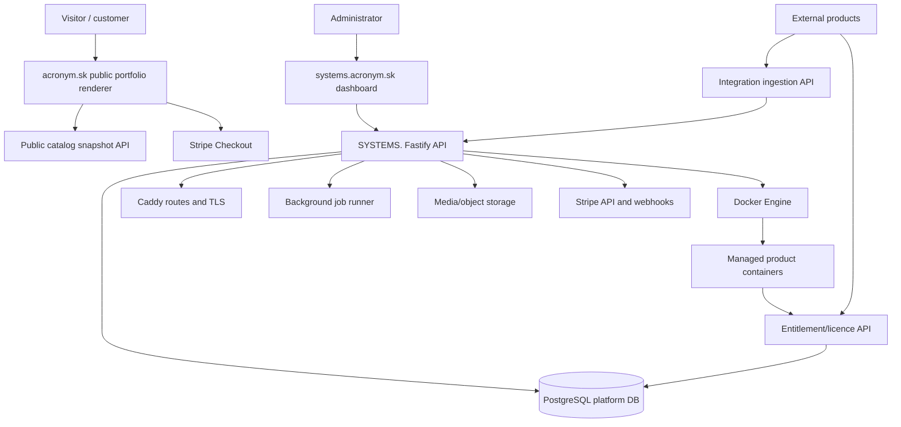
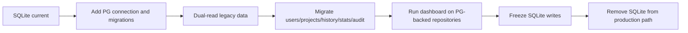
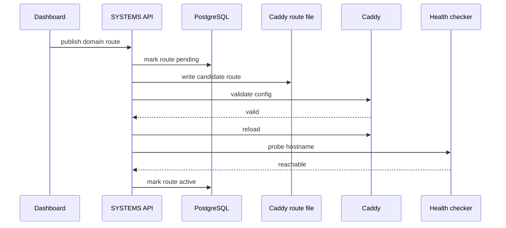
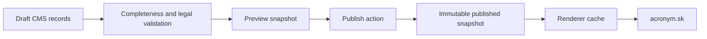
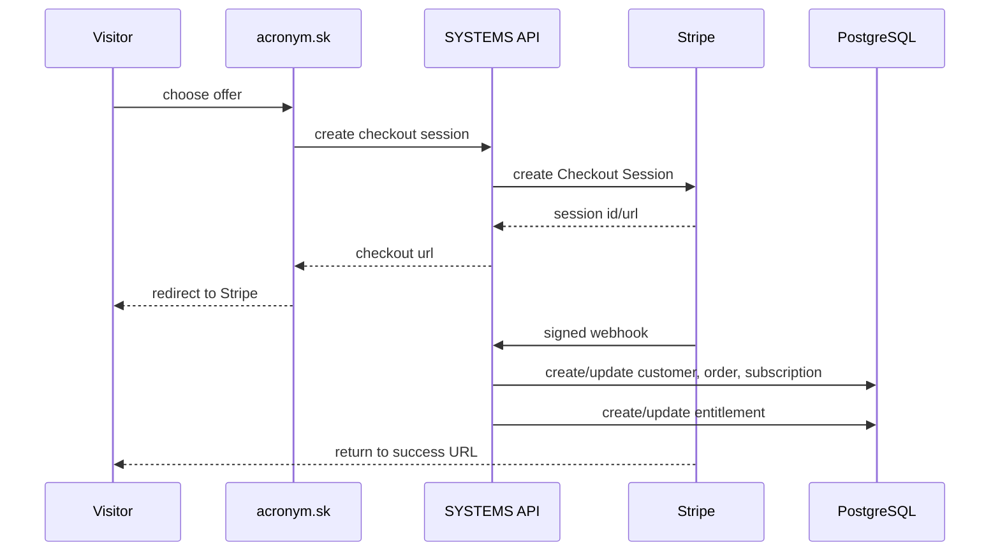
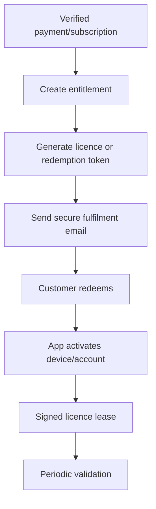

# SYSTEMS. V4 — Technical Upgrade Plan Based on Current Repository

**Document status:** implementation plan  
**Repository inspected:** uploaded `systems-main(2).zip`  
**Target product direction:** SYSTEMS. is Acronym's private control plane for building, deploying, operating, publishing and commercialising digital products.  
**Companion docs:** `docs/V4_PROPOSAL.md`, `docs/V4_IDENTITY_LICENSING_ADDITION.md`, `SYSTEMS_V4_APP_BUILDER_GUIDE.md`

---

## 1. Executive technical verdict

The current SYSTEMS. repository is a strong V2/V3 foundation. It already has the correct core shape for a private deployment control plane:

```text
Vue dashboard
→ Fastify API
→ SQLite control database
→ Docker workloads
→ Caddy/nginx routing
→ health, stats, logs, audit, backups, GitHub hooks and hardening
```

V4 should **not** rewrite this from zero. V4 should introduce a new product/commercial layer and gradually migrate the current `projects` model into a cleaner model:

```text
Current:
Project = deployed thing + route + visibility + health + release + partial product identity

V4:
Product = public/commercial thing Acronym presents and sells
System = technical component that runs somewhere
Environment = production/preview/development instance of a system
Release = deployed version of an environment
Offer = purchasable package
Customer = billing/contact identity
Entitlement = access right
Licence = redeemable/activated product key
```

The largest technical risk is continuing to expand the current `projects` table until it contains deployment state, portfolio content, Stripe billing, customer access, product keys, analytics and domains. That would make V4 fragile.

The correct path is:

```text
Preserve current deploy engine
→ add V4 tables and modules beside it
→ migrate project rows into systems
→ keep legacy /api/projects compatibility temporarily
→ build products, portfolio, commerce and licensing on the new model
→ retire project-shaped APIs after dashboard migration
```

---

## 2. Current repository facts

### 2.1 Backend

Current backend stack:

```text
api/
├── Fastify 5
├── better-sqlite3 control DB
├── optional pg dependency
├── dockerode
├── @fastify/jwt
├── @fastify/cors
├── @fastify/rate-limit
├── @fastify/multipart
└── @fastify/websocket
```

Current backend routes:

```text
/api/auth/*
/api/admin/*
/api/audit/*
/api/deploy/*
/api/projects/*
/api/projects/:slug/env
/api/projects/:slug/logs
/api/projects/:slug/stats
/api/projects/:slug/exec
/api/server/*
/api/internal/attestation/:slug
/api/webhook/github
/api/upload/*
```

Current backend services:

```text
services/
├── backup.js
├── caddy.js
├── dbprovision-runner.js
├── diskhygiene.js
├── docker.js
├── health.js
├── nginx.js
├── notify.js
├── proxy.js
├── reconcile.js
└── zip.js
```

Current utility layer already contains important V4-relevant primitives:

```text
audit chain
attestation
build gate
control-plane migration helper
database provisioning
disk hygiene
feature flags
IP matching
resource limits
lockout
notifications
path safety
project classification
reconciliation
retry
session/CSRF
slug validation
stats
TOTP
upload chunking
webhook validation
```

### 2.2 Frontend

Current dashboard stack:

```text
dashboard/
├── Vue 3
├── Vite
├── Vue Router
├── Pinia-style auth store
├── PWA/static shell
└── current views:
    ├── Systems
    ├── SystemDetail
    ├── Ship
    ├── Events
    ├── Server
    ├── Admin
    └── Login
```

Current navigation is operational, not commercial. V4 will expand it to:

```text
Overview
Portfolio
Products
Systems
Commerce
Customers
Incidents
Events
Server
Admin
```

### 2.3 Database

Current platform DB is SQLite at:

```text
DATA_DIR/platform.db
```

Current core tables:

```text
users
projects
audit_log
sessions
ip_bans
platform_settings
deploy_history
stats_history
```

The current `projects` table already includes many fields that should move to clearer V4 tables:

```text
name
slug
container_id
image_id
port
status
env_vars
previous_image_id
previous_container_id
visibility
deploy_type
basic_user
basic_hash
health_state
health_status
health_response_ms
health_checked_at
route_published
attestation_state
attestation_checked_at
last_error
last_error_stage
last_error_hint
last_error_excerpt
repo
deploy_branch
is_primary
limit_memory_mb
limit_cpu
limit_pids
limit_restart_policy
limit_log_max_size
limit_log_max_file
health_path
health_failures
github_deploy_status
github_deploy_detail
github_deploy_at
```

This table proves the platform has evolved organically. V4 must normalize it.

### 2.4 Existing strengths to keep

Keep and build on these:

```text
HttpOnly cookie sessions
CSRF header validation
token_version session invalidation
server-side session table
optional TOTP
persistent IP denylist
rate limit
CORS origin checking
security headers
tamper-evident audit log
isolated Docker network
CapDrop ALL
no-new-privileges
resource limits
build timeout
build concurrency gate
zip-slip-safe extraction
Dockerfile mode feature flag
chunked uploads
Caddy route generation
route attestation
health checks
stats history
rollback
soft delete vs purge
backup/restore scripts
Windows-first operational scripts
GitHub webhook HMAC verification
```

### 2.5 Existing weaknesses to fix before V4 commerce

Fix or replace these before orders/subscriptions become authoritative:

```text
SQLite as commercial source of truth
idempotent ALTER TABLE migrations with empty catch blocks
projects table as overloaded domain object
implicit route state through generated proxy files
deploy_history too thin for V4 releases
stats_history only infrastructure-focused
no product/customer/order/subscription/entitlement/licence tables
no portfolio snapshot model
no versioned public catalog API
no Stripe webhook idempotency table
no background job queue
no official product integration API keys
no event aggregation layer
CORS missing PATCH in current app.js allow-list
```

---

## 3. Upgrade principles

### 3.1 No big rewrite

The current deployment engine should continue working during the upgrade. V4 modules are added beside current modules.

### 3.2 Add new models before deleting old ones

Do not delete `/api/projects` early. Add `/api/systems`, `/api/products`, `/api/portfolio`, `/api/commerce`, `/api/entitlements` first.

### 3.3 Use compatibility adapters

Legacy dashboard screens can temporarily read from new tables through compatibility-shaped responses.

### 3.4 Make PostgreSQL the V4 authority

SQLite can remain for dev and migration staging, but commercial production V4 should use PostgreSQL.

### 3.5 Deployment and commerce must not share failure domains blindly

A Docker build failure must not block Stripe webhook processing. Analytics overload must not block entitlement updates.

### 3.6 Publish snapshots, not live drafts

The public portfolio renderer should consume immutable published snapshots, not raw CMS draft tables.

### 3.7 SYSTEMS. owns access truth, apps own product-specific user data

Do not create one shared database used directly by every app. Use identity, entitlement and licensing APIs.

---

## 4. Target V4 architecture



---

## 5. Target module structure

### 5.1 Backend

Create a module layout while keeping existing routes alive.

```text
api/src/
├── app.js
├── index.js
├── db/
│   ├── index.js                    # temporary compatibility export
│   ├── postgres.js                 # new PG pool/client
│   ├── sqlite-legacy.js            # current better-sqlite3 wrapper
│   ├── migrate.js                  # versioned migration runner
│   ├── migrations/
│   └── repositories/
├── modules/
│   ├── auth/
│   ├── organisations/
│   ├── products/
│   ├── systems/
│   ├── environments/
│   ├── releases/
│   ├── domains/
│   ├── portfolio/
│   ├── media/
│   ├── commerce/
│   ├── customers/
│   ├── subscriptions/
│   ├── entitlements/
│   ├── licensing/
│   ├── analytics/
│   ├── incidents/
│   ├── integrations/
│   ├── jobs/
│   └── audit/
├── routes/
│   └── legacy current route files
├── services/
│   ├── docker/
│   ├── caddy/
│   ├── stripe/
│   ├── email/
│   ├── storage/
│   ├── cache/
│   ├── queue/
│   └── crypto/
└── util/
```

### 5.2 Frontend

```text
dashboard/src/
├── modules/
│   ├── overview/
│   ├── portfolio/
│   ├── products/
│   ├── systems/
│   ├── commerce/
│   ├── customers/
│   ├── incidents/
│   ├── events/
│   ├── server/
│   └── admin/
├── components/
├── api/
├── stores/
└── router/
```

---

## 6. Immediate hard fixes before V4 work

These should be done first because they affect the reliability of every later phase.

### 6.1 Fix CORS methods

Current `api/src/app.js` allows:

```js
methods: ['GET', 'POST', 'PUT', 'DELETE', 'OPTIONS']
```

But the current dashboard already uses `PATCH` endpoints, including:

```text
PATCH /api/projects/:slug/visibility
PATCH /api/projects/:slug/limits
PATCH /api/projects/:slug/repo
PATCH /api/projects/:slug/primary
PATCH /api/admin/settings
```

Change to:

```js
methods: ['GET', 'POST', 'PUT', 'PATCH', 'DELETE', 'OPTIONS']
```

### 6.2 Stop silent schema migration failures

The current DB uses many:

```js
try { db.exec(`ALTER TABLE ...`) } catch {}
```

For V4, keep existing SQLite compatibility, but add a versioned migration runner for new tables. Migration failure must be visible.

### 6.3 Add schema health endpoint

Add:

```text
GET /api/server/schema
```

Return:

```json
{
  "database": "sqlite|postgres",
  "schemaVersion": "v4_001",
  "pendingMigrations": 0,
  "lastMigrationAt": "..."
}
```

### 6.4 Add platform mode flags

Add environment flags:

```env
SYSTEMS_PLATFORM_MODE=legacy|dual|v4
SYSTEMS_DB_ENGINE=sqlite|postgres
ENABLE_V4_PRODUCTS=false
ENABLE_V4_PORTFOLIO=false
ENABLE_V4_COMMERCE=false
ENABLE_V4_LICENSING=false
ENABLE_V4_ANALYTICS=false
```

### 6.5 Introduce background job table even before queue service

At minimum:

```sql
CREATE TABLE jobs (
  id UUID PRIMARY KEY,
  type TEXT NOT NULL,
  status TEXT NOT NULL,
  priority INTEGER NOT NULL DEFAULT 100,
  payload JSONB NOT NULL DEFAULT '{}',
  attempts INTEGER NOT NULL DEFAULT 0,
  max_attempts INTEGER NOT NULL DEFAULT 5,
  run_after TIMESTAMPTZ NOT NULL DEFAULT now(),
  locked_at TIMESTAMPTZ,
  locked_by TEXT,
  last_error TEXT,
  created_at TIMESTAMPTZ NOT NULL DEFAULT now(),
  updated_at TIMESTAMPTZ NOT NULL DEFAULT now()
);
```

Stripe webhooks, portfolio snapshots, media processing, analytics aggregation and health checks should use jobs.

---

## 7. PostgreSQL migration plan

### 7.1 Why PostgreSQL now

V4 adds concurrent writes from:

```text
admin dashboard
Stripe webhooks
analytics ingestion
external system heartbeats
licence validation
background jobs
health checks
portfolio publishing
```

SQLite WAL is good for the current local control plane. It is not the right long-term authority for commerce, subscriptions, analytics and licences.

### 7.2 Migration stages



### 7.3 Required scripts

Add:

```text
api/scripts/migrate-sqlite-to-postgres.js       # exists as package script target; complete it
api/scripts/verify-postgres-migration.js
api/scripts/export-sqlite-snapshot.js
scripts/migrate-v4-windows.ps1
scripts/verify-v4-windows.ps1
```

### 7.4 Migration validation

Migration is accepted only when:

```text
users count matches
sessions count may be dropped intentionally
projects become systems
deploy_history becomes releases
stats_history becomes infrastructure_metrics
audit chain is preserved or archived
env metadata is preserved
encrypted env values remain decryptable
routes can be regenerated
current containers reconcile with migrated systems
dashboard loads from new APIs
backup includes PG dump
restore works on a clean host
```

---

## 8. V4 database schema

The following schema is the target shape. It can be implemented over multiple migrations.

### 8.1 Organisations

```sql
CREATE TABLE organisations (
  id UUID PRIMARY KEY,
  name TEXT NOT NULL,
  slug TEXT NOT NULL UNIQUE,
  created_at TIMESTAMPTZ NOT NULL DEFAULT now()
);
```

Seed:

```text
Acronym
```

### 8.2 Admin users

Current `users` can be migrated and expanded.

```sql
CREATE TABLE admin_users (
  id UUID PRIMARY KEY,
  organisation_id UUID REFERENCES organisations(id),
  username TEXT NOT NULL UNIQUE,
  email TEXT,
  password_hash TEXT NOT NULL,
  role TEXT NOT NULL DEFAULT 'admin',
  token_version INTEGER NOT NULL DEFAULT 0,
  totp_secret TEXT,
  totp_enabled BOOLEAN NOT NULL DEFAULT false,
  created_at TIMESTAMPTZ NOT NULL DEFAULT now(),
  last_login_at TIMESTAMPTZ
);
```

Keep `sessions`, `ip_bans`, `audit_log`, but migrate IDs to UUID or maintain integer compatibility through mapping tables.

### 8.3 Products

```sql
CREATE TABLE products (
  id UUID PRIMARY KEY,
  organisation_id UUID NOT NULL REFERENCES organisations(id),
  name TEXT NOT NULL,
  slug TEXT NOT NULL,
  lifecycle_state TEXT NOT NULL DEFAULT 'building',
  portfolio_state TEXT NOT NULL DEFAULT 'hidden',
  commercial_state TEXT NOT NULL DEFAULT 'not_for_sale',
  primary_system_id UUID,
  created_at TIMESTAMPTZ NOT NULL DEFAULT now(),
  updated_at TIMESTAMPTZ NOT NULL DEFAULT now(),
  UNIQUE (organisation_id, slug)
);
```

### 8.4 Systems

```sql
CREATE TABLE systems (
  id UUID PRIMARY KEY,
  organisation_id UUID NOT NULL REFERENCES organisations(id),
  product_id UUID REFERENCES products(id) ON DELETE SET NULL,
  name TEXT NOT NULL,
  slug TEXT NOT NULL,
  system_type TEXT NOT NULL,
  runtime_type TEXT NOT NULL DEFAULT 'managed',
  current_status TEXT NOT NULL DEFAULT 'unknown',
  repo TEXT,
  deploy_branch TEXT DEFAULT 'main',
  is_primary_root BOOLEAN NOT NULL DEFAULT false,
  current_release_id UUID,
  created_at TIMESTAMPTZ NOT NULL DEFAULT now(),
  updated_at TIMESTAMPTZ NOT NULL DEFAULT now(),
  UNIQUE (organisation_id, slug)
);
```

System types:

```text
web_app
marketing_site
api
worker
static_site
desktop_distribution
external
```

Runtime types:

```text
managed
external
static
worker
```

### 8.5 System environments

```sql
CREATE TABLE system_environments (
  id UUID PRIMARY KEY,
  system_id UUID NOT NULL REFERENCES systems(id) ON DELETE CASCADE,
  name TEXT NOT NULL,
  access_policy TEXT NOT NULL DEFAULT 'private',
  health_path TEXT NOT NULL DEFAULT '/api/health',
  readiness_path TEXT DEFAULT '/api/ready',
  public_url TEXT,
  route_published BOOLEAN NOT NULL DEFAULT false,
  basic_user TEXT,
  basic_hash TEXT,
  created_at TIMESTAMPTZ NOT NULL DEFAULT now(),
  UNIQUE (system_id, name)
);
```

### 8.6 Releases

```sql
CREATE TABLE releases (
  id UUID PRIMARY KEY,
  environment_id UUID NOT NULL REFERENCES system_environments(id) ON DELETE CASCADE,
  version TEXT,
  release_number INTEGER,
  source_type TEXT NOT NULL,
  source_ref TEXT,
  commit_sha TEXT,
  image_id TEXT,
  container_id TEXT,
  port INTEGER,
  container_port INTEGER,
  status TEXT NOT NULL,
  build_started_at TIMESTAMPTZ,
  build_finished_at TIMESTAMPTZ,
  deployed_at TIMESTAMPTZ,
  health_verified_at TIMESTAMPTZ,
  created_by UUID,
  logs_ref TEXT,
  metadata JSONB NOT NULL DEFAULT '{}'
);
```

### 8.7 Domains

```sql
CREATE TABLE domains (
  id UUID PRIMARY KEY,
  system_id UUID NOT NULL REFERENCES systems(id) ON DELETE CASCADE,
  environment_id UUID REFERENCES system_environments(id) ON DELETE CASCADE,
  hostname TEXT NOT NULL UNIQUE,
  domain_type TEXT NOT NULL,
  verification_token TEXT,
  verification_status TEXT NOT NULL DEFAULT 'pending',
  tls_status TEXT NOT NULL DEFAULT 'unknown',
  is_canonical BOOLEAN NOT NULL DEFAULT false,
  redirect_to_canonical BOOLEAN NOT NULL DEFAULT true,
  route_status TEXT NOT NULL DEFAULT 'inactive',
  last_checked_at TIMESTAMPTZ,
  created_at TIMESTAMPTZ NOT NULL DEFAULT now()
);
```

Domain types:

```text
default_subdomain
custom
apex
preview
internal
```

### 8.8 Secrets

Move from project env blob to environment-scoped secrets.

```sql
CREATE TABLE environment_secrets (
  id UUID PRIMARY KEY,
  environment_id UUID NOT NULL REFERENCES system_environments(id) ON DELETE CASCADE,
  key TEXT NOT NULL,
  encrypted_value TEXT NOT NULL,
  value_hash TEXT,
  updated_by UUID,
  updated_at TIMESTAMPTZ NOT NULL DEFAULT now(),
  UNIQUE (environment_id, key)
);
```

### 8.9 Infrastructure metrics

Current `stats_history` becomes:

```sql
CREATE TABLE infrastructure_metrics (
  id UUID PRIMARY KEY,
  system_id UUID NOT NULL REFERENCES systems(id) ON DELETE CASCADE,
  environment_id UUID REFERENCES system_environments(id) ON DELETE CASCADE,
  release_id UUID REFERENCES releases(id) ON DELETE SET NULL,
  cpu_percent REAL,
  memory_mb REAL,
  memory_limit_mb REAL,
  rx_bytes BIGINT,
  tx_bytes BIGINT,
  recorded_at TIMESTAMPTZ NOT NULL DEFAULT now()
);
```

### 8.10 Health snapshots

```sql
CREATE TABLE health_snapshots (
  id UUID PRIMARY KEY,
  system_id UUID NOT NULL REFERENCES systems(id) ON DELETE CASCADE,
  environment_id UUID REFERENCES system_environments(id) ON DELETE CASCADE,
  release_id UUID REFERENCES releases(id) ON DELETE SET NULL,
  state TEXT NOT NULL,
  http_status INTEGER,
  response_ms INTEGER,
  attestation_state TEXT,
  error TEXT,
  checked_at TIMESTAMPTZ NOT NULL DEFAULT now()
);
```

---

## 9. Migration mapping from current tables

### 9.1 `projects` to `systems`

```text
projects.id                     → legacy_project_id mapping
projects.name                   → systems.name
projects.slug                   → systems.slug
projects.deploy_type            → systems.system_type
projects.status                 → systems.current_status
projects.repo                   → systems.repo
projects.deploy_branch          → systems.deploy_branch
projects.is_primary             → systems.is_primary_root
```

### 9.2 `projects` to `system_environments`

Create one `production` environment per current project.

```text
projects.visibility             → system_environments.access_policy
projects.health_path            → system_environments.health_path
projects.route_published        → system_environments.route_published
projects.basic_user             → system_environments.basic_user
projects.basic_hash             → system_environments.basic_hash
```

### 9.3 `projects` to `releases`

Create one current release row when `container_id` or `image_id` exists.

```text
projects.container_id           → releases.container_id
projects.image_id               → releases.image_id
projects.port                   → releases.port
projects.status                 → releases.status
projects.updated_at             → releases.deployed_at approximate
```

Create previous release if:

```text
previous_image_id or previous_container_id exists
```

### 9.4 `deploy_history` to `releases`

Each row becomes a historical release attached to the production environment.

```text
deploy_history.image_id         → releases.image_id
deploy_history.container_id     → releases.container_id
deploy_history.deployed_at      → releases.deployed_at
```

### 9.5 `stats_history` to `infrastructure_metrics`

```text
project_id                      → mapped system_id
cpu_percent                     → infrastructure_metrics.cpu_percent
memory_mb                       → infrastructure_metrics.memory_mb
memory_limit_mb                 → infrastructure_metrics.memory_limit_mb
rx_bytes                        → infrastructure_metrics.rx_bytes
tx_bytes                        → infrastructure_metrics.tx_bytes
recorded_at                     → infrastructure_metrics.recorded_at
```

### 9.6 `audit_log`

Keep current audit rows but add entity-type fields going forward:

```sql
ALTER TABLE audit_log ADD COLUMN entity_type TEXT;
ALTER TABLE audit_log ADD COLUMN entity_id TEXT;
ALTER TABLE audit_log ADD COLUMN request_id TEXT;
```

Do not destroy the existing hash chain. For old rows, preserve original row shape and start V4 hash-chain verification from the first V4 row if necessary.

---

## 10. V4 API plan

### 10.1 Keep current routes alive

Keep these during migration:

```text
/api/projects/*
/api/deploy/*
/api/projects/:slug/logs
/api/projects/:slug/stats
/api/projects/:slug/env
/api/projects/:slug/exec
```

Mark as legacy once V4 replacements exist.

### 10.2 Add new routes

```text
/api/products
/api/products/:id
/api/products/:id/systems
/api/products/:id/portfolio
/api/products/:id/offers
/api/products/:id/analytics

/api/systems
/api/systems/:id
/api/systems/:id/environments
/api/systems/:id/environments/:envId
/api/systems/:id/releases
/api/systems/:id/deployments
/api/systems/:id/domains
/api/systems/:id/logs
/api/systems/:id/health
/api/systems/:id/secrets
/api/systems/:id/limits
/api/systems/:id/repo

/api/portfolio/pages
/api/portfolio/products
/api/portfolio/media
/api/portfolio/preview
/api/portfolio/publish
/api/portfolio/snapshots
/api/public/catalog
/api/public/catalog/:locale
/api/public/products/:slug

/api/commerce/offers
/api/commerce/checkout/session
/api/commerce/customer-portal
/api/commerce/orders
/api/commerce/subscriptions
/api/commerce/webhooks/stripe

/api/customers
/api/customers/:id/orders
/api/customers/:id/subscriptions
/api/customers/:id/entitlements

/api/entitlements/check
/api/entitlements/admin/grant
/api/entitlements/admin/revoke

/api/licensing/redeem
/api/licensing/activate
/api/licensing/validate
/api/licensing/deactivate

/v1/ingest/heartbeat
/v1/ingest/releases
/v1/ingest/errors
/v1/ingest/events
/v1/ingest/metrics
```

### 10.3 Route compatibility adapter

Implement a `legacyProjectsRepository` that reads from V4 tables but returns old shapes.

Example old shape:

```json
{
  "name": "Portfolio",
  "slug": "portfolio",
  "container_id": "...",
  "image_id": "...",
  "port": 3000,
  "status": "running",
  "visibility": "public",
  "route_published": 1
}
```

Generated from:

```text
systems
+ production environment
+ current release
+ default domain
+ latest health snapshot
```

---

## 11. Deployment engine upgrade

### 11.1 Current deploy pipeline

Current pipeline:

```text
multipart zip upload
→ extract
→ detect project type
→ generate/use Dockerfile
→ build image
→ run Docker container
→ publish proxy route
→ record deploy history
→ detached health probe
```

Keep this.

### 11.2 V4 deploy target

Change deploy target from:

```text
project slug
```

to:

```text
system ID + environment name
```

New deploy route:

```text
POST /api/systems/:id/environments/:environment/deploy
```

Body:

```text
zip upload OR completed chunked upload OR git redeploy request
```

### 11.3 Preview-to-production promotion

Add:

```text
POST /api/systems/:id/environments/preview/deploy
POST /api/systems/:id/promote
```

Promotion should:

```text
verify preview release exists
verify health/readiness
copy/promote image to production release
start production container
switch route after healthy
keep previous production release for rollback
```

### 11.4 Build locks

Current `BuildGate` and deploy lock should become environment-scoped:

```text
global build concurrency limit
per-system deployment lock
per-environment promotion lock
route publication lock
```

Do not allow two production deploys for the same system at once.

### 11.5 Release retention

Current `releaseRetention` setting should move to:

```text
platform default
product override
system override
environment override
```

Default: keep 5 successful production releases.

---

## 12. Routing and Caddy upgrade

### 12.1 Current state

Current Caddy renderer accepts:

```js
renderRoute({ slug, port, visibility, basicUser, basicHash, apex })
```

This is good for V2, but V4 needs:

```text
multiple domains
custom domains
preview domains
canonical redirects
domain verification
TLS state
route transaction state
```

### 12.2 New route input

```js
renderRoute({
  hostname,
  upstreamHost,
  upstreamPort,
  accessPolicy,
  basicUser,
  basicHash,
  isCanonical,
  redirectTarget,
  attestationSlug,
  maintenanceMode
})
```

### 12.3 Route transaction



If validation or reload fails:

```text
keep old route
mark new route failed
create incident
audit event
show recovery action
```

### 12.4 Domain verification

Custom domain activation requires:

```text
domain added
→ verification token generated
→ DNS TXT/CNAME/A instruction displayed
→ verifier confirms ownership
→ Caddy route generated
→ TLS checked
→ canonical status selected
```

Never publish arbitrary custom hostnames without verification.

---

## 13. Portfolio CMS implementation

### 13.1 Portfolio belongs inside SYSTEMS.

Add a first-class dashboard module:

```text
Portfolio
├── Home
├── Navigation
├── Pages
├── Products
├── Media
├── Redirects
├── Legal
├── Locales
├── Preview
├── Publish history
└── Analytics
```

### 13.2 Public renderer remains separate

`acronym.sk` should be a deployed system, not the private dashboard.

```text
SYSTEMS. Portfolio CMS
→ immutable published snapshots
→ public catalog API/cache
→ acronym.sk renderer
```

### 13.3 Tables

```sql
CREATE TABLE portfolio_pages (
  id UUID PRIMARY KEY,
  organisation_id UUID NOT NULL REFERENCES organisations(id),
  locale TEXT NOT NULL,
  page_type TEXT NOT NULL,
  slug TEXT NOT NULL,
  title TEXT NOT NULL,
  seo_title TEXT,
  seo_description TEXT,
  status TEXT NOT NULL DEFAULT 'draft',
  updated_at TIMESTAMPTZ NOT NULL DEFAULT now(),
  UNIQUE (organisation_id, locale, slug)
);

CREATE TABLE product_portfolio_profiles (
  id UUID PRIMARY KEY,
  product_id UUID NOT NULL REFERENCES products(id) ON DELETE CASCADE,
  locale TEXT NOT NULL,
  title TEXT NOT NULL,
  tagline TEXT,
  short_description TEXT,
  full_description TEXT,
  seo_title TEXT,
  seo_description TEXT,
  cover_media_id UUID,
  status TEXT NOT NULL DEFAULT 'draft',
  completeness_score INTEGER NOT NULL DEFAULT 0,
  UNIQUE (product_id, locale)
);

CREATE TABLE portfolio_blocks (
  id UUID PRIMARY KEY,
  owner_type TEXT NOT NULL,
  owner_id UUID NOT NULL,
  locale TEXT NOT NULL,
  block_type TEXT NOT NULL,
  position INTEGER NOT NULL,
  data JSONB NOT NULL,
  created_at TIMESTAMPTZ NOT NULL DEFAULT now()
);

CREATE TABLE portfolio_snapshots (
  id UUID PRIMARY KEY,
  organisation_id UUID NOT NULL REFERENCES organisations(id),
  version INTEGER NOT NULL,
  locale TEXT NOT NULL,
  content JSONB NOT NULL,
  content_hash TEXT NOT NULL,
  schema_version TEXT NOT NULL,
  published_by UUID NOT NULL,
  published_at TIMESTAMPTZ NOT NULL DEFAULT now(),
  UNIQUE (organisation_id, locale, version)
);
```

### 13.4 Snapshot publishing



### 13.5 Locales

Initial locales:

```text
sk
en
```

Every public page must have:

```text
locale URL
localized SEO
localized legal links
localized pricing copy
language switch mapping
fallback status
translation completeness indicator
```

Recommended URLs:

```text
/
 /sk
 /en
 /sk/products/{slug}
 /en/products/{slug}
 /sk/legal/terms
 /en/legal/terms
```

---

## 14. Media implementation

### 14.1 Tables

```sql
CREATE TABLE media_assets (
  id UUID PRIMARY KEY,
  organisation_id UUID NOT NULL REFERENCES organisations(id),
  uploaded_by UUID,
  storage_key TEXT NOT NULL,
  public_url TEXT,
  media_type TEXT NOT NULL,
  mime_type TEXT NOT NULL,
  size_bytes BIGINT NOT NULL,
  width INTEGER,
  height INTEGER,
  status TEXT NOT NULL DEFAULT 'quarantined',
  alt_text TEXT,
  created_at TIMESTAMPTZ NOT NULL DEFAULT now()
);
```

### 14.2 Pipeline

```text
upload
→ validate extension and MIME
→ quarantine
→ scan if scanner configured
→ extract dimensions/metadata
→ create web derivatives
→ approve
→ use in CMS
```

Do not let arbitrary uploaded files become public immediately.

---

## 15. Commerce and Stripe implementation

### 15.1 Tables

```sql
CREATE TABLE offers (
  id UUID PRIMARY KEY,
  product_id UUID NOT NULL REFERENCES products(id) ON DELETE CASCADE,
  name TEXT NOT NULL,
  slug TEXT NOT NULL,
  description TEXT,
  offer_type TEXT NOT NULL,
  billing_interval TEXT,
  price_cents INTEGER,
  currency TEXT NOT NULL DEFAULT 'eur',
  trial_days INTEGER,
  stripe_product_id TEXT,
  stripe_price_id TEXT,
  fulfilment_type TEXT NOT NULL,
  entitlement_template JSONB NOT NULL DEFAULT '{}',
  public_visibility TEXT NOT NULL DEFAULT 'public',
  active BOOLEAN NOT NULL DEFAULT true,
  created_at TIMESTAMPTZ NOT NULL DEFAULT now(),
  UNIQUE (product_id, slug)
);

CREATE TABLE customers (
  id UUID PRIMARY KEY,
  organisation_id UUID NOT NULL REFERENCES organisations(id),
  stripe_customer_id TEXT UNIQUE,
  email TEXT,
  name TEXT,
  billing_country TEXT,
  tax_id TEXT,
  created_at TIMESTAMPTZ NOT NULL DEFAULT now()
);

CREATE TABLE orders (
  id UUID PRIMARY KEY,
  customer_id UUID REFERENCES customers(id),
  offer_id UUID REFERENCES offers(id),
  stripe_checkout_session_id TEXT UNIQUE,
  stripe_payment_intent_id TEXT,
  amount_cents INTEGER,
  currency TEXT NOT NULL DEFAULT 'eur',
  status TEXT NOT NULL,
  paid_at TIMESTAMPTZ,
  created_at TIMESTAMPTZ NOT NULL DEFAULT now()
);

CREATE TABLE subscriptions (
  id UUID PRIMARY KEY,
  customer_id UUID NOT NULL REFERENCES customers(id),
  offer_id UUID NOT NULL REFERENCES offers(id),
  stripe_subscription_id TEXT UNIQUE NOT NULL,
  status TEXT NOT NULL,
  current_period_start TIMESTAMPTZ,
  current_period_end TIMESTAMPTZ,
  cancel_at_period_end BOOLEAN NOT NULL DEFAULT false,
  trial_end TIMESTAMPTZ,
  created_at TIMESTAMPTZ NOT NULL DEFAULT now(),
  updated_at TIMESTAMPTZ NOT NULL DEFAULT now()
);

CREATE TABLE payment_webhook_events (
  id UUID PRIMARY KEY,
  provider TEXT NOT NULL,
  provider_event_id TEXT NOT NULL UNIQUE,
  event_type TEXT NOT NULL,
  received_at TIMESTAMPTZ NOT NULL DEFAULT now(),
  processed_at TIMESTAMPTZ,
  status TEXT NOT NULL DEFAULT 'received',
  payload JSONB NOT NULL,
  error TEXT
);
```

### 15.2 Stripe service module

Add:

```text
api/src/services/stripe/client.js
api/src/services/stripe/checkout.js
api/src/services/stripe/webhooks.js
api/src/services/stripe/customerPortal.js
```

Environment variables:

```env
STRIPE_SECRET_KEY=
STRIPE_WEBHOOK_SECRET=
STRIPE_SUCCESS_URL=
STRIPE_CANCEL_URL=
STRIPE_CUSTOMER_PORTAL_RETURN_URL=
```

### 15.3 Checkout flow



Success return is never proof of payment. Only signed Stripe webhooks modify access.

### 15.4 Webhook handling requirements

Handle:

```text
checkout.session.completed
checkout.session.expired
customer.subscription.created
customer.subscription.updated
customer.subscription.deleted
invoice.payment_succeeded
invoice.payment_failed
charge.refunded
charge.dispute.created
```

Rules:

```text
verify signature
store provider event id
process idempotently
use DB transactions
queue entitlement updates
handle out-of-order events
retry failed processing
audit access changes
```

---

## 16. Entitlements, licensing and product keys

### 16.1 Tables

```sql
CREATE TABLE entitlements (
  id UUID PRIMARY KEY,
  customer_id UUID REFERENCES customers(id),
  product_id UUID NOT NULL REFERENCES products(id),
  offer_id UUID REFERENCES offers(id),
  order_id UUID REFERENCES orders(id),
  subscription_id UUID REFERENCES subscriptions(id),
  entitlement_type TEXT NOT NULL,
  state TEXT NOT NULL,
  starts_at TIMESTAMPTZ NOT NULL DEFAULT now(),
  valid_until TIMESTAMPTZ,
  grace_until TIMESTAMPTZ,
  features JSONB NOT NULL DEFAULT '{}',
  created_at TIMESTAMPTZ NOT NULL DEFAULT now()
);

CREATE TABLE licences (
  id UUID PRIMARY KEY,
  entitlement_id UUID NOT NULL REFERENCES entitlements(id) ON DELETE CASCADE,
  product_id UUID NOT NULL REFERENCES products(id),
  key_hash TEXT UNIQUE,
  display_prefix TEXT,
  state TEXT NOT NULL DEFAULT 'active',
  max_activations INTEGER,
  created_at TIMESTAMPTZ NOT NULL DEFAULT now(),
  redeemed_at TIMESTAMPTZ,
  revoked_at TIMESTAMPTZ
);

CREATE TABLE licence_activations (
  id UUID PRIMARY KEY,
  licence_id UUID NOT NULL REFERENCES licences(id) ON DELETE CASCADE,
  activation_type TEXT NOT NULL,
  device_fingerprint_hash TEXT,
  product_user_id TEXT,
  state TEXT NOT NULL DEFAULT 'active',
  last_validated_at TIMESTAMPTZ,
  created_at TIMESTAMPTZ NOT NULL DEFAULT now()
);
```

### 16.2 Product key flow



### 16.3 Product key rules

```text
use high entropy random keys
store key hash, not raw key
never encode email/price/plan in key
support revocation and replacement
support device/seat limits
audit every activation/deactivation
do not instantly disable on first failed payment
use grace periods and signed leases
```

### 16.4 Required API

```text
POST /api/entitlements/check
POST /api/licensing/redeem
POST /api/licensing/activate
POST /api/licensing/validate
POST /api/licensing/deactivate
```

### 16.5 Subscription state handling

States:

```text
trialing
active
past_due
grace
suspended
cancel_at_period_end
cancelled
expired
refunded
chargeback
manual_revoked
```

App behaviour must be encoded in entitlement state and signed leases.

---

## 17. Integration API for apps and external systems

### 17.1 Integration keys

```sql
CREATE TABLE integration_keys (
  id UUID PRIMARY KEY,
  organisation_id UUID NOT NULL REFERENCES organisations(id),
  product_id UUID REFERENCES products(id),
  system_id UUID REFERENCES systems(id),
  name TEXT NOT NULL,
  key_hash TEXT NOT NULL UNIQUE,
  scopes TEXT[] NOT NULL,
  status TEXT NOT NULL DEFAULT 'active',
  last_used_at TIMESTAMPTZ,
  created_at TIMESTAMPTZ NOT NULL DEFAULT now(),
  revoked_at TIMESTAMPTZ
);
```

Scopes:

```text
heartbeat:write
events:write
errors:write
releases:write
metrics:write
entitlements:check
licences:validate
```

### 17.2 Ingestion endpoints

```text
POST /v1/ingest/heartbeat
POST /v1/ingest/releases
POST /v1/ingest/errors
POST /v1/ingest/events
POST /v1/ingest/metrics
```

### 17.3 Authentication

Use:

```text
Authorization: Bearer <integration_key>
```

Store only hashed keys. Show raw key once.

Do not use administrator JWTs in product apps.

---

## 18. Analytics implementation

### 18.1 Raw product events

```sql
CREATE TABLE product_events (
  id UUID PRIMARY KEY,
  organisation_id UUID NOT NULL REFERENCES organisations(id),
  product_id UUID REFERENCES products(id),
  system_id UUID REFERENCES systems(id),
  environment TEXT,
  event_name TEXT NOT NULL,
  anonymous_id TEXT,
  product_user_id TEXT,
  occurred_at TIMESTAMPTZ NOT NULL,
  received_at TIMESTAMPTZ NOT NULL DEFAULT now(),
  properties JSONB NOT NULL DEFAULT '{}',
  context JSONB NOT NULL DEFAULT '{}'
);
```

### 18.2 Aggregates

```sql
CREATE TABLE product_metric_daily (
  id UUID PRIMARY KEY,
  product_id UUID NOT NULL REFERENCES products(id),
  metric_date DATE NOT NULL,
  metric_name TEXT NOT NULL,
  value NUMERIC NOT NULL,
  dimensions JSONB NOT NULL DEFAULT '{}',
  UNIQUE (product_id, metric_date, metric_name, dimensions)
);
```

### 18.3 Dashboard metrics

Show separately:

```text
Operations:
- uptime
- response time
- CPU
- memory
- deploys
- errors
- incidents

Business:
- portfolio views
- product page views
- CTA clicks
- checkout starts
- purchases
- subscriptions
- MRR/ARR
- active entitlements
- licence activations
- churn/past due
```

### 18.4 Ingestion safety

```text
rate limit by integration key
cap payload size
drop huge properties
batch inserts
queue aggregation
downsample operational metrics
raw event retention policy
aggregate retention policy
```

---

## 19. Incidents and maintenance

### 19.1 Tables

```sql
CREATE TABLE incidents (
  id UUID PRIMARY KEY,
  product_id UUID REFERENCES products(id),
  system_id UUID REFERENCES systems(id),
  environment_id UUID REFERENCES system_environments(id),
  severity TEXT NOT NULL,
  status TEXT NOT NULL,
  title TEXT NOT NULL,
  description TEXT,
  started_at TIMESTAMPTZ NOT NULL DEFAULT now(),
  resolved_at TIMESTAMPTZ,
  created_by UUID
);

CREATE TABLE maintenance_windows (
  id UUID PRIMARY KEY,
  system_id UUID REFERENCES systems(id),
  environment_id UUID REFERENCES system_environments(id),
  status TEXT NOT NULL,
  message TEXT,
  starts_at TIMESTAMPTZ,
  ends_at TIMESTAMPTZ,
  created_by UUID,
  created_at TIMESTAMPTZ NOT NULL DEFAULT now()
);
```

### 19.2 Behaviour

When a live product fails:

```text
keep portfolio page available
disable launch CTA if app is unavailable
keep checkout only if fulfilment is unaffected
create incident
notify admin
offer rollback
show maintenance only when configured
```

---

## 20. Background jobs

### 20.1 Job types

```text
stripe.webhook.process
portfolio.snapshot.publish
portfolio.snapshot.render
media.process
analytics.aggregate.daily
analytics.aggregate.hourly
health.check
domain.verify
domain.tls.check
email.send
licence.expire
subscription.reconcile
backup.run
```

### 20.2 Job runner

Start with in-process worker because current platform is single-host.

Later it can move to a separate worker process.

Rules:

```text
jobs have priorities
commerce and entitlement jobs outrank analytics
webhook jobs outrank builds
stuck jobs are unlocked after timeout
failures retry with backoff
poison jobs stop after max attempts
all critical job failures create events/incidents
```

---

## 21. Dashboard upgrade plan

### 21.1 New routes

```js
const routes = [
  { path: '/', name: 'overview' },
  { path: '/portfolio', name: 'portfolio' },
  { path: '/portfolio/pages/:id?', name: 'portfolio-page' },
  { path: '/products', name: 'products' },
  { path: '/products/:id', name: 'product-detail' },
  { path: '/systems', name: 'systems' },
  { path: '/systems/:id', name: 'system-detail' },
  { path: '/commerce', name: 'commerce' },
  { path: '/commerce/orders/:id', name: 'order-detail' },
  { path: '/customers', name: 'customers' },
  { path: '/customers/:id', name: 'customer-detail' },
  { path: '/incidents', name: 'incidents' },
  { path: '/events', name: 'events' },
  { path: '/server', name: 'server' },
  { path: '/admin', name: 'admin' }
]
```

### 21.2 Existing route redirects

```text
/ship              → /systems/new or /systems/deploy
/projects/:slug    → /systems/:mappedId
/deploy            → /systems/deploy
/activity          → /events
```

### 21.3 Product detail tabs

```text
Overview
Portfolio
Offers
Commerce
Analytics
Systems
Domains
Customers
Settings
```

### 21.4 System detail tabs

```text
Overview
Environments
Deployments
Releases
Domains
Health
Logs
Metrics
Secrets
Limits
Integrations
Settings
```

---

## 22. Security upgrade

### 22.1 Keep current security

Keep:

```text
HttpOnly cookies
CSRF
session table
token_version
TOTP
rate limit
IP denylist
audit chain
security headers
route attestation
Docker isolation
resource limits
typed destructive confirmations
```

### 22.2 Add V4 security

Add:

```text
role-based admin permissions
separate customer identity realm
integration key scopes
Stripe webhook signature verification
licence lease signing key rotation
domain ownership verification
media quarantine
public catalog data allowlist
secret value write-only UI
per-module audit events
incident response runbook
```

### 22.3 Admin roles

Initial roles:

```text
owner
admin
operator
commerce
viewer
```

Capabilities:

```text
owner: everything
admin: products/systems/portfolio
operator: deploy/rollback/incidents/logs
commerce: offers/orders/customers/entitlements
viewer: read-only
```

### 22.4 Data boundaries

Never expose through public APIs:

```text
container IDs
host ports
Docker image IDs
repo URLs
env var names if sensitive
logs
admin users
customer raw records
Stripe payloads
integration keys
licence key hashes
```

---

## 23. Performance, caching and host protection

### 23.1 Public site

`acronym.sk` should not hit the live database on every request.

Use:

```text
published snapshots
renderer local cache
ETag
stale-while-revalidate
immutable hashed assets
pre-rendered product pages
last-known-good snapshot
```

### 23.2 Admin API

Admin APIs:

```text
no-store cache headers
pagination everywhere
bounded date ranges
dashboard cards use aggregates
logs stream with limits
stats downsampled
```

### 23.3 Builds and deploys

Current build gate is good. Extend it:

```text
one build default on first host
per-system lock
disk admission check before upload/build
image pruning
release retention
upload caps
chunk expiry
build timeout
container memory/CPU/PID limits
log rotation
```

### 23.4 Commerce protection

Commerce must be protected from noisy workloads:

```text
Stripe webhook route has separate rate limits
webhook processing is queued
entitlement checks are fast and indexed
analytics cannot block entitlements
build jobs lower priority than payment jobs
```

---

## 24. Backup and restore upgrade

Current Windows backup scripts should be extended to include:

```text
PostgreSQL dump
portfolio snapshots
media metadata
media files or object-storage manifest
Stripe mapping tables
orders/subscriptions/entitlements/licences
integration keys metadata
domains
Caddy route files
release metadata
current releases
audit log
platform settings
```

Do not back up raw secrets unencrypted.

### 24.1 Recovery targets

Recommended V4 targets:

```text
RPO: 24 hours maximum for full platform; lower for commerce if feasible
RTO: 4 hours for control plane
RTO: 1 hour for public portfolio renderer from last snapshot
RTO: 30 minutes for restoring Caddy routes on same host
```

### 24.2 Restore test

Add:

```text
scripts/test-v4-restore-windows.ps1
```

Acceptance:

```text
clean machine or clean data dir
restore backup
start API/dashboard/Caddy
verify login
verify products
verify systems
verify public catalog snapshot
verify at least one route
verify orders/entitlements visible
verify no secrets printed
```

---

## 25. Legal/compliance technical hooks

The legal text itself must be approved separately, but the platform needs technical support for:

```text
versioned terms/privacy/cookie/legal pages
checkout disclosure version captured per order
digital content withdrawal consent captured where applicable
subscription renewal/cancellation state visibility
VAT/customer country evidence fields
invoice/refund references
cookie consent state for marketing analytics
GDPR export/delete workflow
complaint/contact form retention
accessibility checks for public pages
```

Add tables:

```sql
CREATE TABLE legal_versions (
  id UUID PRIMARY KEY,
  locale TEXT NOT NULL,
  document_type TEXT NOT NULL,
  version TEXT NOT NULL,
  content_hash TEXT NOT NULL,
  published_at TIMESTAMPTZ NOT NULL DEFAULT now(),
  published_by UUID NOT NULL
);

CREATE TABLE checkout_disclosures (
  id UUID PRIMARY KEY,
  order_id UUID REFERENCES orders(id),
  subscription_id UUID REFERENCES subscriptions(id),
  terms_version_id UUID REFERENCES legal_versions(id),
  privacy_version_id UUID REFERENCES legal_versions(id),
  withdrawal_consent BOOLEAN,
  marketing_consent BOOLEAN,
  captured_at TIMESTAMPTZ NOT NULL DEFAULT now()
);
```

---

## 26. Testing strategy

### 26.1 Existing tests to keep

Current tests already cover:

```text
alerts
attestation route
audit
backup
build
caddy
controlplane migration
deploy e2e
disk hygiene
env crypto
health
integration
ip matching
limits
lockout
path safety
proxy
reconcile
retry
slug
stats
thresholds
TOTP
V2 behaviours
```

Keep these green through all phases.

### 26.2 New test suites

Add:

```text
api/test/v4-products.test.js
api/test/v4-systems.test.js
api/test/v4-environments.test.js
api/test/v4-releases.test.js
api/test/v4-domains.test.js
api/test/v4-portfolio.test.js
api/test/v4-commerce.test.js
api/test/v4-stripe-webhooks.test.js
api/test/v4-entitlements.test.js
api/test/v4-licensing.test.js
api/test/v4-analytics.test.js
api/test/v4-integration-keys.test.js
api/test/v4-migration.test.js
api/test/v4-jobs.test.js
```

### 26.3 Critical acceptance tests

Must pass before V4 launch:

```text
migrate current SQLite to PostgreSQL
legacy /api/projects still lists systems
deploy new app to preview
promote preview to production
publish portfolio snapshot
public catalog exposes no private data
custom domain cannot publish before verification
Stripe webhook creates order/subscription/entitlement idempotently
duplicate Stripe webhook does not duplicate entitlement
payment failure moves subscription to past_due/grace
grace expiry suspends entitlement
one-time purchase creates perpetual entitlement
licence key can be redeemed once
device activation limit works
SYSTEMS outage does not break cached licence lease
analytics ingestion cannot overload DB
backup/restore preserves commerce and portfolio
```

---

## 27. Implementation phases

### Phase 0 — Stabilise current repo

```text
Fix CORS PATCH
Add migration runner skeleton
Add schema health endpoint
Add platform mode flags
Add job table
Add request IDs globally
Add pagination limits where missing
```

Acceptance:

```text
all existing tests pass
dashboard still works
deploy/redeploy/rollback still works
```

### Phase 1 — PostgreSQL foundation

```text
Add PG pool
Add versioned migrations
Add migration scripts
Migrate users/sessions/settings/audit
Migrate projects into systems/environments/releases
Add legacy compatibility repository
```

Acceptance:

```text
SQLite-to-PG migration can run repeatedly on test snapshots
legacy endpoints work against PG-backed data
backup/restore includes PG
```

### Phase 2 — Systems model

```text
Add /api/systems
Add environments
Add releases
Move deploy route to system+environment
Add preview environment
Add promote-to-production
Add release retention
Update dashboard Systems/SystemDetail
```

Acceptance:

```text
new system can deploy to preview
preview can promote to production
legacy /api/projects redirects/compat works
```

### Phase 3 — Domains and routing

```text
Add domains table
Move Caddy route source to domains/environments
Add default subdomain records
Add custom domain verification
Add canonical redirects
Add route transaction state
Add domain health/TLS checks
```

Acceptance:

```text
route generation is reversible
failed Caddy reload does not corrupt active route
custom domain requires verification
```

### Phase 4 — Products

```text
Add products table/API
Link systems to products
Add product lifecycle/portfolio/commercial states
Add product dashboard
Add product overview metrics placeholder
```

Acceptance:

```text
one product can contain multiple systems
one system can exist without product
state machines are independent
```

### Phase 5 — Portfolio CMS

```text
Add portfolio pages/profiles/blocks/media
Add SK/EN locale model
Add public catalog snapshot API
Add publish/rollback
Deploy acronym.sk renderer as primary system
Add portfolio dashboard module
```

Acceptance:

```text
portfolio renders from published snapshot
draft changes do not affect public site
renderer works from last-known-good snapshot
```

### Phase 6 — Commerce

```text
Add offers/customers/orders/subscriptions
Add Stripe Checkout
Add Stripe Customer Portal
Add webhook verification/idempotency
Add commerce dashboard
Add manual/complimentary orders
```

Acceptance:

```text
one-time payment creates order
subscription creates subscription
duplicate webhook is harmless
success redirect alone does not grant access
```

### Phase 7 — Entitlements and licensing

```text
Add entitlements/licences/activations
Add product-key generation
Add redemption/activation/validation APIs
Add signed licence leases
Add subscription state to entitlement sync
Add customer entitlement dashboard
```

Acceptance:

```text
active subscription grants access
past_due uses grace
cancelled expires correctly
refunded purchase revokes entitlement
licence activation limit works
```

### Phase 8 — Analytics and integrations

```text
Add integration keys
Add ingestion endpoints
Add product_events
Add metric aggregates
Add dashboard analytics
Add SDK skeleton
```

Acceptance:

```text
external app can heartbeat
events aggregate into product dashboard
bad integration key rejected
analytics pressure does not affect commerce
```

### Phase 9 — Hardening and launch

```text
RBAC
legal version capture
GDPR export/delete workflow
media quarantine final
restore drill
load testing
security review
runbooks
operator docs
```

Acceptance:

```text
V4 launch checklist complete
public portfolio live
first paid test purchase complete
restore tested
no critical security findings open
```

---

## 28. File-level change map

### 28.1 Modify

```text
api/src/app.js
- add PATCH to CORS
- register V4 modules
- add request ID
- separate public ingestion rate limits from admin rate limits

api/src/db/index.js
- split into sqlite-legacy and repository facade
- remove future silent migrations
- export PG-backed repositories in V4 mode

api/src/routes/deploy.js
- keep legacy
- refactor pipeline into service callable by system environment deploys

api/src/routes/projects.js
- keep compatibility
- progressively proxy to systems module

api/src/services/caddy.js
- support hostname/domain records
- support canonical redirects
- support maintenance mode
- validate/reload transaction flow

api/src/services/docker.js
- add system/environment labels
- add release labels
- expose container reconciliation by release
```

### 28.2 Add

```text
api/src/db/postgres.js
api/src/db/migrate.js
api/src/db/migrations/*.sql

api/src/modules/products/*
api/src/modules/systems/*
api/src/modules/environments/*
api/src/modules/releases/*
api/src/modules/domains/*
api/src/modules/portfolio/*
api/src/modules/media/*
api/src/modules/commerce/*
api/src/modules/customers/*
api/src/modules/subscriptions/*
api/src/modules/entitlements/*
api/src/modules/licensing/*
api/src/modules/analytics/*
api/src/modules/integrations/*
api/src/modules/incidents/*
api/src/modules/jobs/*

api/src/services/stripe/*
api/src/services/email/*
api/src/services/storage/*
api/src/services/queue/*
api/src/services/crypto/signing.js

dashboard/src/modules/portfolio/*
dashboard/src/modules/products/*
dashboard/src/modules/systems/*
dashboard/src/modules/commerce/*
dashboard/src/modules/customers/*
dashboard/src/modules/incidents/*
```

---

## 29. Risks and mitigations

| Risk | Mitigation |
|---|---|
| V4 becomes too large | strict phased feature flags |
| Commerce bugs grant wrong access | webhook idempotency, DB transactions, entitlement audit |
| SYSTEMS outage locks out users | signed cached entitlement/licence leases |
| Public site overloads control DB | immutable snapshots and renderer cache |
| Route update breaks all domains | staged Caddy validate/reload and rollback |
| Analytics overloads host | rate limits, batching, aggregation jobs, retention |
| Product/user data coupling | API/SDK protocol, no shared app DB |
| SQLite migration loses data | dry-run migration, verification script, backup first |
| Dashboard becomes too complex | split Products, Systems, Portfolio and Commerce modules |
| Stripe events arrive out of order | webhook event store plus reconciliation jobs |

---

## 30. Launch gates

V4 is not launch-ready until all are true:

```text
PostgreSQL is production authority
current systems migrated and visible
legacy deploy still works or has replacement
portfolio CMS publishes immutable SK/EN snapshots
acronym.sk renderer uses snapshots and cache
custom domains require verification
Stripe Checkout and webhooks are idempotent
subscriptions create/revoke entitlements correctly
product keys are hashed, revocable and auditable
external integration keys are scoped and hashed
analytics is aggregated and rate-limited
backup/restore tested on clean host
security review completed
legal/compliance texts approved externally
existing tests plus V4 tests pass
```

---

## 31. Final engineering recommendation

Build V4 as a controlled evolution:

```text
Do not rewrite the deployment engine.
Do not overload projects further.
Do not put portfolio/commerce/licensing into one table.
Do not let Stripe redirects grant access.
Do not let public portfolio query draft/admin data.
Do not make SYSTEMS. a real-time single point of failure for every paying customer.
```

The current codebase is good enough to become V4 if the next work is structural. The first real engineering milestone is not Stripe or the portfolio UI. It is this:

```text
PostgreSQL + Products/Systems/Environments/Releases + compatibility layer
```

Once that exists, the rest of V4 can be added safely without fighting the current `projects` table forever.
