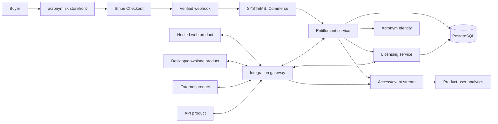
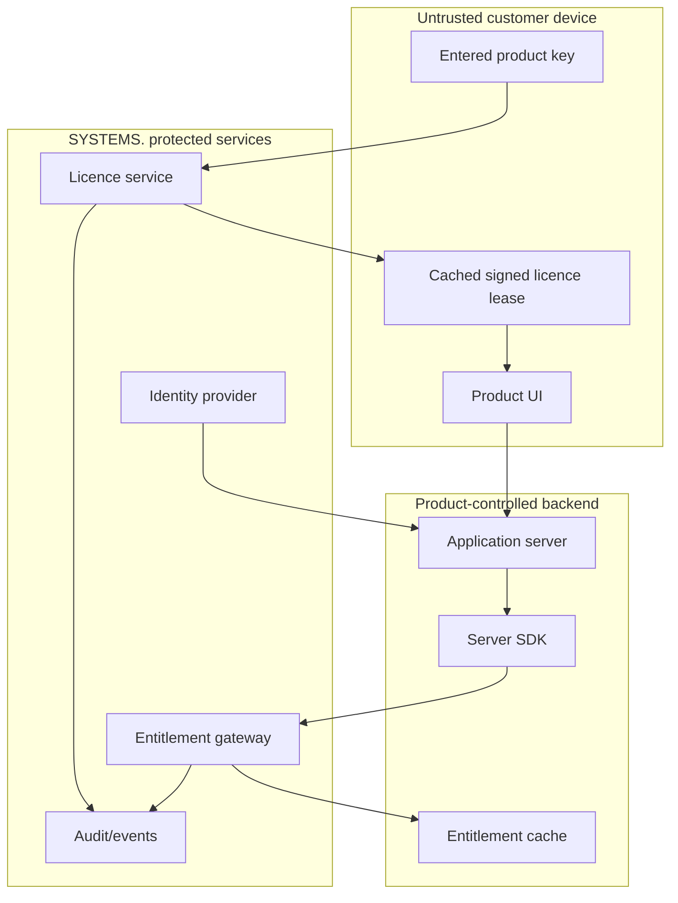
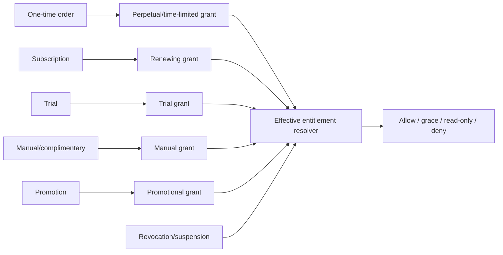
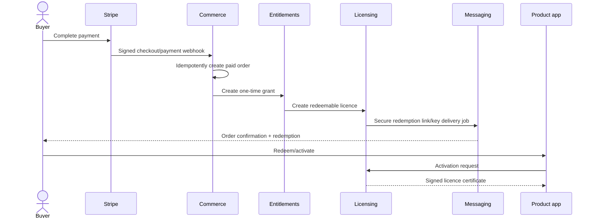
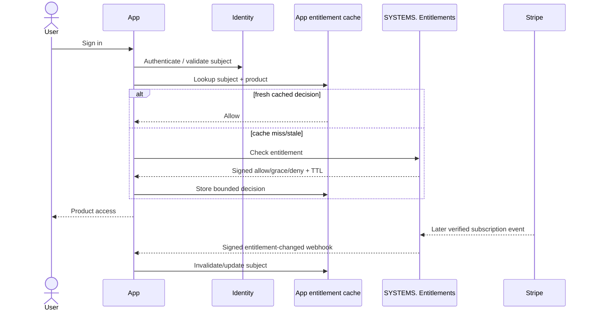
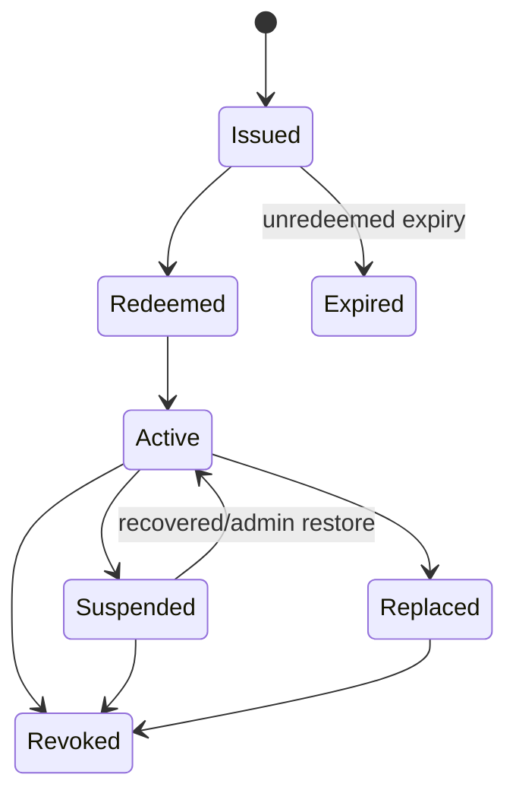
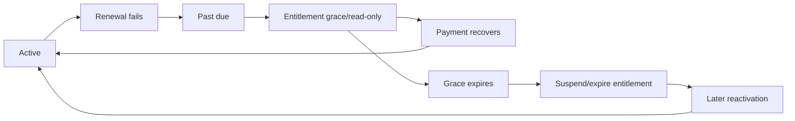
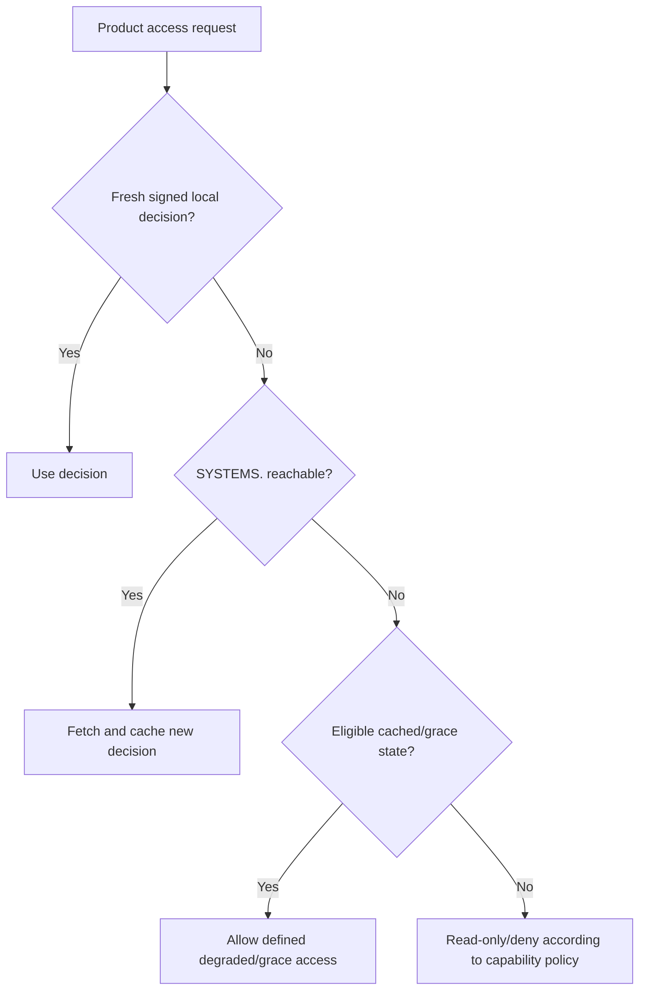
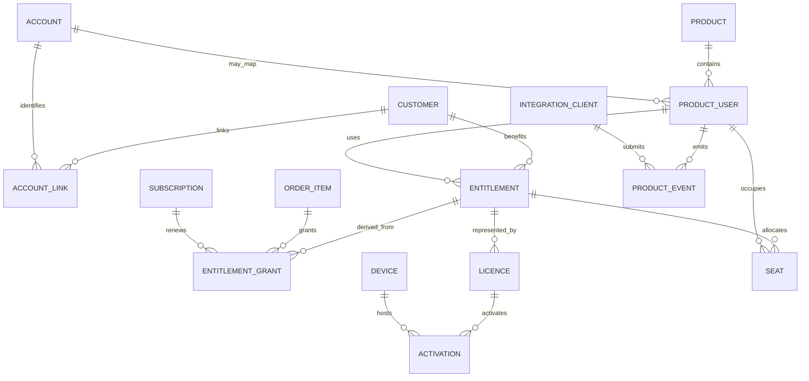

# SYSTEMS. V4 Mini-Proposal

## Unified Identity, Entitlements, Licensing, and Product-User Analytics

**Status:** Proposed V4 companion specification  
**Parent specification:** `docs/V4/V4_PROPOSAL.md`  
**Product:** SYSTEMS. by Acronym  
**Document version:** 1.0  
**Date:** 19 June 2026  
**Companion documents:**

- `docs/V4/V4_PROPOSAL.md` — definitive product and architecture proposal (parent)
- `docs/V4/SYSTEMS_V4_IMPLEMENTATION_ROADMAP_FIXED.md` — phased implementation roadmap (Phase 7 and 7.5)
- `docs/V4/SYSTEMS_V4_TECHNICAL_UPGRADE_PLAN.md` — technical upgrade plan based on current repository
- `docs/V4/SYSTEMS_V4_APP_BUILDER_GUIDE_FIXED.md` — app builder integration guide; defines how products consume the identity and entitlement API
- `docs/V4/V4_DEVELOPER_ALLOCATION.md` — task allocation between Alex and Tomas

> **SYSTEMS. standardises identity and entitlement communication across Acronym products; it does not force products to share one database.**

---

## Contents

1. Executive decision
2. Goals and non-goals
3. Core terminology
4. Architecture
5. Identity model
6. Entitlement model
7. Product integration modes
8. Purchase-to-access flows
9. Product licences and keys
10. Subscription lifecycle
11. Offline and degraded operation
12. Seats, devices, and organisations
13. Standard integration API
14. SDK and application contract
15. Product-user analytics
16. Dashboard experience
17. Security and abuse resistance
18. Privacy and EU/Slovak compliance
19. Performance, caching, and availability
20. Data model
21. Operations and scaling
22. Migration strategy
23. Edge cases
24. Delivery phases
25. Acceptance criteria
26. Final recommendation

---

## 1. Executive decision

SYSTEMS. V4 will add a central identity, entitlement, licensing, and product-user intelligence subsystem. It will connect verified commerce state to actual product access and give administrators a consistent view of registration, activation, payment, subscription, licence, seat, device, and usage status across every Acronym product.

It will **not** create one shared application-user database and will **not** read arbitrary product databases directly.

Instead, SYSTEMS. provides:

- Optional shared Acronym identity using standard authentication protocols.
- A canonical customer, account, product-user, entitlement, licence, activation, and subscription model.
- A versioned server API and supported SDKs.
- Signed webhooks when access changes.
- Online entitlement checks with safe caching.
- Product-key redemption and activation for downloadable products.
- Signed offline licence leases where offline use is required.
- Standard product-user and usage events.
- Aggregated per-product user and commercial analytics.
- Auditable revocation, recovery, grace, and manual-override workflows.

### 1.1 Unfiltered architecture ruling

| Approach | Decision | Reason |
|---|---|---|
| One shared user database for every app | Rejected | Excessive coupling, security blast radius, migrations, privacy risk, and availability dependency |
| SYSTEMS. directly reads each app database | Rejected | Fragile schemas, excessive data access, unsafe credentials, and unreliable meaning |
| Standard user table copied into every app | Optional adapter only | Useful as a local projection, but not the cross-product source of truth |
| Versioned identity/entitlement API and SDK | Approved | Stable boundary, least privilege, product independence, and observable behaviour |
| Central Acronym login for every product | Supported, not mandatory | Valuable for hosted products, but external/legacy products need bring-your-own identity |
| Product keys for all applications | Rejected | Appropriate for desktop/download/API products, unnecessary and weaker for hosted web apps |

---

## 2. Goals and non-goals

### 2.1 Goals

- Know which customers and product users are registered, active, paying, trialing, past due, cancelled, or entitled.
- Grant product access only from verified order/subscription/manual entitlement state.
- Deliver a product key or secure redemption link automatically where the offer requires it.
- Suspend or expire subscription-backed access according to explicit grace policy.
- Keep one-time purchases active according to their licence terms.
- Support hosted, downloadable, offline, API, external, and manually fulfilled products.
- Provide consistent product-user analytics without ingesting unnecessary profile data.
- Allow applications to survive temporary SYSTEMS. unavailability.
- Preserve immutable commercial, licence, activation, and access-decision evidence.
- Make product integrations replaceable and versioned rather than database-coupled.

### 2.2 Non-goals

- Replacing each product's internal profile/content/database model.
- Requiring every visitor or one-time buyer to create an Acronym account before checkout.
- Exposing Stripe objects or administrator credentials to product clients.
- Using a product key as the sole security boundary for hosted web applications.
- Permanently disabling users immediately after the first failed renewal.
- Tracking arbitrary user behaviour, screen content, keystrokes, or sensitive app data.
- Building DRM intended to make piracy impossible.
- Making every product request depend synchronously on SYSTEMS.

---

## 3. Core terminology

| Entity | Meaning |
|---|---|
| Customer | Billing/contact party that purchases or subscribes. May be a person or organisation. |
| Account | Login identity controlled by Acronym Identity, if one exists. |
| Product user | A user identity inside one particular product. May map to an Acronym account or external identity. |
| Identity link | Verified association between an account/customer and a product-user identifier. |
| Entitlement | Canonical right to use a product/capability through a period and policy. |
| Entitlement grant | One source contributing access, such as an order item, subscription, trial, administrator, or promotion. |
| Offer | Commercial package that defines price and resulting entitlement template. |
| Licence | Managed credential/record representing a redeemable product right. |
| Product key | Human-enterable high-entropy redemption credential for a licence. |
| Activation | Binding between a licence/entitlement and an account, installation, device, or API client. |
| Seat | One assignable unit of access within a multi-user entitlement. |
| Device | Privacy-minimised installation identifier, not unrestricted hardware fingerprinting. |
| Licence certificate | Signed machine-readable statement of rights used by an application. |
| Licence lease | Shorter-lived signed certificate requiring periodic refresh, suitable for subscriptions/offline operation. |
| Access decision | Auditable allow/deny/degraded result derived from grants, policy, time, and revocation state. |
| Integration client | Product backend or application authorised to call narrowly scoped SYSTEMS. endpoints. |

The terms are deliberately separate. A Stripe customer is not automatically a login account. A customer may buy seats for multiple product users. A product user may have access from more than one grant.

---

## 4. Architecture



### 4.1 Trust boundaries



Product clients are untrusted. Secret-bearing entitlement calls belong on product backends whenever one exists. Desktop applications use public-client protocols, redemption tokens, device activation, and signed certificates rather than embedded server secrets.

---

## 5. Identity model

### 5.1 Supported identity modes

#### Mode A — Acronym Identity

Recommended for new hosted Acronym products.

- OpenID Connect/OAuth 2.1-style authorization.
- Authorization Code with PKCE for browser/native clients.
- Product receives stable subject ID and approved minimal claims.
- Central session/account security without sharing passwords.
- Product keeps its own profile and product-specific data.

#### Mode B — Bring your own identity

For existing/external applications.

- Product authenticates its own users.
- Product sends an opaque `external_user_id` under its integration client.
- SYSTEMS. stores a scoped product-user record and optional verified identity link.
- Product passwords, reset tokens, and full profiles remain outside SYSTEMS.

#### Mode C — Licence-only

For desktop/offline products where an account is unnecessary.

- Customer redeems a key or secure link.
- Licence binds to an installation/device or optional account.
- SYSTEMS. stores the entitlement/activation without creating a general login identity.

### 5.2 Account rules

- Email is a mutable contact/login attribute, not the primary identifier.
- Stable internal IDs and provider subject IDs identify accounts.
- Email verification state is explicit.
- Account merge is audited and never implicitly inferred from matching email alone.
- One customer may link to multiple accounts/product users.
- One account may be a user under multiple products without exposing cross-product activity to those products.
- Products receive only claims/scopes needed for their function.
- Authentication factors and sessions are never shared through product databases.

### 5.3 Product-user registration

A product registers or upserts a user through a scoped integration:

```json
{
  "external_user_id": "usr_7f31...",
  "account_subject": "optional-acronym-subject",
  "registered_at": "2026-06-19T12:00:00Z",
  "locale": "sk",
  "country": "SK"
}
```

Only bounded, documented fields are accepted. Names, addresses, profile content, and sensitive attributes are excluded unless a defined business requirement and lawful basis exist.

---

## 6. Entitlement model

### 6.1 Entitlements are derived from grants



One entitlement may have several grants. Cancelling one source must not revoke access provided by another valid source.

### 6.2 Entitlement fields

- Product and capability.
- Subject: customer, account, product user, organisation, licence, or installation.
- Source grant(s).
- Access tier/plan.
- Start, paid-through, expiry, grace-until, and revoked times.
- Seat/device/concurrency limits.
- Offline allowance.
- Feature flags/capabilities.
- Fulfilment and update/support scope.
- Policy/version used to resolve access.
- Current effective state and reason.

### 6.3 Effective states

```text
pending
trial
active
grace
read_only
suspended
expired
revoked
```

Commercial provider state and effective access state remain separate. For example, Stripe may report `past_due` while SYSTEMS. reports entitlement `grace` until a configured deadline.

### 6.4 Access-decision response

```json
{
  "decision": "allow",
  "entitlement_id": "ent_01...",
  "product_id": "prod_01...",
  "plan": "pro",
  "capabilities": ["core", "export", "sync"],
  "seats": { "limit": 5, "assigned": 3 },
  "valid_until": "2026-07-19T12:00:00Z",
  "refresh_after": "2026-06-19T12:15:00Z",
  "policy_version": 4,
  "reason": "active_subscription"
}
```

The response is signed or delivered over mutually authenticated/server-authenticated channels as appropriate. It contains no unnecessary billing or personal data.

---

## 7. Product integration modes

| Product type | Recommended access mechanism | Key use |
|---|---|---|
| Hosted web/SaaS | Acronym Identity or product auth + server entitlement API/webhook | Normally none |
| Native desktop | Redemption key + activation + signed licence lease | Yes |
| Offline desktop | Redemption/activation + signed offline certificate/lease | Yes |
| Mobile app | Account/store entitlement mapping + server verification | Only when distribution model needs it |
| API/developer product | Scoped API credential backed by entitlement and quota | API key, not human product key |
| Download-only asset | Secure fulfilment link and entitlement | Optional redemption code |
| Source-code purchase | Entitlement + manual/repository fulfilment | Optional |
| Service/setup | Manual fulfilment milestone | No runtime key |
| External hosted product | BYO identity + scoped entitlement integration | Usually none |

Product key generation is configured per offer fulfilment type, not globally per product.

---

## 8. Purchase-to-access flows

### 8.1 One-time downloadable licence



### 8.2 Subscription-backed hosted product



### 8.3 Manual/complimentary access

Administrator-created grants require reason, scope, start/end, responsible administrator, optional approving administrator, and audit history. Manual access cannot rewrite Stripe state or disguise itself as paid revenue.

---

## 9. Product licences and keys

### 9.1 Product-key principles

- At least 128 bits of cryptographically secure randomness before encoding.
- Human-friendly alphabet avoiding ambiguous characters.
- Checksum for typing errors, not security.
- Optional visible nonsecret prefix identifying product/key generation.
- No embedded email, customer ID, plan, price, expiry, or personal data.
- Full plaintext shown only at creation/redemption delivery when required.
- Server stores lookup prefix plus keyed/HMAC fingerprint, not recoverable plaintext.
- Rate-limited, monitored redemption and validation.

Example shape—not a fixed final format:

```text
ACR-PLOT-7K9M-Q4TX-V8CP-2ND6-WR3H
```

### 9.2 Licence lifecycle



### 9.3 Redemption

Redemption is distinct from validation:

1. Buyer enters key or follows secure one-time link.
2. SYSTEMS. verifies fingerprint, status, offer/product, redemption limits, and risk controls.
3. Buyer optionally authenticates/creates an account.
4. Licence binds to the permitted subject.
5. Product receives a licence certificate/activation result.
6. Original key becomes nonreusable except under explicit multi-redemption/seat policy.

Email should prefer a short-lived redemption link with the key available in a secure fulfilment view. Email is not treated as a permanent secure key vault.

### 9.4 Revocation and replacement

Reasons include refund, chargeback, fraud, duplicate issue, abuse under enforceable terms, compromised key, subscription expiry, administrator correction, and customer-requested replacement.

Revocation is append-only and records actor, reason, source evidence, effective time, notification, affected activations, and appeal/support path. Replacement creates a new licence and links the old one; it never mutates history.

### 9.5 One-time purchase policy

One-time purchase normally creates a perpetual entitlement subject to the purchased licence. It is not periodically disabled for lack of a subscription. Update/support eligibility may be time-limited separately without invalidating the purchased version unless the offer clearly and lawfully defines otherwise.

---

## 10. Subscription lifecycle

### 10.1 Billing-to-access mapping

| Stripe state/event | Default SYSTEMS. behaviour |
|---|---|
| Checkout/subscription incomplete | No active paid grant |
| Trialing | Trial entitlement according to offer |
| Active | Active entitlement through provider period end |
| Past due | Grace/read-only according to offer policy |
| Payment recovered | Return same entitlement to active idempotently |
| Cancel at period end | Remain active until paid-through end |
| Immediate cancellation | Apply configured immediate/end-period rule from verified state |
| Unpaid/expired | Suspend/expire after grace policy |
| Refund/chargeback | Apply explicit product/legal policy; do not guess |

### 10.2 Policy configuration per offer

- Grace-period length.
- Whether grace allows full or read-only access.
- Offline lease maximum.
- Data export/download window.
- Seat reduction timing on downgrade.
- Cancellation effective time.
- Reactivation and data-restoration behaviour.
- Customer notifications and localized templates.
- Manual-review conditions for chargebacks/fraud.

### 10.3 Failure-to-pay flow



The first failed payment never automatically destroys customer data or permanently revokes the licence. Access state, data retention, and deletion are separate policies.

---

## 11. Offline and degraded operation

### 11.1 Signed licence leases

Subscription-backed offline products receive a signed lease with:

- Licence, product, plan, capabilities, and pseudonymous subject/device IDs.
- Issued-at, not-before, expiry, and recommended refresh time.
- Offline allowance and policy version.
- Key ID and Ed25519 or equivalent modern signature.
- No billing details or unnecessary personal information.

The application embeds only public verification keys. SYSTEMS. protects signing private keys and supports rotation/overlap.

### 11.2 Offline policy

- Typical subscription lease: 7–30 days depending on product risk and expected offline use.
- Refresh before expiry while online.
- Temporary SYSTEMS. outage does not immediately block paid users.
- Clock rollback/tampering signals risk but must avoid destructive false positives.
- Perpetual products may use long-lived certificates plus revocation refresh where appropriate.
- High-risk online capabilities may require fresher verification than core offline functionality.

### 11.3 Degraded access

Products can implement:

- Full cached access.
- Read-only mode.
- Export-only mode.
- Limited offline capabilities.
- Grace warning without interruption.
- Denial only after verified expiry/revocation and policy allowance.

Each product declares and tests its degraded behaviour. A SYSTEMS. outage cannot be allowed to corrupt customer data or trap it without export.

---

## 12. Seats, devices, and organisations

### 12.1 Seat model

- Entitlement owns a seat limit.
- Seats are assigned to account/product-user IDs.
- Invitations do not consume a seat until policy-defined acceptance.
- Seat assignment/removal is audited.
- Downgrade below current usage enters an over-limit resolution state rather than randomly removing users.
- Concurrent-user limits, named seats, and device activations are distinct concepts.

### 12.2 Device model

Device identity should use an app-generated installation key pair or random installation ID, not invasive fingerprinting. Store:

- Installation/device ID and optional display label.
- Platform/app version.
- First/last activation and validation time.
- Licence/account association.
- Status and revocation reason.
- Minimal risk signals.

Customers receive self-service device visibility and reset within abuse-resistant limits. Administrators can override with audit.

### 12.3 Organisation/team accounts

The model supports a purchasing organisation, billing owner, product organisation, administrators, members, seats, and invitations. V4 may initially expose only simple seat assignment, but the schema must not equate one Stripe customer with one human product user.

---

## 13. Standard integration API

### 13.1 Namespaces

```text
/api/identity/*
/api/entitlements/*
/api/licensing/*
/api/customers/*
/api/ingest/*
/api/webhooks/*
```

Representative endpoints:

```text
POST /api/customers/product-users
POST /api/customers/product-users/{external-id}/link-account
POST /api/ingest/events

POST /api/entitlements/check
POST /api/entitlements/batch-check
GET  /api/entitlements/{id}

POST /api/licensing/redeem
POST /api/licensing/activate
POST /api/licensing/validate
POST /api/licensing/deactivate
GET  /api/licensing/revocations/{product-id}

POST /api/webhooks/integration/acknowledge
```

Administrator APIs for grants, revocations, replacements, seats, and device resets remain under `/api/admin/*` and require stronger permissions.

### 13.2 Authentication classes

| Caller | Authentication |
|---|---|
| Hosted product backend | Scoped confidential integration credential or mTLS later |
| Browser/mobile public client | OIDC authorization with PKCE; never product server secret |
| Desktop product | Public-client activation protocol + proof of installation key possession |
| External server | Rotatable scoped key/HMAC or mTLS |
| SYSTEMS. administrator | Separate admin session/TOTP realm |

### 13.3 API guarantees

- Schema validation and versioning.
- Idempotency keys for writes/redemptions/activations/events.
- Request and decision correlation IDs.
- Bounded payload and batch sizes.
- Explicit rate-limit headers and retry rules.
- Consistent error codes, not logic based on human error text.
- UTC timestamps and documented clock-skew tolerance.
- No direct database access as an integration requirement.

---

## 14. SDK and application contract

### 14.1 Initial SDKs

- TypeScript/Node server SDK.
- Browser OIDC helper where required.
- Framework-neutral REST/OpenAPI contract.
- Later native desktop helpers only when a real product requires them.

Avoid creating many unmaintained SDKs. A high-quality HTTP contract and generated types are preferable to thin, inconsistent wrappers.

### 14.2 Server SDK responsibilities

- Credential handling outside source control.
- Entitlement check and batch check.
- Local bounded cache.
- Signature verification.
- Webhook verification/deduplication.
- Product-user upsert.
- Event batching/retry.
- Clear fail-open/fail-closed/degraded policy configuration.

### 14.3 Integration manifest

Each product declares:

```yaml
identity_mode: acronym_oidc | external | licence_only
entitlement_mode: hosted | desktop_lease | api_quota | manual
product_id: prod_...
capabilities:
  - core
  - export
cache:
  decision_ttl_seconds: 900
  outage_grace_seconds: 86400
subscription:
  past_due_mode: grace
  grace_days: 7
licensing:
  device_limit: 2
  offline_lease_days: 14
```

SYSTEMS. validates the manifest against offer policy. Applications cannot extend access beyond server-defined maximums by changing local configuration.

---

## 15. Product-user analytics

### 15.1 Core metrics

- Registered product users.
- Verified/linked accounts.
- Daily/monthly active users.
- Paying customers versus active product users.
- Trial users and trial-to-paid conversion.
- Signup, onboarding, activation and first-meaningful-action completion.
- Onboarding drop-off by step, product version, plan, locale and referrer.
- D1/D7/D30 retention, cohort retention and reactivation.
- Active, grace, suspended, expired, and revoked entitlements.
- Licences issued, redeemed, active, unredeemed, replaced, and revoked.
- Device activations and seat utilisation.
- Registration-to-activation and activation-to-paid conversion.
- Churn, payment recovery, and reactivation.
- Usage by product version, plan, locale, and bounded platform class.
- Entitlement validation failures by safe reason category.

### 15.2 Standard events

```text
product_user_registered
account_linked
session_started
meaningful_activity
onboarding_started
onboarding_step_completed
onboarding_completed
first_meaningful_action_completed
trial_started
licence_issued
licence_redeemed
device_activated
entitlement_checked
entitlement_denied
subscription_grace_started
access_suspended
access_reactivated
seat_assigned
seat_released
feedback_submitted
bug_report_submitted
```

Products may define additional allow-listed events, but arbitrary properties and raw business records are not accepted.

### 15.3 Analytics boundaries

- SYSTEMS. does not query product user tables.
- Applications send events or periodic bounded summaries.
- Active-user definitions are explicit per product; opening a background process may not count as meaningful activity.
- Billing analytics use verified commerce records, not client claims.
- Revenue, MRR, refunds, chargebacks and payment status are read from canonical commerce state.
- Retention and onboarding analytics are derived from bounded standard events and explicit product definitions.
- Product events use pseudonymous product-user IDs.
- Dashboards use aggregates by default; access to individual activity is restricted and justified.
- Internal/admin/test traffic can be marked and excluded without deleting audit history.

---

## 16. Dashboard experience

### 16.1 Global navigation addition

```text
Customers
├── Customers
├── Accounts
├── Product users
├── Entitlements
├── Licences
├── Activations
└── Access incidents
```

### 16.2 Product workspace additions

```text
Product
├── Users
├── Access
├── Licences
├── Seats and devices
├── Integration
├── User analytics
├── Feedback
└── Bug reports
```

### 16.3 Product user view

Shows only authorized, relevant data:

- Product-user identity and account/customer links.
- Registration and last meaningful activity.
- Effective entitlement and explanation.
- Source grants and paid-through/grace/expiry.
- Assigned seats/devices.
- Licence/activation state.
- Access-decision history with safe reasons.
- Linked feedback threads and bug reports where authorised.
- Support/manual actions and audit.

### 16.4 Feedback and bug report links

Feedback and bug reports may be linked to product users, accounts, customers, orders, subscriptions, entitlements, licences, activations, releases and error groups. The link must record who created it, why it was created and whether the link exposes customer-identifying data to an administrator.

Feedback is not used to make automatic access decisions. It may inform support, product planning and bug triage, but entitlement and billing state remain canonical.

### 16.5 Administrator actions

- Grant complimentary/time-limited access.
- Extend grace with reason.
- Replace/revoke licence.
- Reset/deactivate device.
- Assign/release seat.
- Resend secure redemption.
- Reconcile with Stripe.
- Export a customer's entitlement evidence.

High-impact actions show consequences, require confirmation/reason, and never silently rewrite billing state.

---

## 17. Security and abuse resistance

### 17.1 Threat model

Protect against:

- Stolen/shared product keys.
- Brute-force key redemption.
- Forged licence certificates.
- Replay of activation/entitlement responses.
- Embedded app credentials extraction.
- Compromised product integration key.
- One app querying another app's users.
- Customer/account takeover.
- Device-limit reset abuse.
- Clock manipulation for offline leases.
- Webhook forgery or duplicate delivery.
- Administrator abuse or accidental mass revocation.
- SYSTEMS. outage being used to bypass access indefinitely.

### 17.2 Required controls

- Cryptographically random keys and keyed fingerprints.
- Ed25519 or equivalent signed certificates with key IDs/rotation.
- Product, environment, and scope bound into every credential/decision.
- Public clients contain no reusable server secret.
- Proof-of-possession installation keys for desktop activation where practical.
- Nonces/idempotency and bounded timestamp acceptance.
- Rate limits by IP, licence prefix, integration, account, and product.
- Progressive abuse controls without permanently locking legitimate buyers.
- Separate production/test keys and environments.
- Least-privilege product scopes; cross-product access denied by default.
- Append-only licence/revocation/administrator audit events.
- Two-person approval option for bulk revocation or mass entitlement changes.
- Security notifications for new activation, replacement, or suspicious access.

### 17.3 Key management

- Signing keys are separate from ordinary database encryption/session keys.
- Private signing keys use protected storage and are never available to product containers.
- Public verification keys are distributed as a versioned key set and cached.
- Rotation overlaps old/new verification until all valid leases can transition.
- Compromise procedure can revoke a signing key and reissue leases without deleting commercial history.

### 17.4 Fail-safe policy

Fail-open versus fail-closed is selected per capability:

- Existing low-risk paid access normally uses cached/grace operation.
- New redemption, seat expansion, and high-risk server actions fail closed when authority cannot be established.
- Customer data remains exportable/read-only where policy permits.
- Emergency global bypass is forbidden; emergency product-specific access extension is time-limited and audited.

---

## 18. Privacy and EU/Slovak compliance

This subsystem follows the parent V4 legal/compliance architecture and requires counsel review before launch.

### 18.1 Data minimisation

SYSTEMS. stores the minimum identity linkage and access evidence required. Product content, user-generated data, passwords, behavioral detail, and sensitive profile attributes stay in the product unless explicitly necessary.

### 18.2 Transparency

Privacy and product terms explain:

- That Acronym/SYSTEMS. manages account, purchase, entitlement, licence, activation, and fraud/security records.
- Which data products send to SYSTEMS.
- Why device/installation identifiers are used.
- How long access and activity evidence is retained.
- When access may be suspended/revoked.
- How customers can view/reset devices, exercise rights, complain, or appeal an incorrect decision.

### 18.3 Automated access decisions

Access automation implements the contract; it should not make opaque high-impact profiling decisions. Fraud/risk flags leading to durable denial or revocation receive review/support handling. SYSTEMS. records the rule/policy version and safe reason for every denial.

### 18.4 Retention and deletion

- Financial/legal acceptance records follow mandatory retention.
- Product-user activity is aggregated and raw events expire under policy.
- Unredeemed keys and stale device records have defined retention.
- Account erasure removes/anonymises optional identity data while retaining restricted legal evidence.
- Product user deletion is communicated through an idempotent integration workflow; it does not silently delete financial records.

### 18.5 Consumer fairness

- Licence/device limits and subscription suspension rules are prominent before purchase.
- A failed renewal does not unexpectedly destroy data.
- Cancellation, reactivation, device reset, and support routes are usable.
- Perpetual licences are not misleadingly converted into subscriptions.
- Offline limitations and validation frequency are disclosed.
- Revocation has an explainable reason and support/appeal path where appropriate.

---

## 19. Performance, caching, and availability

### 19.1 Entitlement cache

Hosted products cache signed access decisions by product, subject, capability set, and policy version. Cache entries include `valid_until` and `refresh_after`. Entitlement-change webhooks accelerate invalidation, but bounded TTL guarantees convergence if a webhook is lost.

Do not cache denials as long as active allows unless reason-specific policy justifies it; payment recovery must not leave a user locked out for an excessive TTL.

### 19.2 Availability model



### 19.3 Server protection

- Batch entitlement checks for team/member lists.
- Batch product events with bounded memory/disk buffering.
- Use database indexes on product/subject/effective state/provider IDs.
- Precompute dashboard aggregates.
- Separate access-check, licence, analytics, and bulk-admin rate/concurrency pools.
- Avoid writing an audit row for every successful cached local check; record authoritative checks and aggregate validation metrics.
- High-volume validation may use a read-optimised entitlement projection rebuilt from canonical grants.
- Licence certificate verification occurs locally and does not hit SYSTEMS. per application action.

### 19.4 Consistency

Canonical grants and revocations live transactionally in PostgreSQL. A derived effective-entitlement projection may be cached, but includes source/policy version and can be rebuilt. Commerce webhook processing writes canonical state plus outbox event atomically. Products converge through webhook plus TTL/refresh.

### 19.5 Service objectives

- Existing cached/offline access survives a temporary control-plane outage.
- Verified Stripe events are durably recorded before expensive fulfilment.
- Licence issuance/redemption is idempotent.
- Entitlement check p95 and error rate are independently monitored.
- Revocation propagation target is product/risk specific and disclosed; emergency high-risk revocation can use shorter cache/online requirements.

---

## 20. Data model



### 20.1 Tables

#### Identity

- `accounts`
- `account_emails`
- `account_sessions`
- `account_links`
- `product_users`
- `product_user_links`

#### Access (Phase 7.5 additions/extensions)

The following tables from Phase 7 already exist and are extended here:

- `entitlement_grants` — Phase 7 creates this table with a nullable `account_id` FK. Phase 7.5 populates that column via a customer-email → account-email matching migration and adds account-linked grant sources.
- `licences`, `licence_activations`, `entitlement_revocations`, `effective_entitlements` — already in Phase 7; not recreated.

New tables added in Phase 7.5:

- `seats`
- `seat_assignments`

#### Licensing (Phase 7.5 additions)

`licence_signing_keys` is created in Phase 7 and holds actual Ed25519 key material. Phase 7.5 adds:

- `signing_keys_metadata` — extended metadata for managing multiple key algorithms, key lifecycle states, and public-key distribution. Supplements (does not replace) `licence_signing_keys`.
- `licence_key_fingerprints` — maps fingerprints to active keys for fast lookup without exposing raw key material.
- `licence_certificates` — structured certificate records for multi-device or seat-based licence delivery.
- `devices` — privacy-minimised device records (hashed device ID) for activation tracking.
- `activations` — canonical activation records (previously in `licence_activations`; Phase 7.5 renames and extends with device/seat linkage).
- `revocations` — extends Phase 7 revocation audit with device-level and certificate-level entries.

#### Integration and analytics

- `integration_clients`
- `integration_credentials`
- `integration_webhook_endpoints`
- `integration_webhook_deliveries`
- `product_events_raw`
- `product_user_metrics_daily`

### 20.2 Data invariants

- Product users are unique by `(product_id, external_user_id)`.
- Provider/customer/account/product-user IDs are never conflated.
- Licence plaintext is not stored after one-time delivery where avoidable.
- One provider event creates a commercial/grant transition at most once.
- One activation request/idempotency key creates at most one activation.
- Effective entitlement is reproducible from canonical grants, revocations, policy, and time.
- Revocation and manual override history is append-only.
- `entitlement_grants.account_id` is nullable — NULL in Phase 7, populated in Phase 7.5 by the customer-email → account-email matching migration. Cancelling one grant source must never revoke access from a separate grant source (multi-grant resolver invariant).
- Account merge is audited and never implicit from a matching email alone. Two accounts must be explicitly merged by an admin action.

---

## 21. Operations and scaling

### 21.1 Initial deployment

The services may begin as modules/processes inside the V4 control-plane deployment, but preserve boundaries:

- Identity/authentication module.
- Entitlement/grant resolver.
- Licence issuer/activation module.
- Integration/event ingestion.
- Background delivery/webhook worker.

Signing operations and high-volume event ingestion should be independently separable. The main deployment API should not be required for an entitlement check.

### 21.2 Scaling path

1. PostgreSQL canonical state plus in-process/read projection cache.
2. Dedicated entitlement/licence worker and durable queue.
3. Shared cache/read replicas only after measured need.
4. Independent stateless entitlement gateway replicas.
5. Hardware-backed/managed signing keys if product risk/revenue warrants it.

### 21.3 Monitoring

- Entitlement checks by state/reason/product.
- Cache hit rate and stale/grace decisions.
- Licence issue/redemption/activation success and abuse rate.
- Webhook delivery lag/failure.
- Subscription transition and revocation propagation lag.
- Signing key age/rotation status.
- Product event queue age/drop/quarantine.
- Database projection drift/rebuild health.

---

## 22. Migration strategy

### 22.1 Existing products

1. Register product and integration mode.
2. Map existing commercial offers to entitlement templates.
3. Import existing customers/subscriptions from verified provider data.
4. Import product users using opaque external IDs and minimum fields.
5. Produce a dry-run identity-link report; do not merge automatically by email.
6. Create grants and compare expected access with current product behaviour.
7. Run dual-read/shadow entitlement checks without enforcing.
8. Resolve differences.
9. Enable webhooks/cache invalidation.
10. Turn on enforcement gradually with rollback/degraded mode.

### 22.2 Existing perpetual keys

Import fingerprints/status and preserve original licence terms. If raw keys cannot be safely imported, support one-time migration redemption that exchanges an old validated key for a new SYSTEMS. licence without invalidating legitimate offline users unexpectedly.

### 22.3 No flag-day migration

Products adopt the contract independently. SYSTEMS. dashboards label integration completeness and data freshness. A product is never shown as fully entitlement-managed until purchase, renewal, cancellation, outage, and recovery paths pass certification.

---

## 23. Edge cases

| Edge case | Required behaviour |
|---|---|
| Customer pays but webhook is delayed | Show processing; do not invent access from redirect; fulfil after verified event. |
| Same checkout webhook delivered repeatedly | Unique provider event and idempotent grant/licence creation. |
| Two simultaneous licence redemptions | Transaction/lock allows only policy-permitted redemption count. |
| Key is mistyped repeatedly | Checksum gives safe error; rate limits prevent enumeration. |
| Buyer forwards unredeemed email | Optional account binding/risk review; support legitimate gifting only when offer allows it. |
| Subscription payment fails once | Enter configured grace/read-only, not immediate destructive revocation. |
| Payment recovers | Reactivate same grant/entitlement and invalidate denial cache quickly. |
| Subscription ends but perpetual grant also exists | Resolver keeps access from perpetual source. |
| Refund occurs after licence activation | Apply offer/legal refund policy, record revocation, notify product and customer. |
| Chargeback is disputed | Use review/suspension policy; do not delete evidence. |
| Product is offline beyond lease | Apply disclosed degraded/expiry policy; preserve data/export where applicable. |
| User changes device clock | Detect bounded anomalies; avoid destructive permanent revocation from client clock alone. |
| User reinstalls OS | Customer can reset/recover activation within abuse-resistant rules. |
| Device fingerprint changes | Prefer installation key/account recovery rather than brittle hardware matching. |
| Product webhook is unavailable | Retry with signed idempotent delivery; TTL checks still converge. |
| Entitlement service is unavailable | Use last signed decision/lease within product policy. |
| Signing key is compromised | Revoke key ID, rotate, reissue leases, preserve commercial entitlements. |
| Product integration credential leaks | Revoke/rotate scoped credential and identify affected event/check window. |
| App asks about another product | Deny scope regardless of known subject ID. |
| Two accounts share the same email | Never merge automatically; use verified merge flow. |
| Customer buys seats but has no account | Maintain customer entitlement; invite/link product users later. |
| Seat downgrade is below usage | Enter over-limit state and request selection; do not randomly remove access. |
| Manual grant overlaps trial/subscription | Keep source grants distinct; calculate one effective access result. |
| Admin accidentally bulk revokes | Impact preview, typed confirmation, optional second approval, auditable recovery. |
| User requests erasure | Remove/anonymise optional identity/activity while preserving restricted legal records. |
| Product reports impossible event timestamps | Quarantine/bound skew; retain receive time and avoid corrupt aggregates. |
| Analytics events are lost | Access and billing remain correct; expose loss/queue health rather than fabricating totals. |
| Key appears in logs/support ticket | Redact format, allow replacement, and never use plaintext as DB authority. |
| Test purchase reaches production app | Environment-bound credentials/entitlements prevent cross-environment access. |

---

## 24. Delivery phases

### Phase 1 — canonical access model

- Accounts/product users/identity links.
- Entitlements, grants, policies, and resolver.
- Manual grants and admin views.
- Server entitlement API with cache contract.

**Exit:** One hosted test product can resolve access without shared DB access.

### Phase 2 — commerce automation

- Order/subscription to grant templates.
- Idempotent Stripe-driven transitions.
- Grace, recovery, cancellation, and reconciliation.
- Signed product webhooks.

**Exit:** One-time and subscription purchases produce correct effective access through failure/recovery tests.

### Phase 3 — licensing

- Key generation/fingerprints.
- Redemption, licence, device, activation, replacement, revocation.
- Signed certificates/leases and key rotation.
- Customer device self-service.

**Exit:** A downloadable test product functions online/offline and survives SYSTEMS. outage within policy.

### Phase 4 — identity and teams

- Acronym OIDC account integration.
- BYO identity links.
- Seats, invitations, organisations, merge/recovery.

**Exit:** Hosted and team products can map payer, account, and product users correctly.

### Phase 5 — product-user analytics

- Standard event contract and batching.
- Aggregates and product dashboards.
- Registration, onboarding, activation, active, paid, trial, retention, churn, seat/device, and licence metrics.
- Feedback and bug-report links to product-user context where permitted.
- Privacy/retention controls.

**Exit:** Analytics reconcile with canonical commerce/access state and do not require product DB reads.

### Phase 6 — hardening

- Abuse/rate/replay/credential tests.
- Load, cache, outage, webhook-loss, clock, and key-rotation tests.
- Privacy/legal/security review.
- Integration certification and runbooks.

**Exit:** Production enforcement is enabled only for certified products.

---

## 25. Acceptance criteria

### Architecture

- No product requires direct access to SYSTEMS. PostgreSQL.
- SYSTEMS. requires no direct credentials for a product's user database.
- Products are isolated by credential scope and product/environment identity.
- Customer, account, product user, entitlement, subscription, licence, activation, seat, and device remain distinct entities.

### Commerce and access

- Verified one-time purchase creates exactly one intended grant/licence.
- Subscription activation, past due, grace, recovery, period-end cancellation, expiry, refund, and chargeback policies are tested.
- Overlapping grants resolve correctly without accidental revocation.
- Browser redirects/client events cannot grant paid access.
- Manual grants are distinguishable from revenue.

### Licensing

- Product keys have sufficient entropy, checksum, one-time-safe handling, and nonrecoverable server fingerprinting.
- Redemption/activation are idempotent and rate-limited.
- Signed certificates reject forgery, wrong product/environment, expiry, and revoked signing keys.
- Device reset/replacement/revocation is auditable and customer-supportable.
- Perpetual licences remain valid according to their purchased terms.

### Availability and performance

- Hosted products use bounded signed entitlement caching.
- Offline product continues through documented outage window.
- Webhook loss converges through TTL/reconciliation.
- Entitlement and licence work cannot starve Stripe webhook recording.
- Dashboard analytics use aggregates rather than scanning raw events per request.

### Security and privacy

- Public apps contain no confidential integration credentials.
- One product cannot query another product's subjects or entitlements.
- Key/signing/integration credential rotation is exercised.
- Abuse and bulk-administration safeguards are tested.
- Data inventory, retention, erasure/anonymisation, transparency, and customer appeal/support flows are approved.

### Analytics

- Registered, onboarding, activation, retention, active, paid, trial, grace, suspended, churn, licence, activation, seat, and device metrics have explicit definitions.
- Revenue/payment status comes from canonical commerce state.
- Product-user activity uses pseudonymous bounded events.
- Analytics failure cannot change entitlement state.

---

## 26. Final recommendation

This addition should become a core V4 capability, implemented after the canonical Product/System/Commerce model and alongside subscriptions.

The final boundary is:

```text
Product databases
  Own product-specific users, profiles, content, and business data

SYSTEMS.
  Owns identity links, commercial entitlements, licences, activations,
  access policy, product-user aggregates, and auditable access decisions

Stripe
  Owns payment methods and recurring billing authority

Product applications
  Enforce access using the SYSTEMS. contract and safe local cache/leases
```

The result is a genuine commercial control plane: SYSTEMS. can show who registered, who paid, what they own, whether their subscription is valid, which seats/devices are active, and how each product is being used—without turning every Acronym application into one fragile shared-database monolith.
