# SYSTEMS. V4 Proposal

**Status:** Definitive implementation proposal  
**Product:** SYSTEMS. by Acronym  
**Target domain:** `acronym.sk`  
**Document version:** 1.2  
**Date:** 18 June 2026  
**Companion documents:**

- `docs/V4/SYSTEMS_V4_IMPLEMENTATION_ROADMAP_FIXED.md` — phased implementation roadmap with exit gates and rollback paths
- `docs/V4/SYSTEMS_V4_TECHNICAL_UPGRADE_PLAN.md` — technical upgrade plan based on current repository
- `docs/V4/V4_IDENTITY_LICENSING_ADDITION.md` — identity, entitlements, licensing and product-user analytics
- `docs/V4/SYSTEMS_V4_APP_BUILDER_GUIDE_FIXED.md` — app builder integration guide and acceptance levels
- `docs/V4/V4_DEVELOPER_ALLOCATION.md` — task allocation between Alex and Tomas

> **SYSTEMS. is Acronym's private control plane for building, deploying, operating, publishing, and commercialising digital products.**

---

## Contents

1. Executive summary
2. Locked product decisions
3. Goals and non-goals
4. Domain language
5. System context
6. URL and path architecture
7. Product and system model
8. Independent state machines
9. Portfolio CMS and publishing
10. Environments, releases, and deployment
11. Domains and access
12. Commerce architecture
13. Customer model
14. External systems and integration API
15. Analytics
16. Dashboard information architecture
17. Security architecture
18. EU and Slovak legal/compliance architecture
19. Reliability, backup, and disaster recovery
20. Performance, caching, and host protection
21. Scaling strategy
22. Background jobs and consistency
23. Observability
24. API quality standards
25. Migration from the current repository
26. Delivery plan
27. Acceptance criteria
28. Key risks and mitigations
29. Edge cases and required behaviour
30. Final product experience

---

## 1. Executive summary

SYSTEMS. V4 evolves the current private deployment engine into the operating core behind Acronym's complete product portfolio. Acronym remains the public brand, portfolio, and storefront. SYSTEMS. remains private and becomes the source of truth for products, the complete portfolio content model, deployed systems, environments, domains, releases, health, publishing, offers, customers, orders, subscriptions, entitlements, and product analytics.

The portfolio is therefore **directly managed inside SYSTEMS.** as a first-class, purpose-built CMS and publishing module. Administrators compose the homepage, global navigation, product pages, editorial pages, media, SEO, pricing presentation, legal content, redirects, and featured ordering from the private dashboard. The public `acronym.sk` website remains a separately deployed renderer that consumes immutable published snapshots. This preserves independent deployment, strong security boundaries, cached availability, and rollback even when the control plane is unavailable.

The defining architectural decision is to keep three concerns separate:

1. **Product plane:** what Acronym presents and sells.
2. **Control plane:** how administrators deploy, operate, publish, and commercialise it.
3. **Runtime plane:** where managed and external systems actually execute.

A product is not a container. A product may contain several systems; a system may have production and preview environments; and internal systems may exist without a public product. Deployment does not imply publication, public access does not imply portfolio visibility, and payment does not itself imply entitlement.

V4 launches as a disciplined single-organisation platform on infrastructure Acronym controls. Its boundaries allow later multi-host operation and client-owned products without turning V4 into a public hosting platform or marketplace.

---

## 2. Locked product decisions

- Acronym is the only seller in V4.
- SYSTEMS. has no public signup and remains private.
- A product may contain multiple managed or external systems.
- Systems may exist without public products.
- Production and preview are first-class environments; development is represented but may remain CLI/integration-led initially.
- Portfolio management is a first-class global SYSTEMS. module, not merely a tab containing product descriptions.
- SYSTEMS. owns portfolio content, layout composition, navigation, media, SEO, redirects, preview, publication history, and portfolio analytics.
- `acronym.sk` remains a separately deployed renderer and never embeds or exposes the private dashboard.
- The renderer reads immutable, schema-versioned publication snapshots and retains a last-known-good snapshot.
- The public portfolio and its CMS support Slovak and English as first-class launch locales, including navigation, pages, products, SEO, legal content, forms, and checkout presentation.
- Portfolio publishing is explicit and editorially controlled.
- SYSTEMS. synchronises portfolio data but never publishes a product merely because its runtime is public.
- One-time purchases and recurring monthly/yearly subscriptions are core V4 capabilities.
- Stripe is the billing authority; SYSTEMS. is the product-access and fulfilment authority.
- PostgreSQL is the authoritative V4 platform database.
- Custom domains require ownership verification before routing or TLS activation.
- External systems use scoped project credentials, never administrator credentials.
- Customer, administrator, preview, and integration identities are separate security realms.
- Customer accounts are not required for the first purchase; entitlements exist independently of an interactive customer account.
- Legal terms, consent text, pricing evidence, and checkout disclosures are versioned and attached to the exact transaction or submission in which they were shown.
- EU/Slovak consumer, tax, privacy, accessibility, and software-security applicability are launch gates, not post-launch documentation tasks.
- V4 is not a marketplace, public PaaS, accounting suite, or remote executor for arbitrary external servers.

---

## 3. Goals and non-goals

### 3.1 Goals

- Operate every Acronym product from one private control plane.
- Deploy managed systems with safe preview-to-production promotion.
- Register and observe systems hosted elsewhere.
- Publish conversion-ready product pages to `acronym.sk`.
- Compose, preview, publish, version, and roll back the complete Acronym portfolio from SYSTEMS.
- Capture contact-for-pricing enquiries and waitlist leads safely, with consent, spam controls, ownership, and follow-up status.
- Sell one-time offers and subscriptions through Stripe.
- Translate paid billing state into explicit customer entitlements.
- Monitor infrastructure health and business performance without mixing them.
- Provide verified domains, secure previews, incidents, maintenance mode, and rollback.
- Preserve an audit trail for technical and commercial actions.
- Scale from one host to multiple execution nodes without replacing the product model.

### 3.2 Non-goals

- Public SYSTEMS. registration.
- Third-party sellers, commissions, reviews, or revenue sharing.
- Direct card handling.
- Full bookkeeping, tax filing, or general-ledger functionality.
- Session replay or invasive visitor tracking.
- Automatic publication of every deployed system.
- Security through secret-looking URL paths.
- Cross-host remote command execution for arbitrary external systems.
- Kubernetes in the initial V4 release.

---

## 4. Domain language

| Term | Meaning |
|---|---|
| Organisation | Ownership boundary. V4 has one active organisation: Acronym. |
| Product | A public or commercial thing Acronym presents, distributes, or sells. |
| System | A technical component: site, app, API, worker, or external service. |
| Environment | Independently configured runtime context such as production or preview. |
| Release | Immutable built/deployed version of a system. |
| Deployment | Attempt to place a release into an environment. |
| Product profile | Public portfolio, media, SEO, and merchandising content. |
| Portfolio site | The global `acronym.sk` experience: homepage, navigation, pages, design tokens, SEO defaults, legal links, and redirects. |
| Content block | A typed, validated page component supported by the public renderer. |
| Publication snapshot | Immutable, schema-versioned representation of all content needed to render one public portfolio version. |
| Renderer | The separately deployed `acronym.sk` application that renders published snapshots. |
| Offer | A purchasable or subscribable commercial package. |
| Order | Commercial record of a one-time checkout or manually recorded purchase. |
| Subscription | Mirrored recurring billing relationship whose authority is Stripe. |
| Entitlement | SYSTEMS.-controlled right to access or receive something. |
| Fulfilment | Delivery of the entitlement: access, download, licence, service, or manual work. |
| Managed system | Built or run by SYSTEMS. |
| External system | Hosted elsewhere but registered for health, releases, analytics, or commerce. |
| Catalog | Safe, published product data consumed by `acronym.sk`. |
| Lead | A consented contact-for-pricing, waitlist, or product enquiry submitted through the portfolio. |

---

## 5. System context

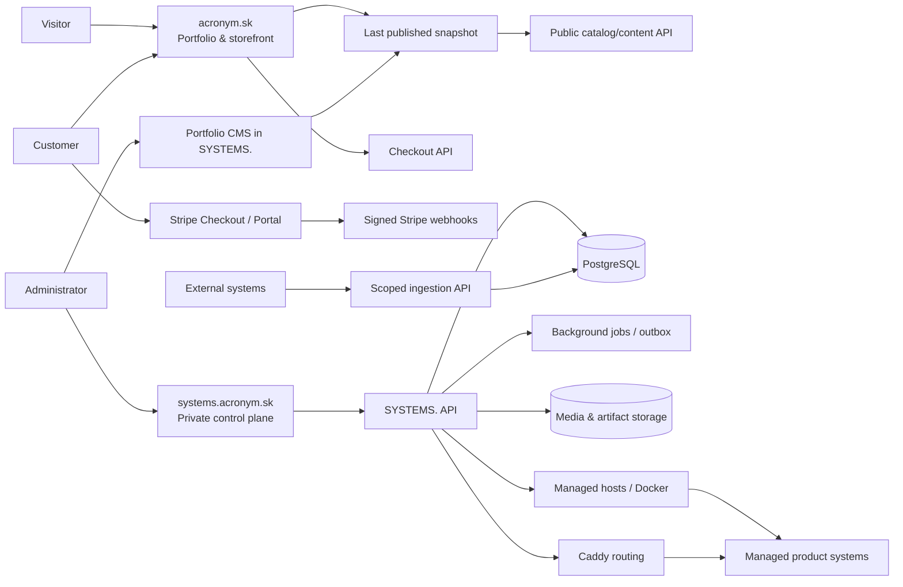

### 5.1 Planes

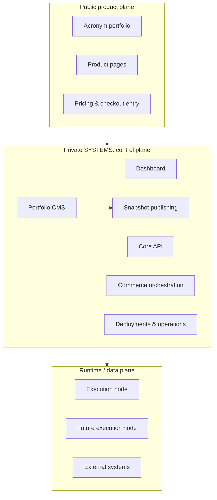

---

## 6. URL and path architecture

### 6.1 Hostnames

| Host pattern | Purpose | Exposure |
|---|---|---|
| `acronym.sk` | Public portfolio and storefront | Public |
| `www.acronym.sk` | Permanent redirect to apex | Public |
| `systems.acronym.sk` | Dashboard and same-origin admin API | Private/authenticated |
| `{slug}.acronym.sk` | Default production address for a managed web system | According to access policy |
| `preview-{slug}.acronym.sk` | Stable preview host when enabled | Token/password protected |
| `api.systems.acronym.sk` | External ingestion and machine integration API | Scoped credentials |
| `status.acronym.sk` | Optional later public status surface | Public, deliberately limited |
| `{verified-custom-domain}` | Canonical product/system domain | Public or protected |

Reserved subdomains must include `www`, `systems`, `api`, `admin`, `status`, `assets`, `cdn`, `mail`, `smtp`, `preview`, and `internal`. Product/system slugs may not use them.

### 6.2 Public portfolio paths

```text
GET  /                              Locale entry/redirect
GET  /sk/                           Slovak homepage
GET  /en/                           English homepage
GET  /{locale}/{products-segment}   Localized product index
GET  /{locale}/{products-segment}/{localized-product-slug}
GET  /{locale}/{products-segment}/{localized-product-slug}/{pricing-segment}
GET  /{locale}/{category-segment}/{localized-category-slug}
GET  /checkout/success              Informational return page only
GET  /checkout/cancelled
GET  /legal/terms
GET  /legal/privacy
GET  /legal/refunds
GET  /legal/withdrawal
GET  /legal/subscriptions
GET  /legal/licences/{product-or-offer}
GET  /legal/cookies
GET  /legal/accessibility
GET  /legal/complaints
GET  /contact
POST /api/public/forms/{public-form-id}/submissions
```

These routes are controlled by the portfolio CMS route registry. Reserved commerce/legal routes cannot be shadowed by an editor-created page. Changing a published slug creates an explicit redirect from the prior path unless an administrator deliberately retires it.

The success path never grants access or marks payment complete. It reads a safe checkout status from SYSTEMS.; verified Stripe webhooks remain authoritative.

Slovak and English use permanently locale-prefixed canonical paths. The root may issue a temporary `302/307` redirect using an explicit saved preference and then `Accept-Language`; it never uses IP location and never creates a locale-specific canonical at the unprefixed root. Each locale has its own validated route manifest and publishes reciprocal `hreflang` links plus `x-default`.

### 6.3 Dashboard paths

```text
/overview
/portfolio
/portfolio/homepage
/portfolio/navigation
/portfolio/pages
/portfolio/pages/new
/portfolio/pages/{page-id}
/portfolio/media
/portfolio/seo
/portfolio/redirects
/portfolio/legal
/portfolio/design
/portfolio/publications
/portfolio/analytics
/portfolio/leads
/products
/products/new
/products/{product-id}/overview
/products/{product-id}/portfolio
/products/{product-id}/offers
/products/{product-id}/commerce
/products/{product-id}/analytics
/products/{product-id}/systems
/products/{product-id}/domains
/products/{product-id}/customers
/products/{product-id}/settings

/systems
/systems/new
/systems/{system-id}/overview
/systems/{system-id}/environments
/systems/{system-id}/releases
/systems/{system-id}/deployments
/systems/{system-id}/operations
/systems/{system-id}/logs
/systems/{system-id}/domains
/systems/{system-id}/access
/systems/{system-id}/integrations
/systems/{system-id}/settings

/commerce/overview
/commerce/offers
/commerce/orders
/commerce/subscriptions
/commerce/entitlements
/commerce/fulfilment
/commerce/reconciliation

/customers
/customers/{customer-id}
/incidents
/events
/server
/admin
```

IDs are immutable identifiers. Slugs are editable presentation/routing identifiers and must not be used as foreign keys.

### 6.4 API namespaces

All routes use `/api/...`. Do not use `/v1/...` or `/api/v4/...` paths. Versioning belongs in payload schemas, not URLs.

```text
/api/auth/*              administrator authentication
/api/admin/*             SYSTEMS. administration
/api/products/*          product management
/api/systems/*           system, environment, release and deployment management
/api/portfolio/*         Portfolio CMS, drafts, snapshots and publishing
/api/public/*            public-safe catalog, product pages, checkout helpers and forms
/api/commerce/*          offers, orders, subscriptions and billing portal actions
/api/customers/*         customer records and customer-linked access state
/api/entitlements/*      effective access checks and admin grants/revocations
/api/licensing/*         product-key redemption, activation, validation and device handling
/api/analytics/*         aggregated product and operations analytics
/api/integrations/*      integration-key administration
/api/ingest/*            app/external heartbeat, release, error, event and metric ingestion
/api/webhooks/*          Stripe, GitHub and provider webhooks
```

Initial representative routes:

```text
GET    /api/public/catalog
GET    /api/public/site
GET    /api/public/snapshot/latest
GET    /api/public/products/{slug}
POST   /api/public/checkout-sessions
GET    /api/public/checkout-sessions/{public-token}/status

GET    /api/products
POST   /api/products
PATCH  /api/products/{id}
POST   /api/products/{id}/publish
POST   /api/products/{id}/unpublish
POST   /api/products/{id}/preview

GET    /api/portfolio
PATCH  /api/portfolio
GET    /api/portfolio/pages
POST   /api/portfolio/pages
PATCH  /api/portfolio/pages/{id}
POST   /api/portfolio/preview
POST   /api/portfolio/publish
POST   /api/portfolio/publications/{id}/rollback
POST   /api/portfolio/media
POST   /api/portfolio/redirects

GET    /api/systems
POST   /api/systems
POST   /api/systems/{id}/environments/{env}/deploy
POST   /api/systems/{id}/promote
POST   /api/systems/{id}/environments/{env}/rollback

POST   /api/admin/domains
POST   /api/admin/domains/{id}/verify
POST   /api/admin/domains/{id}/activate

POST   /api/ingest/heartbeat
POST   /api/ingest/releases
POST   /api/ingest/errors
POST   /api/ingest/events
POST   /api/ingest/metrics

POST   /api/webhooks/stripe
POST   /api/webhooks/github
```

### 6.5 Routing rules

1. The portfolio product/system owns `acronym.sk` through the current primary-system concept.
2. Every routable production environment receives `{system-slug}.acronym.sk`.
3. A verified custom domain may become canonical.
4. When custom canonical routing is enabled, the default subdomain redirects with `308` unless explicitly configured as an alias.
5. Private environments publish no internet route.
6. Preview routes use expiring access grants, not obscure paths.
7. Marketing pages remain independent from application routes.
8. Caddy configuration is validated and reloaded before a route is marked active.
9. CMS-created pages may not claim reserved operational, checkout, webhook, or legal-system paths.
10. Slug/path changes are atomic with their redirect set so a publication cannot create broken internal navigation.

---

## 7. Product and system model

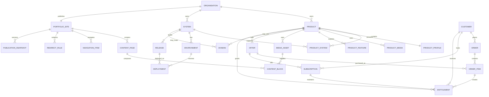

### 7.1 Essential tables

#### Ownership and identity

- `organisations`
- `admin_users`
- `admin_sessions`
- `api_credentials`
- `customers`

#### Product catalog

- `products`
- `product_profiles`
- `product_media`
- `product_features`
- `product_faqs`
- `product_systems`
- `portfolio_sites`
- `content_pages`
- `content_blocks`
- `navigation_items`
- `media_assets`
- `redirect_rules`
- `seo_defaults`
- `forms`
- `form_submissions`
- `leads`
- `lead_events`
- `content_localisations`
- `catalog_publications`
- `publication_snapshots`

#### Runtime

- `systems`
- `environments`
- `releases`
- `deployments`
- `environment_variables`
- `domains`
- `routes`
- `health_checks`
- `incidents`
- `incident_events`

#### Commerce

- `offers`
- `offer_prices`
- `orders`
- `order_items`
- `subscriptions`
- `subscription_items`
- `entitlements`
- `fulfilments`
- `provider_events`

#### Analytics and operations

- `product_events_raw` or an append-only event store
- `product_metrics_daily`
- `runtime_metrics`
- `audit_events`
- `outbox_events`
- `job_runs`

#### Legal, consent, and assurance

- `legal_documents`
- `legal_document_versions`
- `legal_acceptances`
- `consumer_withdrawal_consents`
- `consent_definitions`
- `consent_events`
- `price_history`
- `tax_evidence`
- `complaints`
- `complaint_events`
- `data_subject_requests`
- `processing_activities`
- `processor_register`
- `personal_data_breaches`
- `accessibility_issues`
- `security_vulnerabilities`

### 7.2 Identifier rules

- Use UUIDv7 or ULID identifiers for new domain entities.
- Keep slugs human-readable, unique within organisation, and separately indexed.
- Store all timestamps in UTC; localise only at presentation time.
- Monetary values use integer minor units plus ISO currency, never floating point.
- External provider IDs are unique and indexed.
- Secrets and raw API keys are never stored in recoverable plaintext unless the feature requires retrievable encryption; API keys are hashed.
- Every editable portfolio entity carries a revision/version field for optimistic concurrency.
- Publication snapshots are immutable and content-addressed with a checksum.

---

## 8. Independent state machines

### 8.1 Product lifecycle

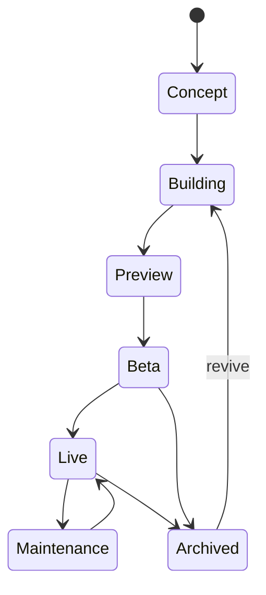

### 8.2 Portfolio publication

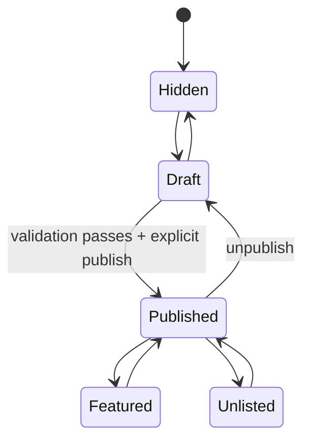

### 8.3 Deployment

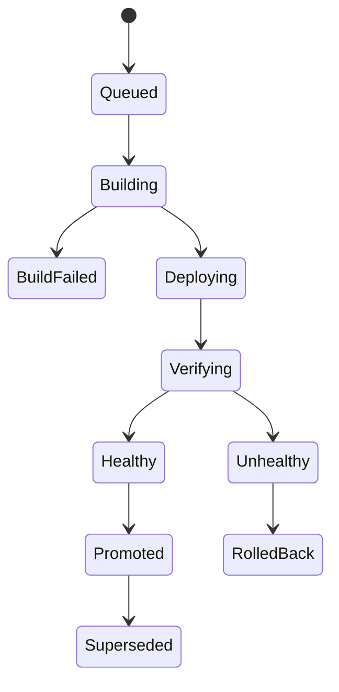

### 8.4 Subscription mirror

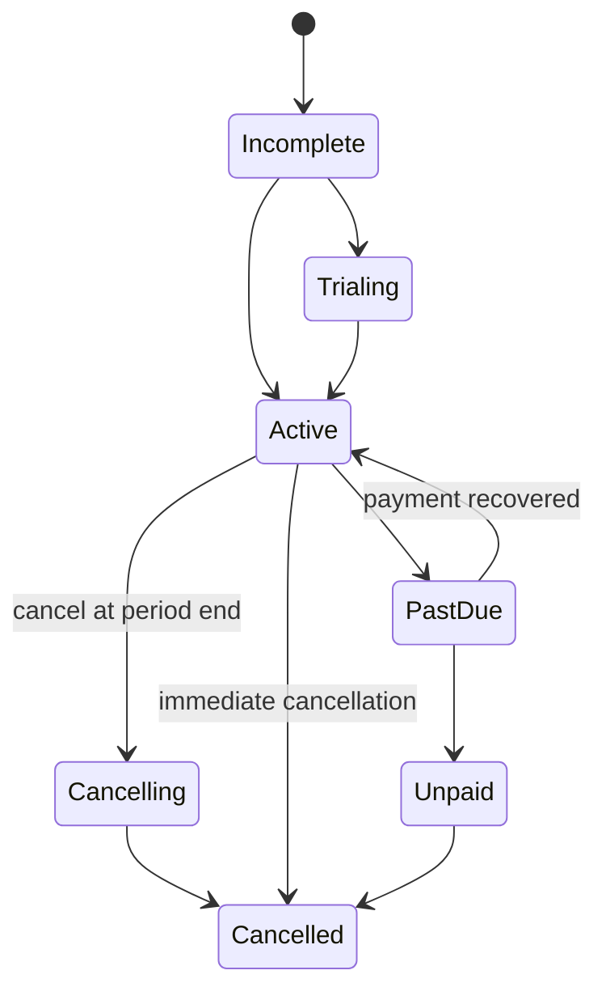

Provider state is mirrored exactly; a derived `access_effective_state` applies Acronym's grace-period and entitlement policy without rewriting Stripe history.

---

## 9. Portfolio CMS and publishing

Portfolio is a top-level SYSTEMS. module. It manages the complete public Acronym experience while the actual renderer remains an independently deployed system.

### 9.1 Portfolio workspace

```text
Portfolio
├── Overview and readiness
├── Homepage
├── Navigation and footer
├── Pages
├── Products and featured ordering
├── Media library
├── SEO and social defaults
├── Redirects
├── Legal content
├── Design system
├── Preview
├── Publications and rollback
└── Analytics
```

The global Portfolio workspace controls site-wide presentation. Product workspaces control product-specific truth. A homepage product block references a product rather than copying its price, title, or status, preventing divergence.

### 9.2 Structured composition

Pages are composed from a typed component registry shared by SYSTEMS. and the renderer, for example:

- Hero
- Featured-product grid
- Product carousel
- Text/media split
- Benefit list
- Feature grid
- Demonstration/video
- Testimonial/proof
- Pricing/offer cards
- FAQ
- Comparison
- CTA band
- Contact block
- Waitlist/lead form
- Legal rich text

Every block has a schema version, allowed fields, validation, accessibility requirements, and renderer compatibility range. Arbitrary JavaScript, raw executable HTML, inline event handlers, and uncontrolled CSS are forbidden. Limited rich text is sanitised on write and render. Brand design tokens are configurable, but layout primitives remain constrained enough to guarantee responsive and accessible output.

### 9.3 Global site controls

SYSTEMS. manages:

- Homepage composition and section ordering.
- Primary, secondary, mobile, and footer navigation.
- Site identity, default SEO, social image, and structured-data defaults.
- Contact details and social destinations.
- Supported locales, default locale, translation status, and locale-specific SEO/routes.
- Legal pages and their effective versions.
- Cookie/consent presentation settings where required.
- Default CTA language and availability messaging.
- Redirects, gone (`410`) routes, and canonical rules.
- Sitemap, robots, structured-data, and feed settings where enabled.
- Design tokens: approved typography, colour, spacing, radius, and motion presets.

The CMS does not become a general-purpose website builder. It is a deliberate Acronym portfolio system with an approved component language.

### 9.4 Product publication requirements

A product cannot publish until it has:

- Public title and unique product slug.
- Tagline and short description.
- Full value proposition.
- Cover image with alt text.
- Lifecycle and commercial state.
- At least one valid CTA.
- SEO title, description, canonical decision, and social image.
- At least one destination, offer, or contact action.
- Valid fulfilment for every active public offer.
- No unresolved blocking validation errors.

SYSTEMS. calculates a readiness score for guidance, but publication is binary and governed by hard validations plus explicit administrator approval.

### 9.5 Site publication requirements

Before publishing, SYSTEMS. validates the complete snapshot:

- All referenced products, offers, pages, blocks, and media exist.
- Internal links resolve in the candidate route table.
- Navigation has no duplicate/conflicting destinations.
- Required alt text and accessible labels exist.
- Heading hierarchy and block constraints pass.
- Canonical URLs and redirect graph are loop-free.
- Reserved paths are not shadowed.
- Renderer supports the snapshot schema and every block version.
- Active offers have valid Stripe/fulfilment configuration.
- Legal links required by checkout are present.
- Media is processed, safe, and available.
- Enabled translations contain required content or an explicit approved fallback.
- Forms reference active, versioned server-side schemas and current consent copy.

Warnings may be acknowledged; blocking errors cannot be bypassed without a specifically audited emergency mechanism.

### 9.6 Eligibility matrix

| Condition | Portfolio page | Launch CTA | Purchase CTA |
|---|---:|---:|---:|
| Public, healthy, published | Yes | Yes | According to offer |
| Preview protected, published | Yes | Request/preview only | According to offer |
| Private runtime, published product | Yes | No | According to fulfilment |
| In development + coming soon | Explicit only | No | Waitlist/contact only |
| Degraded runtime | Yes | Warn or disable | Keep if fulfilment unaffected |
| Failed runtime | Yes | Disable | Policy-driven |
| Archived public case study | Optional | No | No |
| Catalog hidden | No | No | No |

### 9.7 Draft, preview, and publishing flow

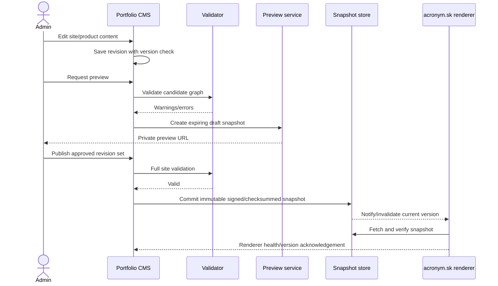

Publishing is an atomic release of the entire public content graph, not a sequence of live row edits. If renderer acknowledgement fails, the prior snapshot remains current and the attempted publication is marked failed/pending rather than falsely live.

### 9.8 Snapshot contract

Each publication contains:

- Snapshot ID, schema version, checksum, creation time, and author.
- Site settings and design-token version.
- Route manifest, redirects, canonical rules, and navigation.
- Pages with ordered typed blocks.
- Safe product and offer projections.
- Media references with immutable variants and integrity metadata.
- SEO, social, structured-data, and legal-page references.

Snapshots are append-only. Rollback activates an earlier compatible snapshot as a new publication event; it does not mutate history. The renderer ships support for the current and at least one prior snapshot schema during migrations.

### 9.9 Catalog and renderer delivery

- The renderer consumes a strict public projection, never admin database rows.
- The renderer can fetch from the public content API, but also persists the last verified snapshot locally/cache-side.
- Snapshot assets use immutable URLs and long-lived caching; the small current-snapshot pointer uses short caching and revalidation.
- Publication sends invalidation/notification, but correctness does not depend on it; the renderer also polls the current pointer.
- Draft preview uses a signed, expiring preview grant and never changes public current state.
- A control-plane outage leaves the last known good site available.
- A renderer deployment and a content publication are separate actions with independent rollback.

### 9.10 Media pipeline

Uploads enter quarantine and are validated before use. The pipeline checks content type by bytes, size, dimensions, decompression limits, and malware policy; strips unsafe metadata where appropriate; rejects active SVG/script content unless sanitised; creates responsive variants; records focal point and alt text; and publishes immutable asset URLs. Deleting an asset referenced by a draft or publication is blocked. Removing it from future content never invalidates historical snapshots within retention.

### 9.11 Editorial concurrency and governance

- Optimistic concurrency prevents one administrator silently overwriting another revision.
- Draft autosave never publishes.
- Publish permission can be stricter than edit permission when roles expand.
- Publication records author, reviewer, validations, warnings acknowledged, snapshot checksum, renderer version, and resulting public verification.
- Scheduled publishing uses UTC internally, shows Europe/Bratislava explicitly, and handles daylight-saving ambiguity.
- Emergency unpublish/maintenance actions remain available when the ordinary renderer is degraded.

### 9.12 Leads, waitlists, and forms

Contact-for-pricing and coming-soon products require a native lead path. SYSTEMS. manages typed form definitions, product/offer attribution, consent copy/version, submission status, assignment, notes, and follow-up history. Public submissions are server-validated by immutable form version, rate-limited, protected with layered spam controls, and never email arbitrary recipient addresses supplied by the browser. Attachments are disabled initially or use the media quarantine pipeline.

Lead states are `new`, `qualified`, `contacted`, `won`, `lost`, `spam`, and `archived`. A lead may later link to a customer/order without rewriting the original submission. PII has a documented retention and deletion policy. Email delivery failure is visible and retryable; a successful browser response does not falsely imply internal notification succeeded.

### 9.13 Multilingual public website

Slovak (`sk`) and English (`en`) are first-class launch languages. Content revisions carry locale and a stable translation-group ID. Products, pages, navigation, block content, SEO, structured data, offer presentation, legal content, consent text, transactional email templates, and forms are translated independently with completeness status.

The language switch resolves the exact equivalent route through the translation graph; it never edits the URL string heuristically. If an equivalent is unavailable, it offers the nearest safe localized parent rather than showing a different-language page without explanation. The selected language is stored in a minimal preference cookie and propagated to Stripe Checkout/Customer Portal where supported. Prices, entitlements, and commercial identity remain the same unless an explicit regional price is configured; translation must never create an accidental second offer.

Every published locale receives localized canonical URLs, reciprocal `hreflang`, sitemap entries, Open Graph metadata, structured data, navigation, error pages, and accessibility labels. Legal, checkout-critical, subscription, withdrawal, and consent content may not use automatic fallback at publication time. Editorial content may use an explicitly labelled fallback policy. Machine translation may create a draft, but can never auto-publish. User-submitted text, customer records, and legal evidence are not silently translated or overwritten.

---

## 10. Environments, releases, and deployment

### 10.1 Environment model

| Capability | Production | Preview | Development |
|---|---:|---:|---:|
| Stable route | Yes | Optional | No guarantee |
| Public by default | Policy-controlled | No | No |
| Promotion target | No | Yes | Yes |
| Independent secrets | Yes | Yes | Yes |
| Independent database | Recommended | Required isolation | Local/isolated |
| Retention | 5 successful releases default | Short-lived | Minimal |

### 10.2 Deployment sequence

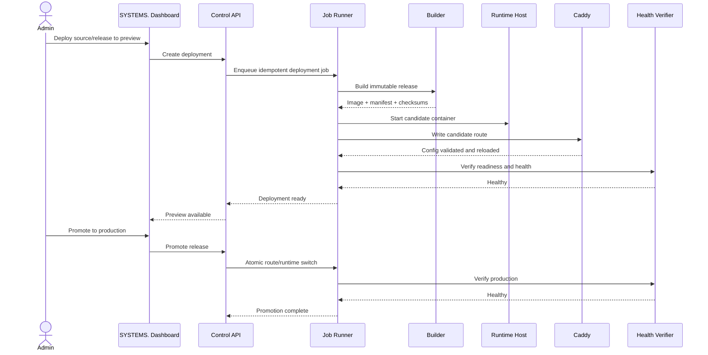

### 10.3 Deployment invariants

- Releases are immutable.
- A deployment references one release and one environment.
- Build and deployment state are distinct.
- Production promotion never rebuilds; it promotes an already verified release.
- The previous healthy release remains rollback-eligible.
- Route changes are validate-then-activate.
- Failed health does not silently report success.
- All mutating operations have idempotency keys and audit entries.

---

## 11. Domains and access

### 11.1 Domain lifecycle

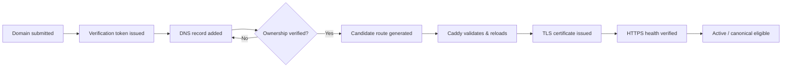

### 11.2 Access policies

- **Public:** internet route with no application-independent gate.
- **Preview protected:** signed expiring grant, optionally combined with password/email restriction.
- **Private:** no public route; access only through approved private connectivity or control-plane tooling.

Preview grants store token hashes, expiry, scope, recipient label, use count, last used time, and revocation state. A token in a URL is exchanged for a short-lived secure, HTTP-only cookie and removed from the visible URL.

### 11.3 Maintenance mode

Maintenance mode operates at the routing layer and can display a branded response without deleting or stopping the runtime. It records the reason, start time, administrator, optional expected end, and incident link.

---

## 12. Commerce architecture

### 12.1 Offer types

- One-time purchase.
- Monthly subscription.
- Annual subscription.
- Free entitlement.
- Contact for pricing.
- Coming soon/waitlist.
- Invite-only or complimentary access.

An offer may have multiple prices, but one currency—EUR—launches first. Prices are immutable once used; commercial changes create a new price version.

### 12.2 Checkout and entitlement sequence

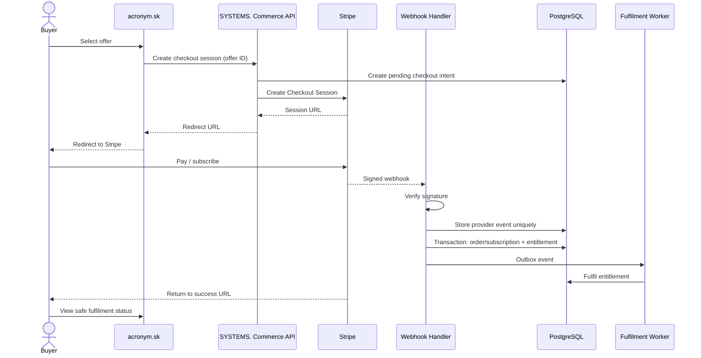

### 12.3 Webhook requirements

- Verify Stripe signatures against the raw request body.
- Store each provider event ID with a unique constraint.
- Acknowledge already-processed events safely.
- Process state changes transactionally.
- Use an outbox for email, access provisioning, and other side effects.
- Tolerate out-of-order events by comparing provider timestamps/state.
- Replay failed events from the dashboard without duplicating fulfilment.
- Never trust browser redirects, client-supplied price amounts, or product metadata as authority.

### 12.4 Subscription capabilities

Core V4 supports:

- Monthly and annual billing.
- Optional trials.
- Upgrade/downgrade through approved price transitions.
- Immediate or period-end cancellation.
- Stripe Customer Portal.
- Payment failure, grace period, recovery, unpaid, and cancelled states.
- Manual and complimentary entitlements.
- Renewal and cancellation audit history.

Access policy is explicit per offer. For example, a past-due subscription may retain access for a configurable grace period; Stripe state is not altered to represent that policy.

### 12.5 Fulfilment types

- `manual_service`
- `secure_download`
- `hosted_access`
- `licence_entitlement`
- `source_access`
- `setup_service`
- `ownership_transfer`

V4 launches with manual fulfilment plus straightforward secure downloads/hosted access. The model supports later automated licence generation without making it a launch blocker.

---

## 13. Customer model

Customers are created from verified checkout data or audited manual entry. They are not SYSTEMS. users.

A customer record connects:

- Billing provider customer ID.
- Verified or checkout-supplied email.
- Orders and order items.
- Subscriptions.
- Entitlements.
- Fulfilment status.
- Customer Portal access creation.
- Consent and required legal records.

No interactive Acronym account is required initially. Secure delivery links are short-lived and revocable. A future customer portal may authenticate customers separately without changing entitlements.

---

## 14. External systems and integration API

### 14.1 Registration

External systems are first-class systems with `runtime_type=external`. They have catalog/product associations and operational state but no local container or deploy controls.

### 14.2 Credential model

- Credential ID plus high-entropy secret shown once.
- Secret stored with a slow/keyed hash as appropriate.
- Scopes such as `heartbeat:write`, `events:write`, `releases:write`, and `errors:write`.
- Per-key and per-system rate limits.
- Rotation with overlap window.
- Immediate revocation.
- Last-used timestamp and source metadata.
- Optional HMAC request signing for higher-trust integrations.

### 14.3 Ingestion flow

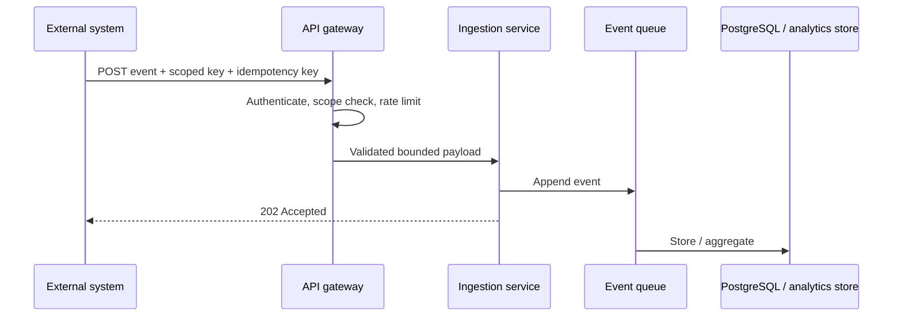

Payloads are schema-versioned, size-limited, timestamp-bounded, and stripped of undeclared sensitive fields. External systems cannot invoke host shell, Docker, route, or administrator actions.

---

## 15. Analytics

### 15.1 Separation

**Product analytics** measure discovery, onboarding, retention and commercial performance:

- Product views and anonymous visitors.
- CTA, demo launches and demo-to-signup conversion.
- Signup, onboarding, activation and first-meaningful-action funnel steps.
- Onboarding drop-off by step, product version, plan, locale and referrer.
- Checkout starts and completions.
- One-time revenue, net revenue, refunds, chargebacks and MRR/ARR-derived views.
- Subscription starts, upgrades, downgrades, churn, recovery and conversion.
- Active subscriptions, paid-through value, trial-to-paid conversion and payment-failure recovery.
- DAU/WAU/MAU, cohort retention, N-day retention and reactivation by product.
- Feedback, bug-report and support-signal volume by product, version and severity.
- Referrers and declared product events.

**Operational analytics** measure system performance:

- Availability and response time.
- CPU, memory, and network.
- Error counts.
- Release/deployment outcomes.
- Container/runtime health.

The product overview may correlate them but never stores them as one ambiguous metric.

### 15.2 Analytics pipeline

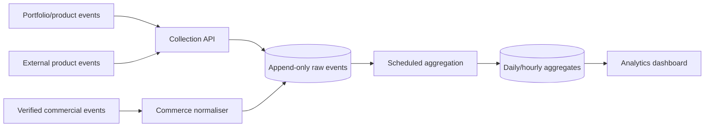

### 15.3 Required product dashboard questions

Each product analytics page must answer:

```text
How much money did this product make?
What is current MRR/ARR and active subscription count?
Where are users dropping during onboarding?
How many users activated and performed the first meaningful action?
What is D1/D7/D30 retention?
What changed after the latest release?
Which plans, locales and referrers convert best?
What feedback, bugs and support issues are increasing?
Which failed payments recovered and which churned?
```

Commercial revenue and payment status always come from canonical commerce/order/subscription records. Product events may explain conversion and retention, but they must not be treated as financial authority.

### 15.4 Privacy and retention

- Use first-party anonymous identifiers.
- Do not implement session replay.
- Do not collect arbitrary page text or form values.
- Minimise IP retention; truncate/hash when business need permits.
- Maintain documented retention windows by event class.
- Respect consent requirements for non-essential analytics.
- Provide deletion/anonymisation procedures for customer-linked data.

---

## 16. Dashboard information architecture

### 16.1 Global overview

The first screen answers:

- What requires attention now?
- What is currently earning or converting?
- Which products are live, unpublished, incomplete, or unhealthy?
- Which deployments, payments, domains, fulfilments, or incidents failed?

It shows revenue, active subscriptions, failed payments, pending fulfilment, conversion, product health, deployments, incidents, and infrastructure capacity without presenting vanity totals ahead of actionable problems.

### 16.2 Global portfolio workspace

Navigation: Overview, Homepage, Navigation, Pages, Products, Media, SEO, Redirects, Legal, Design, Leads, Publications, Analytics.

This is the editorial and publishing control centre for `acronym.sk`. It includes Slovak/English content status, current public version, draft changes, validation status, renderer compatibility, preview, publication history, rollback, broken-link/media warnings, leads, and portfolio-wide conversion.

### 16.3 Product workspace

Tabs: Overview, Portfolio, Offers, Commerce, Analytics, Users, Feedback, Bug Reports, Systems, Domains, Customers, Settings.

### 16.4 System workspace

Tabs: Overview, Environments, Releases, Deployments, Operations, Logs, Domains, Access, Integrations, Settings.

### 16.5 Product feedback and bug reports workspace

Every product has a private Feedback and Bug Reports area. It receives submissions from in-app forms, public product forms, product-specific feedback addresses, product-specific bug-report addresses, and administrator-created support notes.

Required views:

```text
Feedback Inbox
Bug Reports
Triage Queue
Linked Error Groups
Linked Customers / Product Users
Linked Orders / Subscriptions / Entitlements
Release Impact
Response History
```

Feedback items are not legal complaints by default. A triaged item can be escalated into a complaint, incident, refund case, accessibility issue, security vulnerability or product task without losing the original message history.

Bug reports are separate from automatic error groups. Error groups describe what the system observed; bug reports describe what the customer or tester experienced. The two must be linkable.

### 16.6 Global navigation

```text
Overview
Portfolio
Products
Systems
Commerce
Customers
Incidents
Events
Server
Admin
```

### 16.7 Safety UX

- Preview impact before publish, domain, access, and production actions.
- Require typed confirmation for destructive/purge actions.
- Display actual provider/runtime confirmation, not optimistic green states.
- Clearly distinguish saved configuration from applied configuration.
- Make warnings actionable and name the affected product/system/environment.
- Keep advanced host controls away from everyday product operations.
- Show whether a portfolio change is draft, previewed, published, or only saved locally.
- Display snapshot and renderer versions when publication compatibility matters.
- Provide side-by-side change summaries for publication and rollback.

---

## 17. Security architecture

### 17.1 Trust boundaries

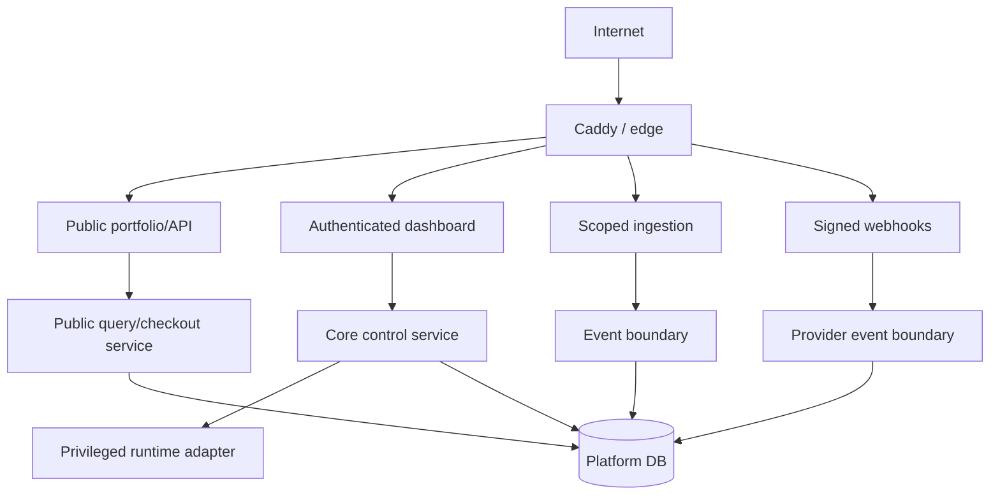

### 17.2 Controls

- Strong administrator passwords and TOTP, with the option to require TOTP globally.
- Short-lived admin access tokens and revocable server-side sessions.
- CSRF protection where cookie authentication is used.
- Strict CORS allow-list including required `PATCH` support.
- Rate limits by route class, identity, and IP.
- Encrypted environment variables with key rotation procedure.
- Hash-chained audit events retained independently of ordinary product analytics.
- Docker socket access isolated behind the smallest possible runtime adapter.
- Container capability dropping, resource limits, isolated networks, read-only filesystems where compatible, and no-new-privileges.
- Signed webhooks and idempotent processing.
- Verified custom-domain ownership.
- Secret scanning and dependency/container vulnerability checks in build flow.
- No secrets in logs, build output, catalog APIs, or client bundles.
- Content Security Policy and secure cookie defaults on public and private surfaces.
- CMS rich text is sanitised with an allow-list; raw script, unsafe embeds, and inline handlers are rejected.
- Media is content-sniffed and quarantined; untrusted SVG and decompression bombs are rejected.
- Health checks, webhooks, media fetches, and external URL previews use SSRF protections: scheme allow-lists, DNS/IP validation, redirect revalidation, timeouts, and private/link-local network denial unless explicitly internal.
- Spreadsheet/CSV exports neutralise formula-leading cells.
- Checkout return URLs, custom domains, and redirect destinations are allow-listed and normalised to prevent open redirects.
- Publication snapshots are checksummed and the renderer rejects unsupported or malformed versions.

### 17.3 Public API projection

Public product DTOs are explicitly constructed. They never expose container IDs, image IDs, host ports, repositories, administrator identities, environment variables, private domains, raw health errors, Stripe secrets, internal customer IDs, or audit details.

### 17.4 Secure development lifecycle

Every control-plane and renderer change passes:

- Peer review for privileged, authentication, commerce, publishing, and migration code.
- Static analysis, dependency audit, secret scanning, and licence-policy checks.
- Unit, integration, migration, authorization, and negative/security tests.
- Container/image vulnerability scanning and an SBOM tied to the release.
- Build provenance/checksum recording and immutable release artifacts.
- Staging/preview verification before production promotion.
- Documented patch prioritisation and supported-version policy.

Critical/high vulnerabilities block promotion unless a time-bounded, owner-approved exception records exposure, compensating control, and remediation date. Production dependencies are pinned through lockfiles; automated updates create reviewed releases rather than mutating live systems.

### 17.5 Privileged runtime safety

The general API should not retain unrestricted Docker-socket power indefinitely. V4 narrows privileged operations behind a runtime adapter/agent with an allow-listed command model. The API submits declarative operations; the adapter validates system/environment ownership, resource limits, image/release identity, allowed mounts, network policy, and route intent.

Forbidden by default:

- Host filesystem mounts outside explicit managed paths.
- Privileged containers, host PID/network mode, device access, added capabilities, or Docker socket mounting into product containers.
- Arbitrary route/config text supplied by users.
- Unbounded outbound network access for high-risk build/preview workloads where practical.
- Secrets embedded into images, logs, build arguments, or public artifacts.

Builds execute as untrusted workloads with time, CPU, memory, PID, disk, network, and output limits. Source archives retain zip-slip, symlink, archive-bomb, and file-count/size protections.

### 17.6 Secrets and cryptographic safety

- Separate keys for session signing, environment encryption, preview grants, API credentials, snapshot integrity, and provider webhooks.
- Key IDs/versioning allow rotation without ambiguous decrypt/sign behaviour.
- Master/recovery material is not stored only on the host it protects.
- Secrets are exposed to the narrowest runtime scope and are never returned after initial creation unless explicitly designed for one-time reveal.
- Rotation invalidates/overlaps credentials deliberately and is tested.
- Production refuses insecure development defaults and missing required secrets.
- Cryptographic operations use established libraries and constant-time verification where relevant.

### 17.7 Incident response and platform safety

Security incidents have severity, owner, affected systems/products/customers, containment actions, evidence timeline, notification assessment, recovery, and post-incident review. Runbooks cover administrator compromise, leaked integration key, Stripe/webhook compromise, malicious deployment, data breach, ransomware, DNS/domain takeover, supply-chain vulnerability, database corruption, and lost encryption/recovery credentials.

Emergency controls include:

- Revoke all administrator sessions.
- Disable/rotate API and preview credentials.
- Freeze deployments and portfolio publishing independently.
- Disable checkout while preserving public informational content.
- Quarantine a product route/container.
- Activate maintenance mode.
- Preserve logs/evidence with restricted access.
- Restore the last verified release/snapshot and reconcile state afterward.

At least twice yearly, run a restore and security tabletop exercise. Material incidents feed concrete tests and runbook updates.

---

## 18. EU and Slovak legal/compliance architecture

> This section defines product and evidence requirements, not legal or tax advice. Before accepting live orders, Acronym must have the final implementation, terms, VAT treatment, withdrawal flow, licence model, privacy documentation, and accessibility position reviewed by a Slovak lawyer and accountant for the actual seller and products.

### 18.1 Applicable framework checklist

The launch review must consider at least:

- Slovak Act No. 108/2024 Coll. on consumer protection and applicable Civil Code rules.
- EU Consumer Rights Directive 2011/83/EU and Digital Content Directive (EU) 2019/770 as implemented in Slovakia.
- Slovak VAT Act No. 222/2004 Coll., EU place-of-supply rules, and the One Stop Shop where applicable.
- GDPR (EU) 2016/679 and Slovak Act No. 18/2018 Coll. on personal-data protection.
- Slovak electronic-communications/cookie and direct-marketing rules, including Act No. 452/2021 Coll. where applicable.
- Slovak alternative-dispute-resolution rules, including Act No. 391/2015 Coll., and current Slovak Trade Inspection information.
- European Accessibility Act requirements as implemented by Slovak Act No. 351/2022 Coll., applicable from 28 June 2025, including any fact-specific microenterprise exemption.
- EU rules on price-reduction history, unfair commercial practices, geo-blocking, and transparent recurring payments.
- Regulation (EU) 2024/2847, the Cyber Resilience Act, where a product with digital elements falls within scope, including phased vulnerability/reporting and later main obligations.
- Slovak cybersecurity/NIS2 implementation where the seller or service is actually in scope.
- Product-specific rules such as the AI Act, open-source licences, export/sanctions controls, or sector rules when a product introduces those risks.

Applicability must be recorded as a dated compliance decision with responsible reviewer; SYSTEMS. must not present every listed regime as automatically applicable to every product.

### 18.2 Seller identity and mandatory public information

The public site and checkout must expose the legally required seller identity in Slovak and English as appropriate, including:

- Legal/business name and legal form.
- Registered address and registration register/details.
- Company ID (`IČO`), tax ID (`DIČ`), and VAT ID (`IČ DPH`) when applicable.
- Functional email, telephone or other required rapid-contact channel.
- Price currency and whether VAT/taxes are included.
- Complaint, support, withdrawal, and ADR contact/process.
- Applicable terms, privacy notice, cookie information, licence terms, and accessibility statement.

SYSTEMS. stores these as versioned legal/site settings. The renderer cannot publish checkout while mandatory seller information or required legal destinations are missing.

### 18.3 Pre-contract consumer information

Before the buyer submits an order, the localized checkout journey must clearly disclose:

- Main product/service characteristics and compatibility/interoperability where relevant.
- Total price including known taxes and mandatory fees, or a clear calculation method.
- Whether the purchase is one-time or recurring.
- Subscription interval, trial terms, renewal mechanics, minimum duration, cancellation method, and consequences.
- Delivery/activation timing and fulfilment method.
- Complaint, conformity, update/support, termination, and withdrawal rights.
- Geographic, device, account, licence-seat, transfer, and usage restrictions.
- Contact-for-pricing status where no binding public price exists.

The final purchase control must use an unambiguous “order with obligation to pay” formulation appropriate to the displayed language. The order summary and legal links must be immediately adjacent and readable; no pre-ticked optional consent or dark-pattern cancellation friction is allowed.

### 18.4 Digital content, services, and withdrawal

Each offer is legally classified before launch as digital content, digital service, other service, goods, licence, or a mixed supply. SYSTEMS. stores the classification and drives the correct checkout evidence.

Where immediate supply of digital content may remove the consumer's 14-day withdrawal right, fulfilment cannot start until the required **express prior consent** and **acknowledgement of loss of the withdrawal right** are captured separately and unambiguously. The exact localized wording, document version, timestamp, customer/session, offer/price version, IP/security evidence, and resulting order are retained. A generic acceptance of terms is not substituted for this evidence.

Where the right is not lost—or for services where different withdrawal/proportionate-payment rules apply—the system exposes the correct withdrawal route and does not overstate non-refundable status. Order confirmation is supplied on a durable medium, normally email/PDF or another retainable format, with the contract information and relevant consent evidence.

### 18.5 Digital conformity, licences, and updates

Product-specific terms must define:

- Licence scope, territory, duration, devices/users, transferability, and prohibited uses.
- Hosted-service availability/support boundaries without misleading guarantees.
- Technical requirements, compatibility, interoperability, and dependencies.
- Security/functionality update period and delivery mechanism where legally required.
- Remedies for non-conformity, complaint handling, termination, and data export where applicable.
- Treatment of user-generated/input data and post-termination access.
- Open-source and third-party component notices.

SYSTEMS. links every order/entitlement to the exact offer, licence, terms, support, and update-policy versions accepted. Later terms cannot silently rewrite an earlier customer's acquired rights.

### 18.6 Subscriptions and cancellation

- Recurring status, interval, trial, renewal price, and cancellation timing are prominent before order.
- Cancellation is available through Stripe Customer Portal or an equally straightforward route; cancellation is not materially harder than signup.
- Price/term changes use advance notice and consent/termination handling required by the contract and law.
- SYSTEMS. records notice dispatch, effective date, affected subscription, and provider result.
- Failed payments and grace periods are described consistently with actual entitlement behaviour.
- Marketing consent is not required to receive essential billing, security, fulfilment, or contract messages.

### 18.7 Pricing, promotions, and VAT

- Store all amounts as provider integer minor units and ISO currency.
- Show consumer prices including VAT where legally required.
- Preserve price versions and, when announcing a consumer price reduction, the legally relevant prior-price history (commonly the lowest price in the preceding 30 days, subject to applicable exceptions).
- Never let the browser supply authoritative amount, tax treatment, billing interval, or Stripe Price ID.
- Determine customer type and location evidence needed for B2C/B2B VAT treatment.
- Validate business VAT IDs through the appropriate process where reverse charge is claimed and retain evidence.
- Evaluate the EU cross-border electronic-services threshold and OSS obligations with the accountant.
- Retain the evidence supporting place of supply and tax treatment for the legally required period.
- Reconcile Stripe transactions/refunds/fees/taxes to accounting exports; SYSTEMS. does not become the general ledger.

Stripe Tax may support calculation but does not replace seller registration, invoicing, evidence, filing, or accounting review.

### 18.8 GDPR and privacy engineering

SYSTEMS. maintains a data inventory and record of processing purposes covering administrators, leads, customers, orders, subscriptions, entitlements, support, security logs, product analytics, and external integrations.

For each purpose it records controller/processor role, categories, lawful basis, recipients/processors, international transfer mechanism, retention, security controls, and data-subject rights path. Contract fulfilment/legal obligation/legitimate interest are evaluated where appropriate; consent is used only where genuinely required and is as easy to withdraw as to give.

Required capabilities include:

- Versioned privacy notices in Slovak and English.
- Data-access, correction, objection, restriction, portability, and erasure workflows.
- Identity verification proportionate to the request.
- Retention and legal-hold rules so erasure does not destroy required financial evidence.
- Processor agreements and subprocessor register for Stripe, hosting, email, analytics, storage, and support vendors.
- Transfer-impact/SCC review where data leaves the EEA.
- Privacy by default, field minimisation, role-based access, and audit of sensitive exports.
- DPIA screening for new high-risk processing.
- Personal-data breach workflow supporting the GDPR 72-hour supervisory-authority assessment window and affected-person notification where required.

### 18.9 Cookies and direct marketing

- Essential authentication, security, language, basket/checkout, and preference storage are classified and documented.
- Non-essential analytics/marketing storage is disabled until valid consent where required.
- Consent is granular, reject is as accessible as accept, withdrawal is persistent/easy, and proof records wording/version/time without excessive tracking.
- Server-side analytics does not evade consent requirements.
- Marketing email/SMS requires the appropriate consent or documented existing-customer exception; every message identifies the sender and provides functional opt-out.
- Suppression lists are retained narrowly so an unsubscribe is not accidentally reversed by deletion/re-import.

### 18.10 Complaints, ADR, and customer support

SYSTEMS. provides auditable complaint cases linked to product, order, entitlement, messages, evidence, deadlines, resolution, refund/remedy, and responsible administrator. Public legal content identifies the applicable Slovak ADR entity/process and current authority information. It must not retain obsolete references to the discontinued EU ODR platform.

Operational incidents and legal complaints are separate but linkable: an outage may affect many customers, while each consumer remedy still needs an individual record.

Product feedback and ordinary bug reports are also separate from legal complaints. SYSTEMS. may link a feedback thread or bug report to a complaint, incident, accessibility issue, security vulnerability, order, entitlement, release or error group, but it must not silently reclassify informal feedback as a legal complaint without an administrator decision.

### 18.11 Accessibility

The portfolio, product pages, forms, checkout entry, authentication/access delivery, customer-facing communications, and support paths target WCAG 2.2 AA and the applicable European/Slovak accessibility requirements. The renderer enforces semantic components, keyboard operation, visible focus, contrast, reduced motion, error identification, captions/transcripts, alt text, responsive zoom, and language attributes.

SYSTEMS. publishes an accessibility statement, contact/feedback path, known limitations, and remediation status. If Acronym relies on a statutory exemption, counsel must document eligibility and any disproportionate-burden assessment; the product should still follow the accessibility baseline as engineering policy.

### 18.12 Records and evidence model

Add at minimum:

- `legal_documents` and immutable `legal_document_versions`
- `legal_acceptances`
- `consumer_withdrawal_consents`
- `consent_definitions` and `consent_events`
- `price_history`
- `tax_evidence`
- `complaints` and `complaint_events`
- `feedback_channels`
- `feedback_threads`
- `feedback_messages`
- `feedback_labels`
- `bug_reports`
- `bug_report_events`
- `feedback_email_ingest_events`
- `data_subject_requests`
- `processing_activities`
- `processor_register`
- `personal_data_breaches`
- `accessibility_issues`
- `security_vulnerabilities`

Evidence records are immutable or append-only, time-synchronised, exportable, access-controlled, and subject to a documented retention schedule. Transaction evidence references the rendered locale and checksums/IDs of the exact legal and consent versions shown.

### 18.13 Compliance launch gate

Live commerce remains disabled until all are complete:

1. Seller identity and VAT status verified.
2. Offer legal classification completed.
3. Slovak and English terms/privacy/licence/withdrawal/subscription copy approved.
4. Checkout disclosures and payment-button wording reviewed.
5. Digital-content consent flow tested with durable confirmation.
6. Stripe, VAT/OSS, invoice, refund, and accounting flows tested.
7. Cookie/analytics consent and marketing rules verified.
8. Complaint, ADR, DSAR, breach, and accessibility processes assigned.
9. Record-retention schedule and processor agreements approved.
10. Counsel/accountant launch sign-off recorded in SYSTEMS.

---

## 19. Reliability, backup, and disaster recovery

### 19.1 Initial service objectives

These are engineering targets, not external contractual SLAs:

- Public portfolio availability target: 99.9% monthly.
- Checkout-creation availability target: 99.9% monthly.
- Control-plane availability target: 99.5% monthly.
- Webhook durability: no acknowledged verified event lost.
- RPO: 24 hours for release artifacts/media; 15 minutes or better for commercial PostgreSQL data once WAL archiving is enabled.
- RTO: 4 hours for control plane; 2 hours target for storefront and commerce restoration.

### 19.2 Backup set

- PostgreSQL base backups plus WAL/archive strategy.
- Caddy base configuration and generated route records.
- Release manifests and required artifacts.
- Media/object storage.
- Portfolio draft revisions, immutable publication snapshots, route manifests, and renderer compatibility metadata.
- Encrypted secrets/key recovery material according to a separately protected procedure.
- Deployment scripts and infrastructure configuration.

Backups require encryption, off-host copies, retention policy, checksums, restoration drills, and evidence. A backup that has never been restored is not considered verified.

### 19.3 Failure isolation

- The storefront serves the last published catalog snapshot during control-plane failure.
- The renderer verifies snapshot checksums and refuses a corrupt/unsupported publication while continuing to serve its last verified version.
- Portfolio content publication is independent from renderer code deployment; either can roll back without forcing the other.
- Provider webhook receipt is separated from slow fulfilment.
- Deployment jobs do not block commerce jobs.
- Analytics ingestion failure does not prevent checkout.
- A failed product runtime does not remove its portfolio page.
- Maintenance mode can be activated independently of the failing runtime.

---

## 20. Performance, caching, and host protection

The initial server is a finite resource shared by the control plane, storefront, database, proxy, workers, and managed products. V4 must preserve safety headroom and prevent builds, analytics, or a single product from degrading checkout, webhooks, or administration.

### 20.1 Workload priority

From highest to lowest protection priority:

1. Stripe webhook receipt and durable recording.
2. Existing public portfolio/static delivery and entitlement checks.
3. Checkout-session creation and customer billing access.
4. Control-plane authentication and emergency operations.
5. Product runtime traffic according to configured class.
6. Health checks and ordinary administration.
7. Fulfilment/email jobs.
8. Deployments and builds.
9. Analytics aggregation, screenshots, media optimisation, and cleanup.

When capacity is constrained, low-priority jobs pause/back off before high-priority paths fail.

### 20.2 Portfolio rendering strategy

The public portfolio is snapshot-driven and should be pre-rendered at publication time wherever possible:

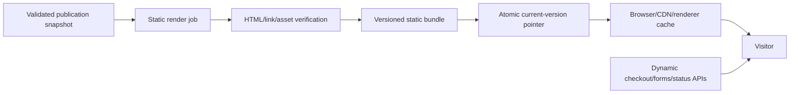

Homepage, product, category, editorial, SEO, sitemap, and legal pages are generated as static or fully cacheable outputs keyed by snapshot ID and locale. Checkout creation, form submission, preview, customer state, and administrator paths remain dynamic. If full pre-rendering is temporarily unavailable, the renderer uses bounded server rendering with a persistent last-known-good cache.

### 20.3 Cache layers and policy

| Content | Cache key | Recommended behaviour |
|---|---|---|
| Hashed media/static assets | Content hash | `public, max-age=31536000, immutable` |
| Published HTML | Snapshot ID + locale + path | Public cache with ETag and controlled `stale-while-revalidate` |
| Current snapshot pointer | Site/locale | Short TTL, ETag/revalidation; small and cheap |
| Public catalog/product JSON | Snapshot ID + locale | Public, versioned, ETag; never raw DB rows |
| Sitemap/robots/feed | Snapshot ID + locale | Generated at publish, publicly cached |
| Draft preview | Preview token + revision | `private, no-store`; isolated from public caches |
| Admin/API secrets/customer data | Identity/request | `private, no-store` |
| Checkout/status | Public opaque token where needed | `no-store`; never shared-cache customer state |
| Webhooks/integration writes | None | Never cached |

Cache invalidation is version-based: publishing creates new keys and atomically changes the current pointer. It does not attempt broad wildcard deletion as the correctness mechanism. Rollback points to a previously verified bundle. Surrogate/CDN purge is an acceleration only.

Every cache varies only on bounded dimensions. Never vary public caches on raw cookies, arbitrary query strings, full user agent, or unbounded headers. Tracking parameters are removed from canonical/cache keys. Language, snapshot, path, and explicitly supported presentation variants are sufficient.

### 20.4 Runtime resource isolation

Every managed container and worker declares:

- CPU quota/shares.
- Hard memory limit and restart policy.
- PID/process limit.
- Disk/volume quota or monitored bounded allocation.
- Log size and rotation.
- Health timing and restart backoff.
- Network exposure and optional outbound-egress policy.
- Runtime class: critical, standard, preview, worker, or build.

Builds run in a separate bounded pool from long-lived systems. On the first host, default concurrent builds should be one unless measured headroom proves more is safe. Preview systems receive lower default quotas and may auto-suspend after inactivity. No container can consume unbounded host resources.

### 20.5 Admission control and headroom

Before upload, extraction, build, database provision, backup, or media processing, SYSTEMS. estimates required disk/memory and checks safe headroom. It rejects or queues work rather than consuming the operating-system reserve.

Initial operating policy should retain at least:

- 25% host memory headroom under ordinary peak load.
- 20% disk free space plus enough space for the largest allowed build and backup operation.
- CPU capacity for Caddy, PostgreSQL, webhook receipt, and emergency administration during one active build.

These are starting guardrails and must be tuned from measurements. Crossing warning/critical thresholds pauses builds, media jobs, analytics aggregation, and nonessential backups/cleanup in a controlled order.

### 20.6 Database efficiency

- Use a bounded connection pool; do not open a connection per event or container metric.
- Index real query paths and inspect slow-query plans before scaling hardware.
- Avoid dashboard N+1 queries through explicit summaries/batching.
- Batch event and metric writes within bounded time/size limits.
- Use keyset/cursor pagination, not deep offsets.
- Precompute hourly/daily analytics rather than scanning raw events for dashboards.
- Partition/archive raw event tables when measured volume requires it.
- Keep media, logs, archives, and release blobs outside PostgreSQL.
- Apply statement, lock, and idle-transaction timeouts.
- Run maintenance/vacuum and backup work in controlled windows with monitoring.

### 20.7 Metrics and polling efficiency

The dashboard must not trigger one Docker stats call and database write per visible card on every browser poll. A central collector samples running systems at configured intervals, batches persistence, and exposes cached summaries. Browser refresh uses conditional requests or push updates and stops/reduces frequency while hidden.

High-resolution operational metrics have short retention; older data is downsampled. Health-check intervals include jitter to avoid synchronized bursts. Private/external systems use the cheapest valid health mechanism. Repeated failures use backoff while remaining alertable.

### 20.8 Backpressure and circuit breakers

- Every queue has bounded concurrency, maximum age, retry budget, and dead-letter path.
- Public ingestion returns `429`/`503` with retry guidance before memory queues grow without bound.
- Stripe webhook endpoints durably record verified events quickly and defer heavy work.
- External providers use timeouts, connection reuse, bounded retries, and circuit breakers.
- Email, Stripe, DNS, GitHub, or object-storage degradation cannot create unlimited blocked promises/workers.
- Upload and request bodies stream to bounded storage; they are not fully buffered in application memory.

### 20.9 Media and network optimisation

- Generate responsive AVIF/WebP plus compatible fallback variants at upload/publish time, not per visitor request.
- Record dimensions to prevent layout shifts and support focal crops.
- Lazy-load noncritical media; preload only measured critical assets.
- Compress text responses at the edge once; avoid double compression.
- Serve range requests for eligible downloads/media without proxying entire files through Node.
- Move public media/releases to object storage/CDN when local IO or bandwidth becomes material.
- Place hard per-file, per-upload, per-form, and per-integration payload limits.

### 20.10 Performance budgets and validation

Initial engineering targets:

- Cached public pages should be served without a PostgreSQL query.
- Portfolio publication may be slower, but public reads remain cheap and stable.
- Public dynamic API and admin API p95 latency targets are measured separately.
- Checkout/webhook load tests run while a build and health collection are active.
- Peak-memory, disk-growth, queue-age, database-connection, and event-loop-lag alerts exist.
- CI checks public bundle size, image weight, schema compatibility, accessibility, and major performance regression.

No numerical traffic capacity is promised until load testing on the actual host establishes it. SYSTEMS. displays measured capacity and safe concurrency rather than a fictional unlimited status.

---

## 21. Scaling strategy

V4 should be horizontally evolvable but vertically simple at launch.

### 21.1 Stage A — single-host launch

Suitable while one host has adequate capacity and failure risk is accepted:

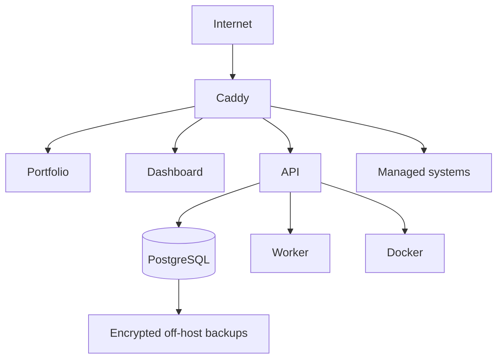

Requirements:

- PostgreSQL separated as its own service/container with durable volume.
- At least one independent background worker process.
- Bounded job concurrency so builds cannot starve checkout/webhooks.
- Per-system CPU/memory limits and global disk pressure protection.
- Off-host backups.
- Static/media assets stored outside ephemeral containers.

### 21.2 Stage B — separated control and execution

Trigger when builds/runtime load affects control-plane latency, a second host is required, or a single Docker daemon becomes a material operational constraint.

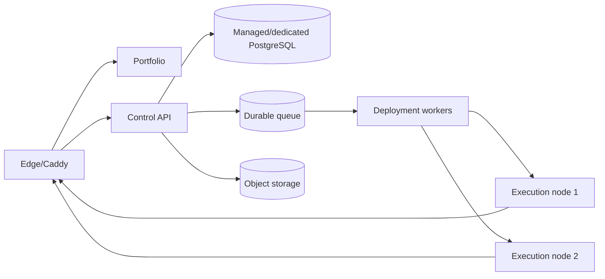

Introduce a SYSTEMS. execution agent with mutual authentication and a narrow command protocol. Do not expose remote Docker sockets.

### 21.3 Stage C — redundant public/commercial services

Trigger when downtime has direct material revenue impact or traffic exceeds one application instance:

- Two or more stateless public/API instances behind the edge.
- PostgreSQL high availability or managed equivalent.
- Durable queue with retry/dead-letter handling.
- Replicated object storage/CDN.
- Multiple execution nodes with placement and capacity awareness.
- Independent monitoring outside the primary infrastructure.

### 21.4 Scaling signals, not arbitrary dates

Scale when sustained evidence appears:

- Build queue delay breaches target repeatedly.
- Host CPU, memory, or disk remains above safe headroom.
- Checkout/API p95 latency degrades during deployments.
- Runtime count or blast radius makes single-host recovery unacceptable.
- Analytics ingestion/aggregation materially competes with transactional work.
- Database size/write rate makes retention or backup windows unsafe.

### 21.5 Data scaling

- Keep transactional data in PostgreSQL.
- Partition or archive high-volume raw analytics by time when volume warrants it.
- Precompute hourly/daily commercial aggregates.
- Retain operational metrics at high resolution briefly and downsample older data.
- Store images, archives, and release artifacts in object storage, not PostgreSQL.
- Use connection pooling before adding application replicas.

---

## 22. Background jobs and consistency

At minimum, jobs cover:

- Builds, deployments, promotions, and rollbacks.
- Health checks and incident evaluation.
- Route/TLS verification.
- Stripe webhook side effects.
- Fulfilment and email.
- Catalog publication/cache invalidation.
- Analytics aggregation and retention.
- Backup verification and cleanup.

Transactional changes that require side effects use the outbox pattern:

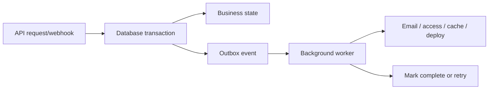

Jobs use bounded retries, exponential backoff, observability, idempotency, and a dead-letter/manual-resolution path.

---

## 23. Observability

### 23.1 Platform telemetry

- Structured logs with request, job, product, system, environment, deployment, order, and provider-event correlation IDs.
- Metrics for HTTP latency/error rates, queue depth/age, webhook delay, deployment duration/success, health state, database saturation, disk capacity, and backup age.
- Traces across checkout creation, webhook processing, deployment, and external ingestion where useful.
- Alerts route to an out-of-band channel.

### 23.2 Required operational alerts

- Public portfolio unavailable.
- Checkout creation failing.
- Stripe webhook signature/process failures or growing delay.
- Database unavailable or near capacity.
- Backup stale or failed verification.
- Caddy validation/reload failure.
- Production system health failure.
- TLS/domain failure.
- Build queue saturation.
- Disk, memory, or CPU capacity risk.

---

## 24. API quality standards

- Version public and integration contracts under `/api/v4` initially; future incompatible contracts use a new version.
- Use JSON Schema validation at every boundary.
- Return a consistent error envelope with code, message, request ID, and safe details.
- Support idempotency keys for checkout creation, deployment commands, manual orders, and ingestion writes.
- Use cursor pagination for potentially large collections.
- Apply optimistic concurrency/version checks to editorial content.
- Document every external endpoint with OpenAPI.
- Never reuse dashboard DTOs as public catalog DTOs.
- Preserve backwards compatibility for explicitly published integration contracts.

---

## 25. Migration from the current repository

### 25.1 Existing foundations to preserve

- Vue dashboard shell and visual system.
- Fastify API pattern and route encapsulation.
- Docker build/run services and hardened defaults.
- Caddy route generation.
- Public/password/private access concepts.
- Primary/apex system routing.
- Release rollback foundation.
- Health reconciliation.
- Encrypted environment variables.
- TOTP/session revocation.
- Tamper-evident audit log.
- GitHub webhook verification and redeploy foundation.
- Backup/restore and operational documentation.

### 25.2 Current concepts to replace or split

| Current V2 concept | V4 destination |
|---|---|
| `projects` row | `systems` plus environment/release/deployment records |
| `visibility` | Environment access policy |
| `is_primary` | Route/domain assignment for portfolio apex |
| `stats_history` | Runtime metrics; separate from product analytics |
| Project repo/branch | System source integration |
| Implicit proxy file route | Explicit `domains` and `routes` records |
| Single current/previous image | Immutable release history and deployments |
| Basic-auth preview | Preview grants with Basic Auth fallback |

### 25.3 Migration sequence

```mermaid
flowchart LR
    A[Stabilise current V2] --> B[Introduce versioned migrations]
    B --> C[Provision PostgreSQL]
    C --> D[Dual-tested data migration]
    D --> E[Create organisation/system/environment model]
    E --> F[Map existing projects to systems]
    F --> G[Introduce products/catalog]
    G --> H[Introduce commerce]
    H --> I[Cut over authoritative writes]
    I --> J[Remove legacy compatibility]
```

### 25.4 Immediate repository corrections

- Add `PATCH` to CORS allowed methods because current dashboard routes already use it.
- Replace silent catch-all `ALTER TABLE` migrations with versioned, observable migrations.
- Validate the claimed production PostgreSQL path end to end.
- Make health path configurable and support private/protected/custom-domain health.
- Persist route/domain state explicitly.
- Ensure database state is not marked successfully applied when Caddy activation fails.
- Remove obsolete Compose `version` metadata during the deployment refresh.
- Resolve current domain-default inconsistencies in Compose/configuration.

---

## 26. Delivery plan

### Phase 0 — operational proof

- Validate Docker, Caddy, PostgreSQL, HTTPS, backup, restore, and rollback on the real Windows host.
- Fix CORS and routing correctness gaps.
- Add versioned migrations and CI migration tests.
- Establish host headroom, container quotas, bounded build concurrency, central metrics collection, and priority-separated jobs.

**Exit:** Current platform can be operated and restored honestly on production infrastructure.

### Phase 1 — V4 foundation

- Organisation, products, systems, environments, releases, and deployments.
- Migrate existing project records.
- Product/system dashboard navigation.
- Preview-to-production promotion.

**Exit:** One product can own multiple systems and production is isolated from preview.

### Phase 2 — portfolio and publishing

- First-class Portfolio module: homepage, navigation, pages, typed blocks, media, SEO, redirects, legal content, and design tokens.
- Slovak/English content, route manifests, language switching, translation status, and localized preview/SEO.
- Product profiles, media, features, FAQs, offers presentation, and readiness validation.
- Schema-versioned public content API and immutable cached snapshots.
- Deploy `acronym.sk` as the primary system.
- Draft preview, whole-site validation, publish/unpublish, featured ranking, publication history, and snapshot rollback.

**Exit:** The complete Acronym portfolio can be composed and deliberately published from SYSTEMS. while the separately deployed renderer continues serving its last verified snapshot through a control-plane outage.

### Phase 3 — domains, access, incidents

- Domain verification, canonical routes, redirects, and TLS state.
- Expiring preview grants.
- Maintenance mode, incidents, alerts, and improved health checks.

**Exit:** Public, preview, private, custom-domain, and failure flows are safe and observable.

### Phase 4 — commerce and subscriptions

- Offers/prices, Stripe Checkout, signed webhooks, Customer Portal.
- Orders, subscriptions, entitlements, fulfilment, and manual/complimentary access.
- Payment-failure/grace/cancellation policies.
- Reconciliation and audit tooling.
- Versioned legal documents/acceptances, digital-content withdrawal evidence, price/tax evidence, consent records, complaints, and compliance launch gate.

**Exit:** One-time and recurring transactions produce correct, replay-safe entitlements.

### Phase 5 — analytics, feedback and external systems

- Public/product event collection and aggregates.
- Onboarding, activation, retention, churn, revenue and subscription analytics per product.
- External-system registration, credentials, heartbeat, releases, errors, events, and metrics.
- Product feedback and bug-report intake from forms, in-app SDK calls and product-specific email channels.
- Business, operational, feedback and bug triage dashboards.

**Exit:** Managed and external products can be measured without conflating business, infrastructure, feedback and support data.

### Phase 6 — hardening and scale readiness

- Load, failure, security, restore, and webhook-replay testing.
- Queue isolation, object storage, retention automation, SLO dashboards.
- Static portfolio pre-rendering, cache-policy validation, load shedding, disk admission control, and performance budgets.
- Legal/privacy/accessibility/security launch review with recorded counsel/accountant decisions.
- Execution-agent protocol design if Stage B triggers are near.

**Exit:** V4 is production-ready under documented capacity and recovery assumptions.

---

## 27. Acceptance criteria

V4 is complete only when all statements below are demonstrably true.

### Product and portfolio

- A product can connect to multiple managed/external systems.
- A system can exist without a product.
- Homepage, navigation, pages, media, SEO, legal content, redirects, and design tokens can be managed from the global Portfolio workspace.
- The public renderer is independently deployable and is not the SYSTEMS. dashboard.
- Publication creates one immutable, checksummed site snapshot and never exposes partial row-by-row changes.
- Unsupported/corrupt snapshots are rejected while the renderer retains the last verified publication.
- Draft preview and public publication cannot be confused or share public cache state.
- Slug changes produce validated redirects and cannot create redirect loops or reserved-path collisions.
- Referenced media cannot be destructively removed from an active/historical retained snapshot.
- Slovak and English routes, navigation, content, SEO, legal documents, forms, error states, and language switching publish coherently.
- The language switch resolves equivalent translation-group routes and never guesses by string replacement.
- Checkout/legal-critical content cannot publish with an unintended language fallback.
- Draft, published, featured, unlisted, and hidden states behave independently of runtime access.
- The portfolio remains available with the last known published catalog during control-plane downtime.
- No private technical fields appear in public responses.

### Deployment and operations

- Preview and production have independent configuration and secrets.
- A verified preview release can be promoted without rebuilding.
- Failed production verification is visible and rollback is tested.
- Routes are marked active only after validated proxy activation.
- Maintenance mode and incidents work while the application runtime is unhealthy.

### Domains and access

- Unverified domains cannot route traffic.
- Canonical redirects are deterministic and loop-free.
- Expired/revoked preview grants stop working.
- Private systems have no accidental public route.

### Commerce

- Browser redirects cannot grant entitlement.
- Duplicate/out-of-order Stripe events do not duplicate orders, subscriptions, or fulfilment.
- Monthly and annual subscriptions support trial, active, past-due, recovery, cancellation, and expiry behaviour.
- Manual and complimentary entitlements are audited.
- Refund/cancellation/provider state remains reconcilable with Stripe.

### Legal, privacy, and accessibility

- Each order records exact offer, price, locale, terms, licence, disclosures, and required withdrawal-consent versions.
- Immediate digital-content fulfilment cannot begin without the configured legally required express consent/evidence.
- The purchase control and subscription disclosures pass Slovak/English legal review.
- VAT/customer-location evidence and price history are exportable and accountant-approved.
- Privacy, cookie consent, marketing opt-out, DSAR, retention, complaint/ADR, breach, and accessibility workflows are tested.
- Live commerce cannot be enabled until the recorded legal/accounting compliance gate is complete.

### Security and recovery

- Admin, customer, preview, and integration credentials cannot substitute for each other.
- Secret values do not appear in logs or public APIs.
- Backup restoration meets the documented procedure and is exercised.
- Audit-chain verification and provider-event history survive migration.
- Rate limits, payload limits, and scoped credentials are tested.
- Malicious archives, media, rich text, SSRF destinations, open redirects, and unsafe container configurations are rejected in negative tests.
- SBOM, vulnerability scan, release provenance, key rotation, and incident-response evidence exist for production releases.

### Scale and performance

- Builds do not materially block checkout or webhook processing under the agreed load test.
- Queue age, database saturation, disk pressure, and public/API latency are visible.
- Capacity limits and Stage B scaling triggers are documented from measured results.
- Cached published pages require no PostgreSQL query and remain available from the last verified snapshot during control-plane failure.
- Public/admin/checkout/preview responses apply the documented cache policy with no shared-cache leakage.
- Build, media, metrics, and analytics work pause/back off before protected commerce/control-plane capacity is exhausted.
- Container CPU, memory, PID, disk/log, and concurrency limits are enforced and tested.

---

## 28. Key risks and mitigations

| Risk | Impact | Mitigation |
|---|---|---|
| V4 attempted as one large rewrite | Long unstable delivery | Vertical phases with working exit criteria and migration compatibility |
| Product fields added back into `projects` | Permanent model confusion | Enforce Product/System/Environment separation |
| Stripe redirect trusted | Unauthorized access | Webhook-only entitlement authority |
| Duplicate/out-of-order webhooks | Duplicate fulfilment | Unique provider events, transactions, idempotency, replay tests |
| Builds starve commerce | Revenue-impacting latency | Separate bounded workers/queues and resource limits |
| Single-host failure | Broad outage | Off-host backups, cached catalog, recovery drills, Stage B triggers |
| Custom-domain misconfiguration | Hijack/outage | Ownership verification and validate-before-activate |
| Analytics becomes invasive | Legal/trust cost | First-party minimal events, consent, retention, no replay |
| External credentials become admin backdoor | Security breach | Narrow scopes and no operational command endpoints |
| UI hides unapplied state | False confidence | Separate desired/applied state and reconcile against reality |
| Legal/consent evidence is not tied to transaction | Unenforceable terms/regulatory exposure | Immutable localized document/consent versions linked to order/session |
| Translation changes commercial meaning | Consumer harm and compliance inconsistency | Translation groups, completeness gates, legal review, no critical fallback |
| Build/analytics workload exhausts host | Storefront/payment outage | Priority queues, admission control, quotas, headroom, load shedding |
| Shared cache leaks preview/customer data | Confidentiality breach | Strict cache classes, locale paths, `no-store`, cache-leak tests |
| Portfolio renderer and snapshot schemas drift | Publication outage | Compatibility handshake, version support window, last-known-good snapshot |

---

## 29. Edge cases and required behaviour

The following cases are part of V4 correctness, not optional polish.

### 29.1 Portfolio and publishing

| Edge case | Required behaviour |
|---|---|
| Two administrators edit the same page | Second stale write receives a version conflict and must reconcile; no silent overwrite. |
| Product changes while a site preview is open | Preview remains pinned to its draft revision set and clearly shows that newer changes exist. |
| Product is unpublished but still referenced on homepage | Whole-site validation blocks publication or requires removal/replacement in the same atomic snapshot. |
| Publication fails halfway | No partial public state; prior snapshot remains current. |
| Renderer cannot understand a new block/schema | Publication is blocked before activation; compatibility error identifies the block/version. |
| Renderer fetches a corrupt snapshot | Reject it by checksum/schema validation and continue serving last verified snapshot. |
| Control plane is down | Renderer serves its cached snapshot; editing/publishing is unavailable but public browsing continues. |
| Renderer is down | Control plane remains usable; incident/maintenance and recovery actions stay available through an independent path. |
| Asset is replaced | Create a new immutable asset/version; historical snapshot keeps the original. |
| Referenced asset deletion requested | Block destructive deletion until references and retained snapshot obligations are cleared. |
| Product/page slug changes | Publish old-to-new redirect atomically; validate no chain/loop/reserved collision. |
| Page intentionally removed | Administrator chooses redirect, `410 Gone`, or retained archive behaviour. |
| Scheduled publish crosses DST change | Store UTC instant, display explicit timezone/offset, require confirmation for ambiguous local time. |
| Publish and renderer deployment happen together | Treat them as independent releases; compatibility handshake determines safe order. |
| Emergency legal correction | Permit audited priority publication without bypassing sanitisation, route safety, or snapshot integrity. |
| Homepage references live price that changes | Price is sourced from active offer projection; snapshot records display data/version and checkout validates current server price. |
| Rich text contains script/unsafe link | Sanitise/reject; preview and public renderer apply the same policy. |
| Uploaded file claims to be an image | Verify bytes, decode within limits, quarantine, process safe variants, and reject mismatch/active content. |

### 29.2 Commerce, subscriptions, and entitlements

| Edge case | Required behaviour |
|---|---|
| Buyer opens two checkout sessions | Each is idempotently tracked; only completed provider objects create commercial state. Policy prevents unintended duplicate active subscriptions. |
| Price changes after checkout opens | Existing Stripe session retains its provider price; new sessions use new price. Order records exact purchased price/version. |
| Stripe webhook arrives twice | Unique provider event constraint makes subsequent delivery a safe no-op. |
| Webhooks arrive out of order | Reconcile against provider object state and event creation time; never regress authoritative state blindly. |
| Success redirect arrives before webhook | Show processing/pending; do not grant access. |
| Webhook processing succeeds but email fails | Order/entitlement commits; outbox retries communication independently. |
| Trial needs no payment method | Offer policy explicitly controls whether this is allowed and what entitlement exists during trial. |
| Payment fails at renewal | Mirror `past_due`, apply configured grace policy, notify, and only revoke according to entitlement policy. |
| Payment later recovers | Restore/continue entitlement idempotently without producing a second entitlement. |
| Cancellation at period end | Access remains through recorded paid-through time, then expires through a scheduled/reconciled transition. |
| Immediate cancellation/refund/chargeback | Apply explicit product policy; retain immutable financial/audit records even if access is revoked. |
| Partial refund | Record amount and provider state; entitlement impact is administrator/product-policy driven, not guessed. |
| Customer changes Stripe email | Link by provider customer ID, preserve email history as needed, and avoid creating a duplicate customer automatically. |
| Same person checks out with two emails | Support audited customer merge without merging provider objects or losing financial history. |
| Manual entitlement overlaps paid subscription | Resolve effective access from grants; cancelling one source must not revoke access granted by another. |
| Upgrade/downgrade with proration | Stripe calculates billing; SYSTEMS. mirrors resulting items/periods and updates entitlement only from verified state. |
| Stripe unavailable | Existing entitlements and storefront content continue; new checkout reports a graceful temporary failure. |
| Webhook secret rotation | Support controlled overlap of active secrets and audit rotation. |
| Currency/tax rounding | Store provider integer minor units and provider tax totals exactly; never recompute with floats. |
| Customer requests deletion | Anonymise what may be removed while retaining legally required transaction records under documented policy. |

### 29.3 Deployment and runtime

| Edge case | Required behaviour |
|---|---|
| Two production promotions race | Environment lock/version check permits one; the other must re-evaluate against the new active release. |
| Build succeeds but route reload fails | Deployment is not marked live; candidate remains diagnosable and prior route stays active. |
| Health check endpoint redirects or requires auth | Follow bounded safe redirects and use configured health credentials/internal endpoint, not arbitrary public assumptions. |
| Application starts slowly | Separate startup, readiness, and liveness timing; do not restart-loop a valid slow start. |
| Rollback release expects old database schema | Deployment manifest declares migration compatibility; irreversible migrations require explicit forward-fix policy and backup gate. |
| Secrets changed after previous release | Rollback preview shows which environment configuration version will apply; secrets are not silently rolled back unless explicitly versioned. |
| Host reboots mid-deployment | Reconciliation determines actual container/route state and resumes or marks failed without inventing success. |
| Disk fills during build | Admission control rejects new build before unsafe headroom; cleanup removes bounded temporary artifacts. |
| Orphaned container/image remains | Reconciler identifies it and requires safe cleanup with audit record. |
| Worker system has no HTTP route | Health uses process/heartbeat semantics and never publishes a web route by default. |
| Product runtime fails but fulfilment is external | Portfolio may keep purchase CTA; launch CTA and incident messaging follow separate policies. |
| Deployment deletion targets active release | Block or require prior promotion/rollback; retained commerce/catalog references remain intact. |

### 29.4 Domains, routing, and preview access

| Edge case | Required behaviour |
|---|---|
| Domain verifies then DNS changes away | Periodically recheck; warn before deactivation and preserve ownership history. |
| Domain is reassigned to another product | Require explicit detach, conflict checks, fresh activation, and atomic route change. |
| IDN domain supplied | Normalise to validated Punycode for storage/routing while displaying safe Unicode with homograph awareness. |
| Redirect points to itself or forms a cycle | Reject the candidate redirect graph before publication. |
| Custom domain and default subdomain canonicalise each other | Enforce one canonical root and a directed acyclic redirect policy. |
| ACME/TLS issuance is rate-limited | Keep route pending, show reason/retry time, and do not claim HTTPS active. |
| Preview token leaks | Administrator can revoke it immediately; use short expiry, exchange for cookie, and remove token from URL. |
| Preview recipient forwards access | Optional email/domain binding or one-use policy; access log makes sharing visible. |
| Private target is accidentally included in public route config | Route generator rejects private environment invariant and tests generated config before reload. |
| Health checker is given an internal/cloud metadata URL | SSRF policy blocks private, loopback, link-local, and metadata destinations unless it is an explicitly registered internal target. |

### 29.5 Analytics and external integrations

| Edge case | Required behaviour |
|---|---|
| Client retries the same event | Event ID/idempotency key deduplicates within the defined retention window. |
| Event timestamp is far past/future | Preserve received time, reject or quarantine outside allowed skew, and never corrupt current aggregates. |
| Integration key is compromised | Revoke/rotate immediately; identify affected writes by credential ID and time range. |
| External system is offline then backfills | Accept bounded batches with original timestamps and idempotency; re-aggregate affected windows. |
| Bot traffic inflates conversion | Apply documented bot/internal-traffic filters while retaining auditable raw classifications. |
| Consent is absent | Collect only strictly necessary events; suppress optional analytics identifiers/events according to policy. |
| Analytics queue is unavailable | Product/checkout requests remain available; bounded buffering or explicit loss metric prevents silent failure. |
| Event schema changes | Version events; accept supported versions and quarantine unsupported payloads without crashing consumers. |
| Customer and anonymous journey connect after checkout | Use a controlled attribution link without exposing customer identity to the browser event stream. |

### 29.6 Jobs, scaling, and recovery

| Edge case | Required behaviour |
|---|---|
| Worker crashes after side effect but before acknowledgement | Idempotent side-effect key makes retry safe. |
| Two schedulers run after scale-out | Distributed lease/advisory lock ensures one logical scheduled execution. |
| Queue backlog grows during builds | Separate commerce/webhook, deployment, and analytics queues/concurrency pools. |
| Database failover interrupts transaction | Request/job retries only when idempotency makes the operation safe. |
| Backup succeeds but encryption key is unavailable | Verification fails; backup is not reported recoverable until key-recovery procedure is proven. |
| Restore uses older snapshot schema | Run compatibility migration in an isolated restore rehearsal before production cutover. |
| Clock drift affects expiry/subscription access | Hosts use monitored time sync; provider time and UTC server time are recorded explicitly. |
| Email provider is unavailable | Durable outbox retries; dashboard exposes undelivered customer communication. |
| Only administrator loses TOTP device | Use documented offline recovery codes/second-admin recovery with audit and forced session review. |

### 29.7 Language, legal, and consent evidence

| Edge case | Required behaviour |
|---|---|
| User switches language on a product page | Resolve the equivalent translation-group route and preserve only safe query state. |
| Equivalent translation is missing | Offer the nearest localized parent or explicit fallback; never silently land on unrelated content. |
| Slovak offer text differs commercially from English | Publication blocks until price, interval, entitlement, withdrawal, and licence meaning are reconciled. |
| Legal copy changes during an open checkout | Completed order records the version actually supplied by the provider/session flow; new checkouts use the new approved version. |
| Immediate fulfilment consent is absent | Keep order/entitlement pending and do not deliver digital content where consent is legally required. |
| Consent database write fails after checkbox | Checkout/marketing action fails safely; browser state alone is not evidence. |
| Buyer withdraws marketing consent | Suppress marketing across locales/providers while retaining essential contract communication. |
| Customer invokes withdrawal or complaint | Create a deadline-tracked case linked to order, evidence, fulfilment, and remedy. |
| Business buyer supplies invalid VAT ID | Do not apply unverified reverse-charge treatment; request correction or use configured consumer treatment. |
| Price reduction starts without history | Block promotional “was/now” presentation until required prior-price evidence exists. |
| Accessibility defect is found after publication | Record severity, affected routes/locales, workaround, owner, due date, and publish remediation without erasing history. |
| Data erasure conflicts with accounting retention | Anonymise nonrequired data, restrict retained evidence, and document the legal hold/basis. |
| Old legal page remains cached | Legal publication creates a new snapshot/purge signal; transactional evidence still references the historical accepted version. |

### 29.8 Resource exhaustion and cache correctness

| Edge case | Required behaviour |
|---|---|
| Build starts while host is near disk limit | Admission control queues/rejects it before extraction and preserves emergency/DB headroom. |
| Product container leaks memory | Hard limit/restart/backoff contains it; incident identifies repeated exhaustion without taking down the control plane. |
| Cache key includes arbitrary query parameters | Normalize/strip nonfunctional parameters to prevent unbounded cache cardinality. |
| Language cookie reaches a shared cache | Locale lives in canonical path; shared response does not vary on raw cookie. |
| Private preview response is cached publicly | `private, no-store`, cache-bypass tests, and distinct preview origin/path prevent leakage. |
| Publication invalidation message is lost | Renderer polls/revalidates the current pointer and converges without relying on purge delivery. |
| Stale public page links to retired offer | Checkout API validates current active offer and returns localized unavailable/replacement response. |
| Metrics collector restarts across many systems | Jitter/rate limits prevent a synchronized Docker/database spike. |
| Analytics backfill is large | Bounded batches and low-priority queue prevent starvation of commerce and webhook processing. |
| Log volume spikes | Per-container rotation/rate policy prevents disk exhaustion and emits a truncation/drop alert. |
| Cache/store is corrupt | Checksum verification rejects content and restores/serves last verified snapshot. |
| CDN/object storage is unavailable | Last local verified portfolio remains available where feasible; dynamic APIs fail independently and visibly. |

## 30. Final product experience

### Visitor

A visitor discovers a polished product on `acronym.sk`, understands its value, sees reliable pricing or a clear contact path, launches an appropriate demo, and purchases or subscribes through Stripe.

### Customer

A customer receives the correct entitlement or fulfilment, can manage recurring billing through Stripe, and never needs access to SYSTEMS. infrastructure.

### Administrator

An administrator creates a product, connects one or more systems, deploys a preview, verifies and promotes it, publishes a conversion-ready portfolio page, configures one-time and subscription offers, monitors customers and revenue, responds to incidents, and operates the runtime from one private control plane.

### SYSTEMS. V4

V4 no longer merely answers:

> Is this container running?

It answers:

> Is this product built, deployed, healthy, securely accessible, publicly presented, commercially available, converting visitors, collecting revenue, and correctly serving its customers?

---

## Appendix A — concise deployment topology

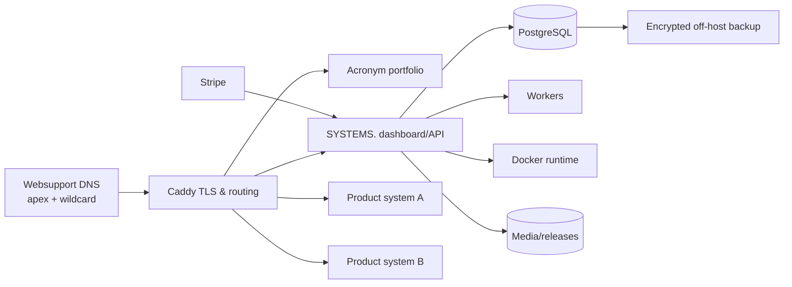

## Appendix B — publication decision flow

```mermaid
flowchart TD
    START[Administrator requests publish] --> VALID{Profile validation passes?}
    VALID -- No --> FIX[Show blocking fields]
    FIX --> START
    VALID -- Yes --> OFFER{Public offers valid?}
    OFFER -- No --> FIXO[Fix price/fulfilment]
    FIXO --> START
    OFFER -- Yes --> DEST{CTA destination valid?}
    DEST -- No --> FIXD[Fix destination/access]
    FIXD --> START
    DEST -- Yes --> SNAP[Create immutable catalog snapshot]
    SNAP --> CACHE[Publish and invalidate cache]
    CACHE --> VERIFY[Verify public page]
    VERIFY --> LIVE[Record published version + audit event]
```

## Appendix C — capability boundary

```text
ACRONYM (public)
  Discover products
  Understand value
  Compare offers
  Buy or subscribe
  Reach product experiences

SYSTEMS. (private)
  Define products
  Build and deploy systems
  Manage environments and domains
  Publish catalog content
  Configure offers
  Mirror billing and grant entitlements
  Monitor operations and conversion
  Audit and recover

STRIPE (billing authority)
  Collect payment
  Maintain payment methods
  Issue provider invoices/receipts
  Manage billing lifecycle
  Emit signed billing events

PRODUCT SYSTEMS (runtime)
  Deliver the actual product
  Enforce entitlements where required
  Emit bounded health and product events
```

## Appendix D — revision summary

### Version 1.2

- Made the complete Portfolio CMS a first-class SYSTEMS. module while preserving `acronym.sk` as an independently deployed renderer.
- Added typed content blocks, immutable whole-site snapshots, media safety, renderer compatibility, draft preview, publication history, and rollback.
- Made Slovak/English public-site mutation and language switching a core capability with stable locale routes and localized SEO/legal/checkout content.
- Added leads, waitlists, forms, consent attribution, and localization-aware content governance.
- Added EU/Slovak consumer, VAT/OSS, GDPR/cookie, direct-marketing, complaints/ADR, accessibility, licence/conformity, and software-security architecture.
- Added secure SDLC, privileged runtime isolation, key management, incident response, and emergency controls.
- Added static pre-rendering, detailed cache classes, resource quotas, admission control, database/metrics efficiency, backpressure, host headroom, and load-shedding priorities.
- Expanded acceptance criteria, risks, and edge-case behaviour across publishing, language, legal evidence, security, subscriptions, and resource exhaustion.
