# SYSTEMS. V4 Proposal

**Status:** Definitive implementation proposal  
**Product:** SYSTEMS. by Acronym  
**Target domain:** `acronym.sk`  
**Document version:** 1.0  
**Date:** 18 June 2026

> **SYSTEMS. is Acronym's private control plane for building, deploying, operating, publishing, and commercialising digital products.**

---

## 1. Executive summary

SYSTEMS. V4 evolves the current private deployment engine into the operating core behind Acronym's complete product portfolio. Acronym remains the public brand, portfolio, and storefront. SYSTEMS. remains private and becomes the source of truth for products, deployed systems, environments, domains, releases, health, portfolio publishing, offers, customers, orders, subscriptions, entitlements, and product analytics.

The defining architectural decision is to keep three concerns separate:

1. **Product plane:** what Acronym presents and sells.
2. **Control plane:** how administrators deploy, operate, publish, and commercialise it.
3. **Runtime plane:** where managed and external systems actually execute.

A product is not a container. A product may contain several systems; a system may have production and preview environments; and internal systems may exist without a public product. Deployment does not imply publication, public access does not imply portfolio visibility, and payment does not itself imply entitlement.

V4 launches as a disciplined single-organisation platform on infrastructure Acronym controls. Its boundaries allow later multi-host operation and client-owned products without turning V4 into a public hosting platform or marketplace.

---

## 2. Locked product decisions

- Acronym is the only seller in V4.
- SYSTEMS. has no public signup and remains private.
- A product may contain multiple managed or external systems.
- Systems may exist without public products.
- Production and preview are first-class environments; development is represented but may remain CLI/integration-led initially.
- Portfolio publishing is explicit and editorially controlled.
- SYSTEMS. synchronises portfolio data but never publishes a product merely because its runtime is public.
- One-time purchases and recurring monthly/yearly subscriptions are core V4 capabilities.
- Stripe is the billing authority; SYSTEMS. is the product-access and fulfilment authority.
- PostgreSQL is the authoritative V4 platform database.
- Custom domains require ownership verification before routing or TLS activation.
- External systems use scoped project credentials, never administrator credentials.
- Customer, administrator, preview, and integration identities are separate security realms.
- Customer accounts are not required for the first purchase; entitlements exist independently of an interactive customer account.
- V4 is not a marketplace, public PaaS, accounting suite, or remote executor for arbitrary external servers.

---

## 3. Goals and non-goals

### 3.1 Goals

- Operate every Acronym product from one private control plane.
- Deploy managed systems with safe preview-to-production promotion.
- Register and observe systems hosted elsewhere.
- Publish conversion-ready product pages to `acronym.sk`.
- Sell one-time offers and subscriptions through Stripe.
- Translate paid billing state into explicit customer entitlements.
- Monitor infrastructure health and business performance without mixing them.
- Provide verified domains, secure previews, incidents, maintenance mode, and rollback.
- Preserve an audit trail for technical and commercial actions.
- Scale from one host to multiple execution nodes without replacing the product model.

### 3.2 Non-goals

- Public SYSTEMS. registration.
- Third-party sellers, commissions, reviews, or revenue sharing.
- Direct card handling.
- Full bookkeeping, tax filing, or general-ledger functionality.
- Session replay or invasive visitor tracking.
- Automatic publication of every deployed system.
- Security through secret-looking URL paths.
- Cross-host remote command execution for arbitrary external systems.
- Kubernetes in the initial V4 release.

---

## 4. Domain language

| Term | Meaning |
|---|---|
| Organisation | Ownership boundary. V4 has one active organisation: Acronym. |
| Product | A public or commercial thing Acronym presents, distributes, or sells. |
| System | A technical component: site, app, API, worker, or external service. |
| Environment | Independently configured runtime context such as production or preview. |
| Release | Immutable built/deployed version of a system. |
| Deployment | Attempt to place a release into an environment. |
| Product profile | Public portfolio, media, SEO, and merchandising content. |
| Offer | A purchasable or subscribable commercial package. |
| Order | Commercial record of a one-time checkout or manually recorded purchase. |
| Subscription | Mirrored recurring billing relationship whose authority is Stripe. |
| Entitlement | SYSTEMS.-controlled right to access or receive something. |
| Fulfilment | Delivery of the entitlement: access, download, licence, service, or manual work. |
| Managed system | Built or run by SYSTEMS. |
| External system | Hosted elsewhere but registered for health, releases, analytics, or commerce. |
| Catalog | Safe, published product data consumed by `acronym.sk`. |

---

## 5. System context

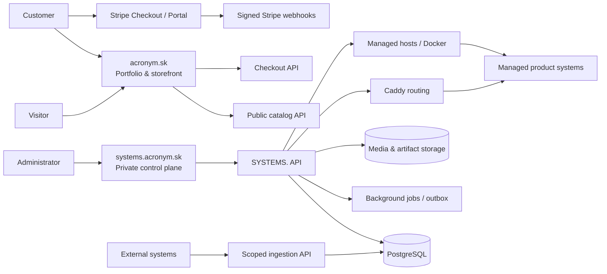

### 5.1 Planes

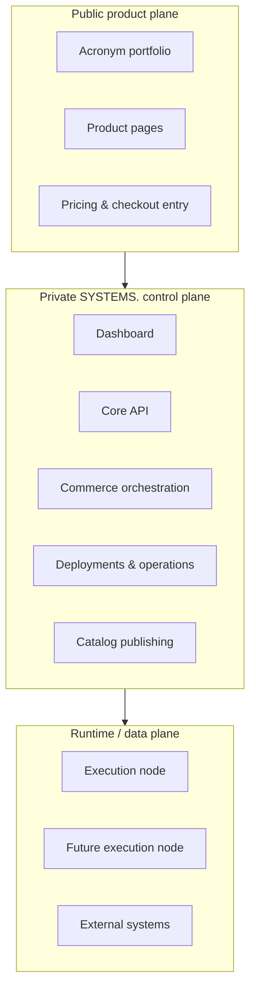

---

## 6. URL and path architecture

### 6.1 Hostnames

| Host pattern | Purpose | Exposure |
|---|---|---|
| `acronym.sk` | Public portfolio and storefront | Public |
| `www.acronym.sk` | Permanent redirect to apex | Public |
| `systems.acronym.sk` | Dashboard and same-origin admin API | Private/authenticated |
| `{slug}.acronym.sk` | Default production address for a managed web system | According to access policy |
| `preview-{slug}.acronym.sk` | Stable preview host when enabled | Token/password protected |
| `api.systems.acronym.sk` | External ingestion and machine integration API | Scoped credentials |
| `status.acronym.sk` | Optional later public status surface | Public, deliberately limited |
| `{verified-custom-domain}` | Canonical product/system domain | Public or protected |

Reserved subdomains must include `www`, `systems`, `api`, `admin`, `status`, `assets`, `cdn`, `mail`, `smtp`, `preview`, and `internal`. Product/system slugs may not use them.

### 6.2 Public portfolio paths

```text
GET  /                              Homepage and featured products
GET  /products                      Published product index
GET  /products/{product-slug}       Product detail page
GET  /products/{product-slug}/pricing
GET  /categories/{category-slug}
GET  /checkout/success              Informational return page only
GET  /checkout/cancelled
GET  /legal/terms
GET  /legal/privacy
GET  /legal/refunds
GET  /contact
```

The success path never grants access or marks payment complete. It reads a safe checkout status from SYSTEMS.; verified Stripe webhooks remain authoritative.

### 6.3 Dashboard paths

```text
/overview
/products
/products/new
/products/{product-id}/overview
/products/{product-id}/portfolio
/products/{product-id}/offers
/products/{product-id}/commerce
/products/{product-id}/analytics
/products/{product-id}/systems
/products/{product-id}/domains
/products/{product-id}/customers
/products/{product-id}/settings

/systems
/systems/new
/systems/{system-id}/overview
/systems/{system-id}/environments
/systems/{system-id}/releases
/systems/{system-id}/deployments
/systems/{system-id}/operations
/systems/{system-id}/logs
/systems/{system-id}/domains
/systems/{system-id}/access
/systems/{system-id}/integrations
/systems/{system-id}/settings

/commerce/overview
/commerce/offers
/commerce/orders
/commerce/subscriptions
/commerce/entitlements
/commerce/fulfilment
/commerce/reconciliation

/customers
/customers/{customer-id}
/incidents
/events
/server
/admin
```

IDs are immutable identifiers. Slugs are editable presentation/routing identifiers and must not be used as foreign keys.

### 6.4 API namespaces

```text
/api/v4/admin/*          Authenticated dashboard operations
/api/v4/public/*         Strictly allow-listed catalog and checkout surfaces
/api/v4/integrations/*   Scoped external-system ingestion
/api/v4/webhooks/*       Signed provider callbacks
```

Initial representative routes:

```text
GET    /api/v4/public/catalog
GET    /api/v4/public/products/{slug}
POST   /api/v4/public/checkout-sessions
GET    /api/v4/public/checkout-sessions/{public-token}/status

GET    /api/v4/admin/products
POST   /api/v4/admin/products
PATCH  /api/v4/admin/products/{id}
POST   /api/v4/admin/products/{id}/publish
POST   /api/v4/admin/products/{id}/unpublish
POST   /api/v4/admin/products/{id}/preview

GET    /api/v4/admin/systems
POST   /api/v4/admin/systems
POST   /api/v4/admin/environments/{id}/deployments
POST   /api/v4/admin/deployments/{id}/promote
POST   /api/v4/admin/environments/{id}/rollback

POST   /api/v4/admin/domains
POST   /api/v4/admin/domains/{id}/verify
POST   /api/v4/admin/domains/{id}/activate

POST   /api/v4/integrations/heartbeat
POST   /api/v4/integrations/releases
POST   /api/v4/integrations/errors
POST   /api/v4/integrations/events
POST   /api/v4/integrations/metrics

POST   /api/v4/webhooks/stripe
POST   /api/v4/webhooks/github
```

### 6.5 Routing rules

1. The portfolio product/system owns `acronym.sk` through the current primary-system concept.
2. Every routable production environment receives `{system-slug}.acronym.sk`.
3. A verified custom domain may become canonical.
4. When custom canonical routing is enabled, the default subdomain redirects with `308` unless explicitly configured as an alias.
5. Private environments publish no internet route.
6. Preview routes use expiring access grants, not obscure paths.
7. Marketing pages remain independent from application routes.
8. Caddy configuration is validated and reloaded before a route is marked active.

---

## 7. Product and system model

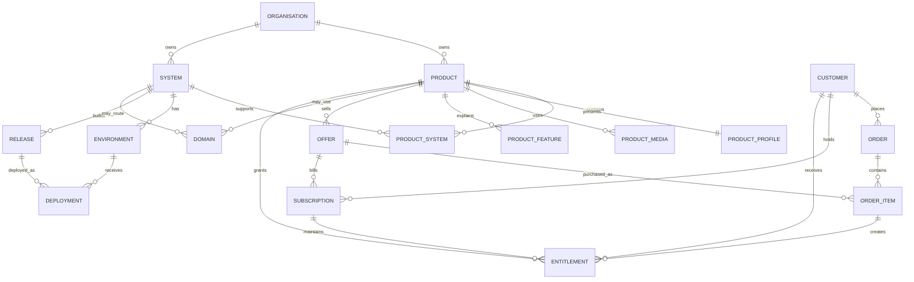

### 7.1 Essential tables

#### Ownership and identity

- `organisations`
- `admin_users`
- `admin_sessions`
- `api_credentials`
- `customers`

#### Product catalog

- `products`
- `product_profiles`
- `product_media`
- `product_features`
- `product_faqs`
- `product_systems`
- `catalog_publications`

#### Runtime

- `systems`
- `environments`
- `releases`
- `deployments`
- `environment_variables`
- `domains`
- `routes`
- `health_checks`
- `incidents`
- `incident_events`

#### Commerce

- `offers`
- `offer_prices`
- `orders`
- `order_items`
- `subscriptions`
- `subscription_items`
- `entitlements`
- `fulfilments`
- `provider_events`

#### Analytics and operations

- `product_events_raw` or an append-only event store
- `product_metrics_daily`
- `runtime_metrics`
- `audit_events`
- `outbox_events`
- `job_runs`

### 7.2 Identifier rules

- Use UUIDv7 or ULID identifiers for new domain entities.
- Keep slugs human-readable, unique within organisation, and separately indexed.
- Store all timestamps in UTC; localise only at presentation time.
- Monetary values use integer minor units plus ISO currency, never floating point.
- External provider IDs are unique and indexed.
- Secrets and raw API keys are never stored in recoverable plaintext unless the feature requires retrievable encryption; API keys are hashed.

---

## 8. Independent state machines

### 8.1 Product lifecycle

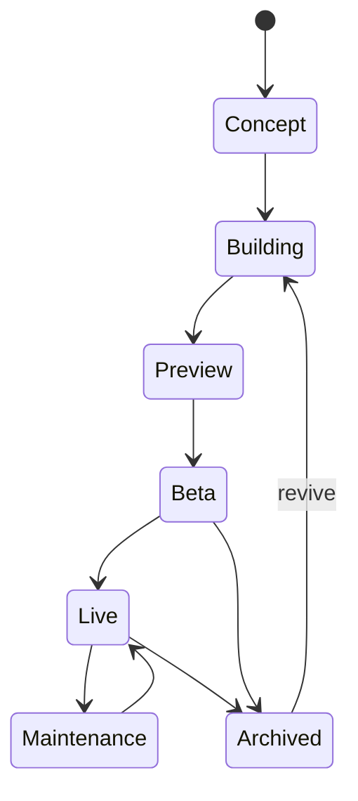

### 8.2 Portfolio publication

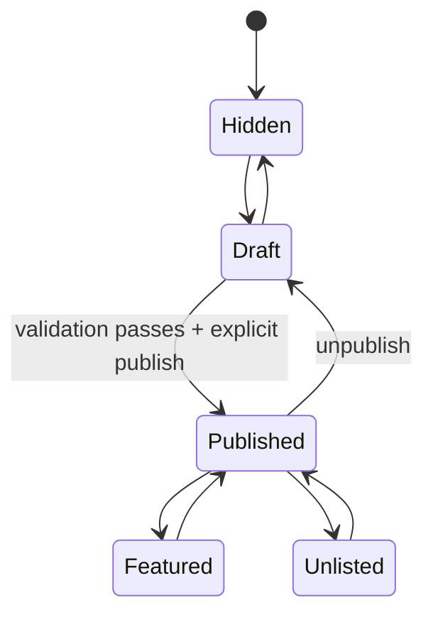

### 8.3 Deployment

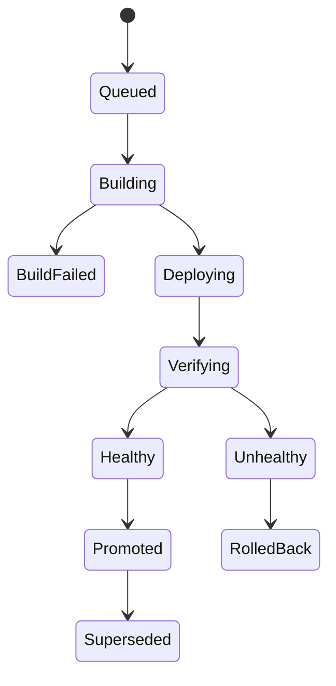

### 8.4 Subscription mirror

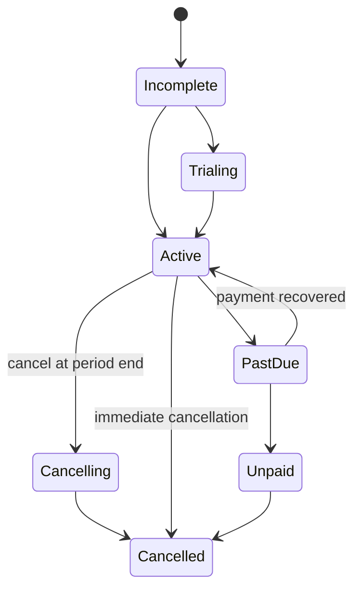

Provider state is mirrored exactly; a derived `access_effective_state` applies Acronym's grace-period and entitlement policy without rewriting Stripe history.

---

## 9. Portfolio publishing

### 9.1 Publication requirements

A product cannot publish until it has:

- Public title and unique product slug.
- Tagline and short description.
- Full value proposition.
- Cover image with alt text.
- Lifecycle and commercial state.
- At least one valid CTA.
- SEO title, description, canonical decision, and social image.
- At least one destination, offer, or contact action.
- Valid fulfilment for every active public offer.
- No unresolved blocking validation errors.

SYSTEMS. calculates a readiness score for guidance, but publication is binary and governed by hard validations plus explicit administrator approval.

### 9.2 Eligibility matrix

| Condition | Portfolio page | Launch CTA | Purchase CTA |
|---|---:|---:|---:|
| Public, healthy, published | Yes | Yes | According to offer |
| Preview protected, published | Yes | Request/preview only | According to offer |
| Private runtime, published product | Yes | No | According to fulfilment |
| In development + coming soon | Explicit only | No | Waitlist/contact only |
| Degraded runtime | Yes | Warn or disable | Keep if fulfilment unaffected |
| Failed runtime | Yes | Disable | Policy-driven |
| Archived public case study | Optional | No | No |
| Catalog hidden | No | No | No |

### 9.3 Catalog delivery

- The portfolio consumes a strict public catalog representation, never admin project rows.
- Published catalog snapshots are versioned and cacheable.
- `acronym.sk` retains the last known good snapshot so a control-plane outage does not erase the storefront.
- Publication invalidates relevant CDN/application caches.
- Draft preview uses a signed, expiring preview token and never changes the public catalog.

---

## 10. Environments, releases, and deployment

### 10.1 Environment model

| Capability | Production | Preview | Development |
|---|---:|---:|---:|
| Stable route | Yes | Optional | No guarantee |
| Public by default | Policy-controlled | No | No |
| Promotion target | No | Yes | Yes |
| Independent secrets | Yes | Yes | Yes |
| Independent database | Recommended | Required isolation | Local/isolated |
| Retention | 5 successful releases default | Short-lived | Minimal |

### 10.2 Deployment sequence

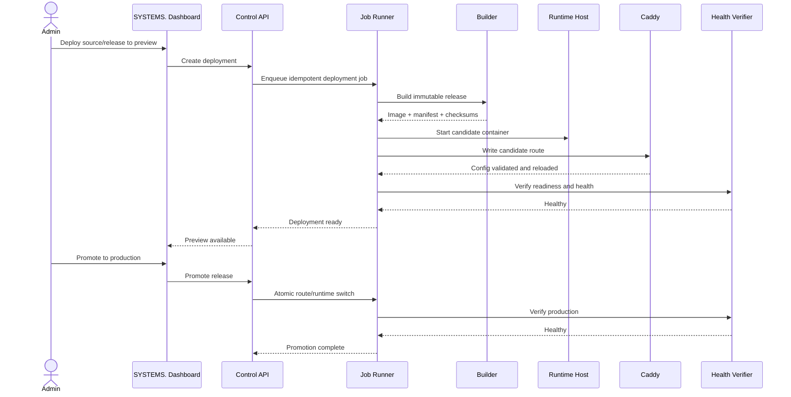

### 10.3 Deployment invariants

- Releases are immutable.
- A deployment references one release and one environment.
- Build and deployment state are distinct.
- Production promotion never rebuilds; it promotes an already verified release.
- The previous healthy release remains rollback-eligible.
- Route changes are validate-then-activate.
- Failed health does not silently report success.
- All mutating operations have idempotency keys and audit entries.

---

## 11. Domains and access

### 11.1 Domain lifecycle

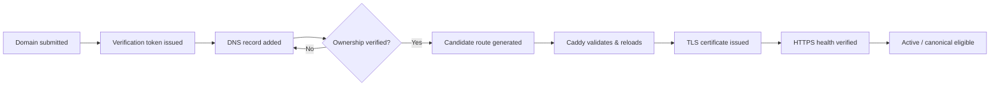

### 11.2 Access policies

- **Public:** internet route with no application-independent gate.
- **Preview protected:** signed expiring grant, optionally combined with password/email restriction.
- **Private:** no public route; access only through approved private connectivity or control-plane tooling.

Preview grants store token hashes, expiry, scope, recipient label, use count, last used time, and revocation state. A token in a URL is exchanged for a short-lived secure, HTTP-only cookie and removed from the visible URL.

### 11.3 Maintenance mode

Maintenance mode operates at the routing layer and can display a branded response without deleting or stopping the runtime. It records the reason, start time, administrator, optional expected end, and incident link.

---

## 12. Commerce architecture

### 12.1 Offer types

- One-time purchase.
- Monthly subscription.
- Annual subscription.
- Free entitlement.
- Contact for pricing.
- Coming soon/waitlist.
- Invite-only or complimentary access.

An offer may have multiple prices, but one currency—EUR—launches first. Prices are immutable once used; commercial changes create a new price version.

### 12.2 Checkout and entitlement sequence

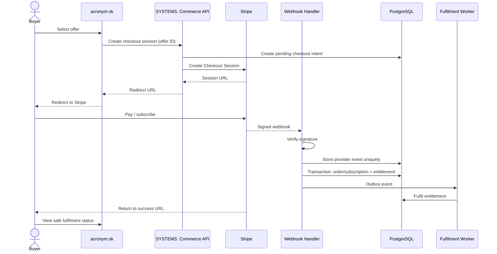

### 12.3 Webhook requirements

- Verify Stripe signatures against the raw request body.
- Store each provider event ID with a unique constraint.
- Acknowledge already-processed events safely.
- Process state changes transactionally.
- Use an outbox for email, access provisioning, and other side effects.
- Tolerate out-of-order events by comparing provider timestamps/state.
- Replay failed events from the dashboard without duplicating fulfilment.
- Never trust browser redirects, client-supplied price amounts, or product metadata as authority.

### 12.4 Subscription capabilities

Core V4 supports:

- Monthly and annual billing.
- Optional trials.
- Upgrade/downgrade through approved price transitions.
- Immediate or period-end cancellation.
- Stripe Customer Portal.
- Payment failure, grace period, recovery, unpaid, and cancelled states.
- Manual and complimentary entitlements.
- Renewal and cancellation audit history.

Access policy is explicit per offer. For example, a past-due subscription may retain access for a configurable grace period; Stripe state is not altered to represent that policy.

### 12.5 Fulfilment types

- `manual_service`
- `secure_download`
- `hosted_access`
- `licence_entitlement`
- `source_access`
- `setup_service`
- `ownership_transfer`

V4 launches with manual fulfilment plus straightforward secure downloads/hosted access. The model supports later automated licence generation without making it a launch blocker.

---

## 13. Customer model

Customers are created from verified checkout data or audited manual entry. They are not SYSTEMS. users.

A customer record connects:

- Billing provider customer ID.
- Verified or checkout-supplied email.
- Orders and order items.
- Subscriptions.
- Entitlements.
- Fulfilment status.
- Customer Portal access creation.
- Consent and required legal records.

No interactive Acronym account is required initially. Secure delivery links are short-lived and revocable. A future customer portal may authenticate customers separately without changing entitlements.

---

## 14. External systems and integration API

### 14.1 Registration

External systems are first-class systems with `runtime_type=external`. They have catalog/product associations and operational state but no local container or deploy controls.

### 14.2 Credential model

- Credential ID plus high-entropy secret shown once.
- Secret stored with a slow/keyed hash as appropriate.
- Scopes such as `heartbeat:write`, `events:write`, `releases:write`, and `errors:write`.
- Per-key and per-system rate limits.
- Rotation with overlap window.
- Immediate revocation.
- Last-used timestamp and source metadata.
- Optional HMAC request signing for higher-trust integrations.

### 14.3 Ingestion flow

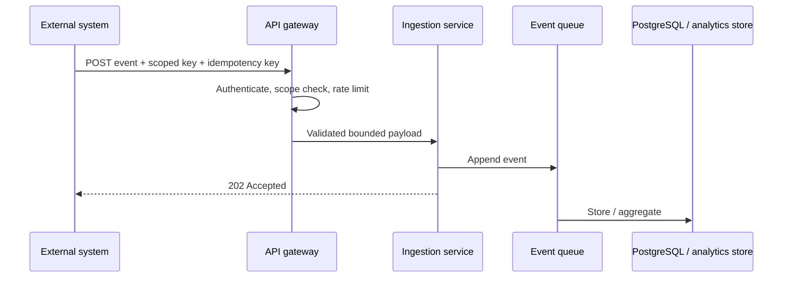

Payloads are schema-versioned, size-limited, timestamp-bounded, and stripped of undeclared sensitive fields. External systems cannot invoke host shell, Docker, route, or administrator actions.

---

## 15. Analytics

### 15.1 Separation

**Product analytics** measure discovery and commercial performance:

- Product views and anonymous visitors.
- CTA and demo launches.
- Checkout starts and completions.
- One-time revenue and MRR/ARR-derived views.
- Subscription starts, churn, recovery, and conversion.
- Referrers and declared product events.

**Operational analytics** measure system performance:

- Availability and response time.
- CPU, memory, and network.
- Error counts.
- Release/deployment outcomes.
- Container/runtime health.

The product overview may correlate them but never stores them as one ambiguous metric.

### 15.2 Analytics pipeline

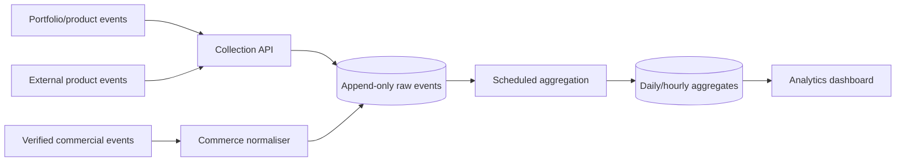

### 15.3 Privacy and retention

- Use first-party anonymous identifiers.
- Do not implement session replay.
- Do not collect arbitrary page text or form values.
- Minimise IP retention; truncate/hash when business need permits.
- Maintain documented retention windows by event class.
- Respect consent requirements for non-essential analytics.
- Provide deletion/anonymisation procedures for customer-linked data.

---

## 16. Dashboard information architecture

### 16.1 Global overview

The first screen answers:

- What requires attention now?
- What is currently earning or converting?
- Which products are live, unpublished, incomplete, or unhealthy?
- Which deployments, payments, domains, fulfilments, or incidents failed?

It shows revenue, active subscriptions, failed payments, pending fulfilment, conversion, product health, deployments, incidents, and infrastructure capacity without presenting vanity totals ahead of actionable problems.

### 16.2 Product workspace

Tabs: Overview, Portfolio, Offers, Commerce, Analytics, Systems, Domains, Customers, Settings.

### 16.3 System workspace

Tabs: Overview, Environments, Releases, Deployments, Operations, Logs, Domains, Access, Integrations, Settings.

### 16.4 Safety UX

- Preview impact before publish, domain, access, and production actions.
- Require typed confirmation for destructive/purge actions.
- Display actual provider/runtime confirmation, not optimistic green states.
- Clearly distinguish saved configuration from applied configuration.
- Make warnings actionable and name the affected product/system/environment.
- Keep advanced host controls away from everyday product operations.

---

## 17. Security architecture

### 17.1 Trust boundaries

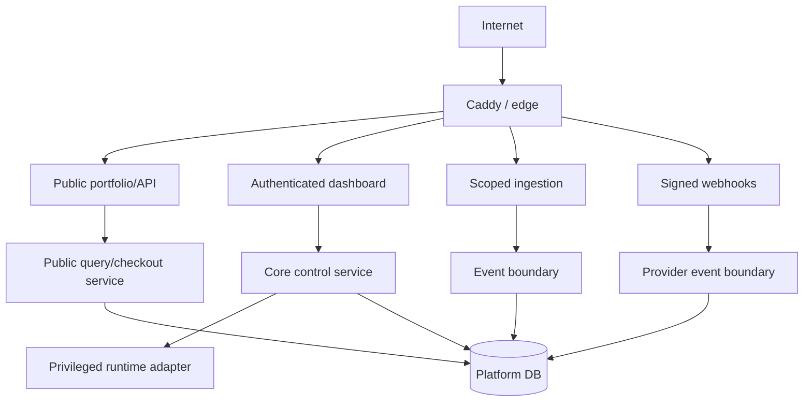

### 17.2 Controls

- Strong administrator passwords and TOTP, with the option to require TOTP globally.
- Short-lived admin access tokens and revocable server-side sessions.
- CSRF protection where cookie authentication is used.
- Strict CORS allow-list including required `PATCH` support.
- Rate limits by route class, identity, and IP.
- Encrypted environment variables with key rotation procedure.
- Hash-chained audit events retained independently of ordinary product analytics.
- Docker socket access isolated behind the smallest possible runtime adapter.
- Container capability dropping, resource limits, isolated networks, read-only filesystems where compatible, and no-new-privileges.
- Signed webhooks and idempotent processing.
- Verified custom-domain ownership.
- Secret scanning and dependency/container vulnerability checks in build flow.
- No secrets in logs, build output, catalog APIs, or client bundles.
- Content Security Policy and secure cookie defaults on public and private surfaces.

### 17.3 Public API projection

Public product DTOs are explicitly constructed. They never expose container IDs, image IDs, host ports, repositories, administrator identities, environment variables, private domains, raw health errors, Stripe secrets, internal customer IDs, or audit details.

---

## 18. Reliability, backup, and disaster recovery

### 18.1 Initial service objectives

These are engineering targets, not external contractual SLAs:

- Public portfolio availability target: 99.9% monthly.
- Checkout-creation availability target: 99.9% monthly.
- Control-plane availability target: 99.5% monthly.
- Webhook durability: no acknowledged verified event lost.
- RPO: 24 hours for release artifacts/media; 15 minutes or better for commercial PostgreSQL data once WAL archiving is enabled.
- RTO: 4 hours for control plane; 2 hours target for storefront and commerce restoration.

### 18.2 Backup set

- PostgreSQL base backups plus WAL/archive strategy.
- Caddy base configuration and generated route records.
- Release manifests and required artifacts.
- Media/object storage.
- Encrypted secrets/key recovery material according to a separately protected procedure.
- Deployment scripts and infrastructure configuration.

Backups require encryption, off-host copies, retention policy, checksums, restoration drills, and evidence. A backup that has never been restored is not considered verified.

### 18.3 Failure isolation

- The storefront serves the last published catalog snapshot during control-plane failure.
- Provider webhook receipt is separated from slow fulfilment.
- Deployment jobs do not block commerce jobs.
- Analytics ingestion failure does not prevent checkout.
- A failed product runtime does not remove its portfolio page.
- Maintenance mode can be activated independently of the failing runtime.

---

## 19. Scaling strategy

V4 should be horizontally evolvable but vertically simple at launch.

### 19.1 Stage A — single-host launch

Suitable while one host has adequate capacity and failure risk is accepted:

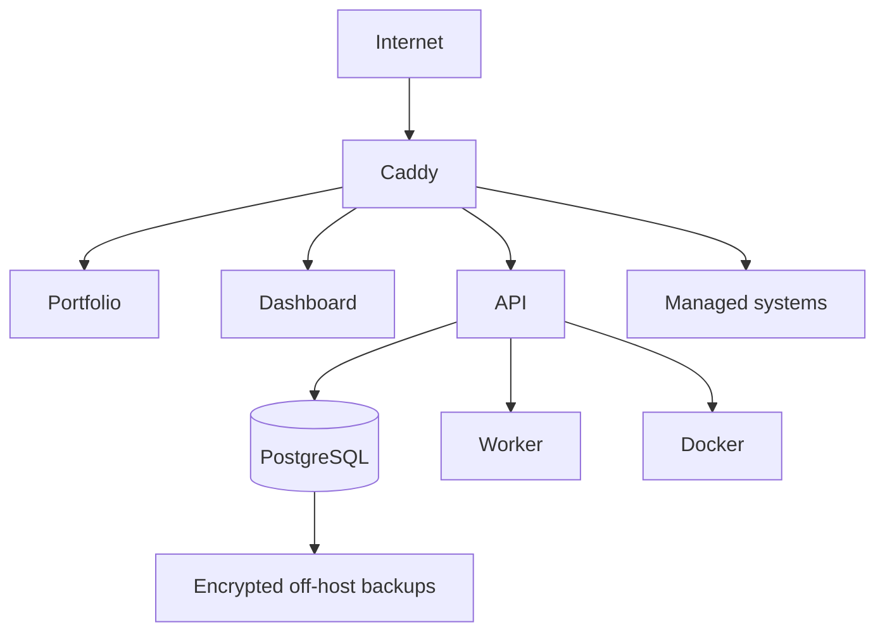

Requirements:

- PostgreSQL separated as its own service/container with durable volume.
- At least one independent background worker process.
- Bounded job concurrency so builds cannot starve checkout/webhooks.
- Per-system CPU/memory limits and global disk pressure protection.
- Off-host backups.
- Static/media assets stored outside ephemeral containers.

### 19.2 Stage B — separated control and execution

Trigger when builds/runtime load affects control-plane latency, a second host is required, or a single Docker daemon becomes a material operational constraint.

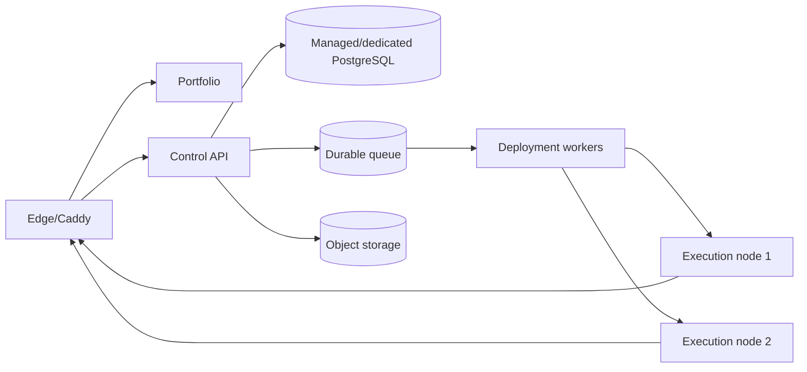

Introduce a SYSTEMS. execution agent with mutual authentication and a narrow command protocol. Do not expose remote Docker sockets.

### 19.3 Stage C — redundant public/commercial services

Trigger when downtime has direct material revenue impact or traffic exceeds one application instance:

- Two or more stateless public/API instances behind the edge.
- PostgreSQL high availability or managed equivalent.
- Durable queue with retry/dead-letter handling.
- Replicated object storage/CDN.
- Multiple execution nodes with placement and capacity awareness.
- Independent monitoring outside the primary infrastructure.

### 19.4 Scaling signals, not arbitrary dates

Scale when sustained evidence appears:

- Build queue delay breaches target repeatedly.
- Host CPU, memory, or disk remains above safe headroom.
- Checkout/API p95 latency degrades during deployments.
- Runtime count or blast radius makes single-host recovery unacceptable.
- Analytics ingestion/aggregation materially competes with transactional work.
- Database size/write rate makes retention or backup windows unsafe.

### 19.5 Data scaling

- Keep transactional data in PostgreSQL.
- Partition or archive high-volume raw analytics by time when volume warrants it.
- Precompute hourly/daily commercial aggregates.
- Retain operational metrics at high resolution briefly and downsample older data.
- Store images, archives, and release artifacts in object storage, not PostgreSQL.
- Use connection pooling before adding application replicas.

---

## 20. Background jobs and consistency

At minimum, jobs cover:

- Builds, deployments, promotions, and rollbacks.
- Health checks and incident evaluation.
- Route/TLS verification.
- Stripe webhook side effects.
- Fulfilment and email.
- Catalog publication/cache invalidation.
- Analytics aggregation and retention.
- Backup verification and cleanup.

Transactional changes that require side effects use the outbox pattern:

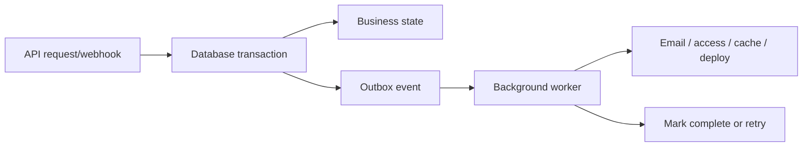

Jobs use bounded retries, exponential backoff, observability, idempotency, and a dead-letter/manual-resolution path.

---

## 21. Observability

### 21.1 Platform telemetry

- Structured logs with request, job, product, system, environment, deployment, order, and provider-event correlation IDs.
- Metrics for HTTP latency/error rates, queue depth/age, webhook delay, deployment duration/success, health state, database saturation, disk capacity, and backup age.
- Traces across checkout creation, webhook processing, deployment, and external ingestion where useful.
- Alerts route to an out-of-band channel.

### 21.2 Required operational alerts

- Public portfolio unavailable.
- Checkout creation failing.
- Stripe webhook signature/process failures or growing delay.
- Database unavailable or near capacity.
- Backup stale or failed verification.
- Caddy validation/reload failure.
- Production system health failure.
- TLS/domain failure.
- Build queue saturation.
- Disk, memory, or CPU capacity risk.

---

## 22. API quality standards

- Version public and integration contracts under `/api/v4` initially; future incompatible contracts use a new version.
- Use JSON Schema validation at every boundary.
- Return a consistent error envelope with code, message, request ID, and safe details.
- Support idempotency keys for checkout creation, deployment commands, manual orders, and ingestion writes.
- Use cursor pagination for potentially large collections.
- Apply optimistic concurrency/version checks to editorial content.
- Document every external endpoint with OpenAPI.
- Never reuse dashboard DTOs as public catalog DTOs.
- Preserve backwards compatibility for explicitly published integration contracts.

---

## 23. Migration from the current repository

### 23.1 Existing foundations to preserve

- Vue dashboard shell and visual system.
- Fastify API pattern and route encapsulation.
- Docker build/run services and hardened defaults.
- Caddy route generation.
- Public/password/private access concepts.
- Primary/apex system routing.
- Release rollback foundation.
- Health reconciliation.
- Encrypted environment variables.
- TOTP/session revocation.
- Tamper-evident audit log.
- GitHub webhook verification and redeploy foundation.
- Backup/restore and operational documentation.

### 23.2 Current concepts to replace or split

| Current V2 concept | V4 destination |
|---|---|
| `projects` row | `systems` plus environment/release/deployment records |
| `visibility` | Environment access policy |
| `is_primary` | Route/domain assignment for portfolio apex |
| `stats_history` | Runtime metrics; separate from product analytics |
| Project repo/branch | System source integration |
| Implicit proxy file route | Explicit `domains` and `routes` records |
| Single current/previous image | Immutable release history and deployments |
| Basic-auth preview | Preview grants with Basic Auth fallback |

### 23.3 Migration sequence

```mermaid
flowchart LR
    A[Stabilise current V2] --> B[Introduce versioned migrations]
    B --> C[Provision PostgreSQL]
    C --> D[Dual-tested data migration]
    D --> E[Create organisation/system/environment model]
    E --> F[Map existing projects to systems]
    F --> G[Introduce products/catalog]
    G --> H[Introduce commerce]
    H --> I[Cut over authoritative writes]
    I --> J[Remove legacy compatibility]
```

### 23.4 Immediate repository corrections

- Add `PATCH` to CORS allowed methods because current dashboard routes already use it.
- Replace silent catch-all `ALTER TABLE` migrations with versioned, observable migrations.
- Validate the claimed production PostgreSQL path end to end.
- Make health path configurable and support private/protected/custom-domain health.
- Persist route/domain state explicitly.
- Ensure database state is not marked successfully applied when Caddy activation fails.
- Remove obsolete Compose `version` metadata during the deployment refresh.
- Resolve current domain-default inconsistencies in Compose/configuration.

---

## 24. Delivery plan

### Phase 0 — operational proof

- Validate Docker, Caddy, PostgreSQL, HTTPS, backup, restore, and rollback on the real Windows host.
- Fix CORS and routing correctness gaps.
- Add versioned migrations and CI migration tests.

**Exit:** Current platform can be operated and restored honestly on production infrastructure.

### Phase 1 — V4 foundation

- Organisation, products, systems, environments, releases, and deployments.
- Migrate existing project records.
- Product/system dashboard navigation.
- Preview-to-production promotion.

**Exit:** One product can own multiple systems and production is isolated from preview.

### Phase 2 — portfolio and publishing

- Product profiles, media, features, FAQs, SEO, readiness validation.
- Public catalog API and cached snapshot.
- Deploy `acronym.sk` as the primary system.
- Draft preview, publish/unpublish, and featured ranking.

**Exit:** A complete product can be deliberately published without exposing control-plane data.

### Phase 3 — domains, access, incidents

- Domain verification, canonical routes, redirects, and TLS state.
- Expiring preview grants.
- Maintenance mode, incidents, alerts, and improved health checks.

**Exit:** Public, preview, private, custom-domain, and failure flows are safe and observable.

### Phase 4 — commerce and subscriptions

- Offers/prices, Stripe Checkout, signed webhooks, Customer Portal.
- Orders, subscriptions, entitlements, fulfilment, and manual/complimentary access.
- Payment-failure/grace/cancellation policies.
- Reconciliation and audit tooling.

**Exit:** One-time and recurring transactions produce correct, replay-safe entitlements.

### Phase 5 — analytics and external systems

- Public/product event collection and aggregates.
- External-system registration, credentials, heartbeat, releases, errors, events, and metrics.
- Business and operational dashboards.

**Exit:** Managed and external products can be measured without conflating business and infrastructure data.

### Phase 6 — hardening and scale readiness

- Load, failure, security, restore, and webhook-replay testing.
- Queue isolation, object storage, retention automation, SLO dashboards.
- Execution-agent protocol design if Stage B triggers are near.

**Exit:** V4 is production-ready under documented capacity and recovery assumptions.

---

## 25. Acceptance criteria

V4 is complete only when all statements below are demonstrably true.

### Product and portfolio

- A product can connect to multiple managed/external systems.
- A system can exist without a product.
- Draft, published, featured, unlisted, and hidden states behave independently of runtime access.
- The portfolio remains available with the last known published catalog during control-plane downtime.
- No private technical fields appear in public responses.

### Deployment and operations

- Preview and production have independent configuration and secrets.
- A verified preview release can be promoted without rebuilding.
- Failed production verification is visible and rollback is tested.
- Routes are marked active only after validated proxy activation.
- Maintenance mode and incidents work while the application runtime is unhealthy.

### Domains and access

- Unverified domains cannot route traffic.
- Canonical redirects are deterministic and loop-free.
- Expired/revoked preview grants stop working.
- Private systems have no accidental public route.

### Commerce

- Browser redirects cannot grant entitlement.
- Duplicate/out-of-order Stripe events do not duplicate orders, subscriptions, or fulfilment.
- Monthly and annual subscriptions support trial, active, past-due, recovery, cancellation, and expiry behaviour.
- Manual and complimentary entitlements are audited.
- Refund/cancellation/provider state remains reconcilable with Stripe.

### Security and recovery

- Admin, customer, preview, and integration credentials cannot substitute for each other.
- Secret values do not appear in logs or public APIs.
- Backup restoration meets the documented procedure and is exercised.
- Audit-chain verification and provider-event history survive migration.
- Rate limits, payload limits, and scoped credentials are tested.

### Scale and performance

- Builds do not materially block checkout or webhook processing under the agreed load test.
- Queue age, database saturation, disk pressure, and public/API latency are visible.
- Capacity limits and Stage B scaling triggers are documented from measured results.

---

## 26. Key risks and mitigations

| Risk | Impact | Mitigation |
|---|---|---|
| V4 attempted as one large rewrite | Long unstable delivery | Vertical phases with working exit criteria and migration compatibility |
| Product fields added back into `projects` | Permanent model confusion | Enforce Product/System/Environment separation |
| Stripe redirect trusted | Unauthorized access | Webhook-only entitlement authority |
| Duplicate/out-of-order webhooks | Duplicate fulfilment | Unique provider events, transactions, idempotency, replay tests |
| Builds starve commerce | Revenue-impacting latency | Separate bounded workers/queues and resource limits |
| Single-host failure | Broad outage | Off-host backups, cached catalog, recovery drills, Stage B triggers |
| Custom-domain misconfiguration | Hijack/outage | Ownership verification and validate-before-activate |
| Analytics becomes invasive | Legal/trust cost | First-party minimal events, consent, retention, no replay |
| External credentials become admin backdoor | Security breach | Narrow scopes and no operational command endpoints |
| UI hides unapplied state | False confidence | Separate desired/applied state and reconcile against reality |

---

## 27. Final product experience

### Visitor

A visitor discovers a polished product on `acronym.sk`, understands its value, sees reliable pricing or a clear contact path, launches an appropriate demo, and purchases or subscribes through Stripe.

### Customer

A customer receives the correct entitlement or fulfilment, can manage recurring billing through Stripe, and never needs access to SYSTEMS. infrastructure.

### Administrator

An administrator creates a product, connects one or more systems, deploys a preview, verifies and promotes it, publishes a conversion-ready portfolio page, configures one-time and subscription offers, monitors customers and revenue, responds to incidents, and operates the runtime from one private control plane.

### SYSTEMS. V4

V4 no longer merely answers:

> Is this container running?

It answers:

> Is this product built, deployed, healthy, securely accessible, publicly presented, commercially available, converting visitors, collecting revenue, and correctly serving its customers?

---

## Appendix A — concise deployment topology

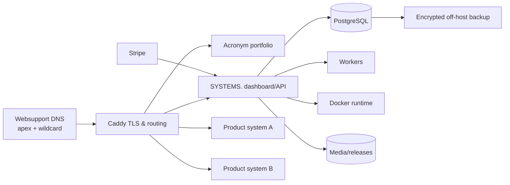

## Appendix B — publication decision flow

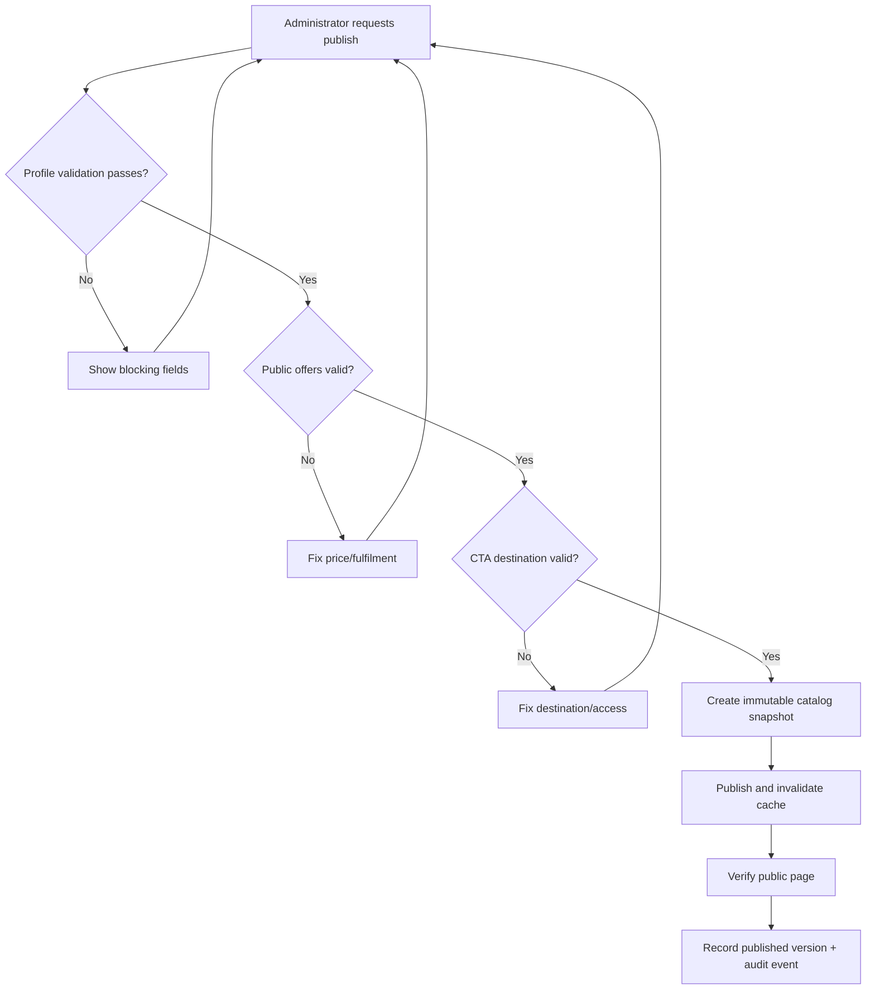

## Appendix C — capability boundary

```text
ACRONYM (public)
  Discover products
  Understand value
  Compare offers
  Buy or subscribe
  Reach product experiences

SYSTEMS. (private)
  Define products
  Build and deploy systems
  Manage environments and domains
  Publish catalog content
  Configure offers
  Mirror billing and grant entitlements
  Monitor operations and conversion
  Audit and recover

STRIPE (billing authority)
  Collect payment
  Maintain payment methods
  Issue provider invoices/receipts
  Manage billing lifecycle
  Emit signed billing events

PRODUCT SYSTEMS (runtime)
  Deliver the actual product
  Enforce entitlements where required
  Emit bounded health and product events
```
